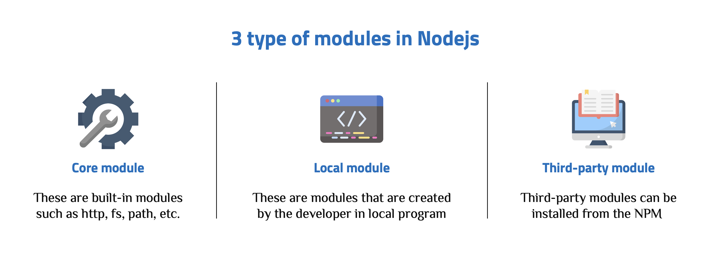
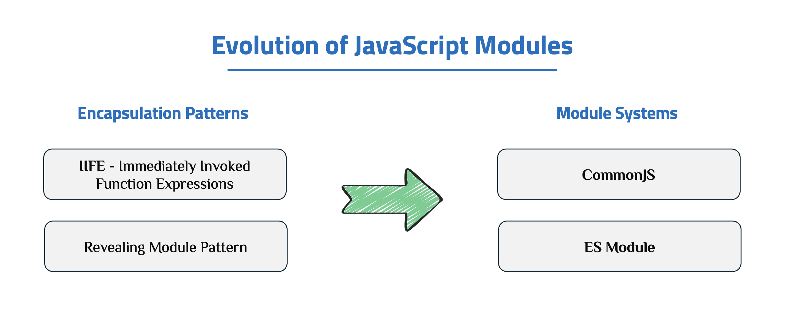

# Module Systems

Node.js supports two module systems: CommonJS (the original system) and ES Modules (the modern standard). Understanding both systems and when to use each is essential for Node.js development.

---

## Core Terminology

### What are Modules?

In Node.js Application, a **Module** can be considered as a block of code that provide a simple or complex functionality that can communicate with external application. Modules can be organized in a single file or a collection of multiple files/folders. Almost all programmers prefer modules because of their reusability throughout the application and ability to reduce the complexity of code into smaller pieces.



### What is a Module System?

There was no built-in module system in the early days of JavaScript. Codes were written in a global scope, rendering functions and variables accessible globally, resulting in naming conflicts and complex codebases. The lack of encapsulation and modularity made it difficult for developers to reuse code across multiple projects.

To handle these issues before official module systems existed, developers used **Encapsulation Patterns** (like **IIFE** - Immediately Invoked Function Expressions and the **Revealing Module Pattern**) to create private scopes and simulate modularity. However, as applications grew, a standardized solution was needed. This led to the introduction of formal Module Systems.



A **Module System** defines the rules and syntax for organizing code into separate files (modules) and managing the dependencies between them. It solves the problem of global scope pollution and dependency management by providing mechanisms for:

1.  **Encapsulation:** Keeping code private within a module unless explicitly exported.
2.  **Exporting:** Defining which variables, functions, or classes are available for use by other modules.
3.  **Importing:** Loading and using functionality from other modules.

In the Node.js ecosystem, there are two primary module systems you need to understand: CommonJS and ES Modules.

### CommonJS (CJS)

**CommonJS** is the original module system in Node.js. It uses `require()` to import modules and `module.exports` or `exports` to export functionality.

**Export syntax:**

```javascript
// Single export
module.exports = function () {
  /* ... */
};

// Multiple exports
module.exports = {
  function1: function () {
    /* ... */
  },
  function2: function () {
    /* ... */
  },
};

// Using exports shortcut
exports.function1 = function () {
  /* ... */
};
exports.function2 = function () {
  /* ... */
};
```

**Import syntax:**

```javascript
// Import entire module
const module = require("./module");

// Import specific exports (destructuring)
const { function1, function2 } = require("./module");
```

### ES Modules (ESM)

**ES Modules** is the modern JavaScript standard for modules, originally designed for browsers but now supported in Node.js.

**Export syntax:**

```javascript
// Named exports
export function function1() { /* ... */ }
export const constant = 'value';

// Default export
export default function() { /* ... */ }

// Mixed exports
export function function1() { /* ... */ }
export default class MyClass { /* ... */ }
```

**Import syntax:**

```javascript
// Named imports
import { function1, constant } from "./module.js";

// Default import
import MyClass from "./module.js";

// Mixed imports
import MyClass, { function1, constant } from "./module.js";

// Import all
import * as module from "./module.js";
```

**Using ES Modules in Node.js:** Change file extension from `.js` to `.mjs` or use `"type": "module"` in `package.json`

### Differences Between CommonJS and ES Modules

| Aspect             | CommonJS                                                                                           | ES Modules                                                                                                 |
| ------------------ | -------------------------------------------------------------------------------------------------- | ---------------------------------------------------------------------------------------------------------- |
| Syntax             | `require()` / `module.exports` (dynamic import, can be called anywhere)                            | `import` / `export` (static import, only at top level, modern JavaScript syntax)                           |
| Loading            | Synchronous `require()`; module is loaded and executed when it is called                           | Static analysis with async support; the module graph is analyzed first and can work with top‑level `await` |
| Resolution         | Runtime (paths and exports are resolved when the code runs)                                        | More compile-time-like (analyzed ahead of time, easier for IDEs/bundlers to optimize and catch errors)     |
| File extension     | `.js` (default in Node), `.cjs` to force CommonJS                                                  | `.mjs` or `.js` when `package.json` has `"type": "module"`                                                 |
| Top-level await    | Not supported (you must wrap it in an async function)                                              | Supported in ESM modules; you can use `await` directly at the top level                                    |
| Tree-shaking       | Limited (exports are dynamic objects, harder to analyze)                                           | Good support (exports are static, easier for bundlers to remove unused code)                               |
| Default in Node.js | Yes, if you do not configure anything else                                                         | No, you need `.mjs` or `"type": "module"` in `package.json` to enable ESM                                  |
| Interoperability   | Best with other CommonJS modules using `require()`; importing ESM usually needs dynamic `import()` | Can `import` CommonJS modules (by default, `module.exports` is treated like a default export)              |
| Use cases          | Legacy codebases, quick scripts, many traditional Node.js libraries                                | New projects, sharing code between frontend and backend, needing tree-shaking and top‑level `await`        |
