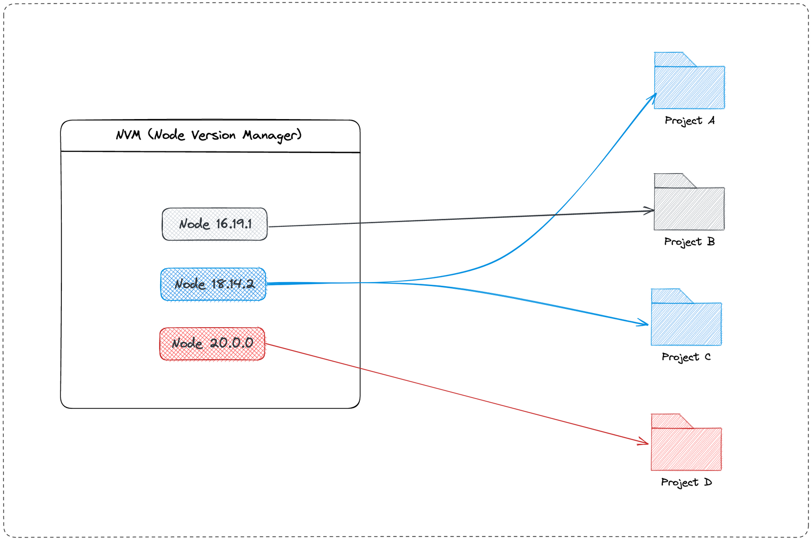

# NVM & Version Management

Understanding NVM (Node Version Manager) is essential for managing multiple Node.js versions across different projects and ensuring consistency in development environments.

---

## Core Terminology

### What is NVM and Why do we need it?

**NVM** (Node Version Manager) is a version manager for Node.js that allows you to install, manage, and switch between multiple versions of Node.js on a single machine. It provides a simple command-line interface to install different Node.js versions and automatically switch between them based on project requirements.

**Why NVM was created:** Different projects often require different Node.js versions. Without a version manager, you would need to manually uninstall and reinstall Node.js versions, which is time-consuming and error-prone. NVM solves this problem by allowing you to:

- Install and switch between versions quickly with a single command
- Automatically use the correct version for each project
- Test your application against different Node.js versions
- Ensure team consistency by sharing version requirements



### How to install NVM

**macOS and Linux:**

```bash
# Install using curl
curl -o- https://raw.githubusercontent.com/nvm-sh/nvm/v0.39.0/install.sh | bash

# Or install using wget
wget -qO- https://raw.githubusercontent.com/nvm-sh/nvm/v0.39.0/install.sh | bash
```

After installation, you need to restart your terminal to apply the changes.

### Installing and Managing Node Versions

Once NVM is installed, you can install and manage Node.js versions easily.

- `nvm install <version>`: Install a specific Node.js version
- `nvm install --lts`: Install the latest LTS (Long-Term Support) version
- `nvm install node`: Install the latest version
- `nvm use <version>`: Switch to a specific version
- `nvm list`: List installed versions
- `nvm list-remote`: List available versions to install
- `nvm alias default <version>`: Set default version
- `nvm uninstall <version>`: Remove a version
- `nvm current`: Show currently active version
- `nvm which <version>`: Show path to a version

### File .nvmrc

The `.nvmrc` file is a simple text file that specifies which Node.js version your project requires. When you navigate to a project directory containing `.nvmrc`, you can automatically switch to the correct version.

---

## Examples and Explanation

### Example 1: Setting Up NVM for a New Project

**Scenario:** You're starting a new project that requires Node.js 18.17.0.

**Step 1: Install the required version:**

```bash
nvm install 18.17.0
```

**Step 2: Create .nvmrc file:**

```bash
cd my-new-project
echo "18.17.0" > .nvmrc
```

**Step 3: Use the version:**

```bash
nvm use
# Output: Now using node v18.17.0
```

**Step 4: Verify:**

```bash
node --version
# Output: v18.17.0
```

**Explanation:**

- Installing a version downloads and sets it up in NVM's directory
- The `.nvmrc` file documents the project's Node.js requirement
- `nvm use` reads `.nvmrc` and switches to that version
- This ensures anyone working on the project uses the correct version

### Example 2: Working with Multiple Projects

**Scenario:** You have two projects - one requires Node.js 16, another requires Node.js 20.

**Project A (requires Node 16):**

```bash
cd project-a
nvm install 16.20.0
echo "16.20.0" > .nvmrc
nvm use
node --version  # v16.20.0
```

**Project B (requires Node 20):**

```bash
cd project-b
nvm install 20.5.0
echo "20.5.0" > .nvmrc
nvm use
node --version  # v20.5.0
```

**Switching between projects:**

```bash
cd project-a
nvm use  # Automatically uses 16.20.0

cd project-b
nvm use  # Automatically uses 20.5.0
```

**Explanation:**

- NVM allows you to have multiple versions installed simultaneously
- Each project can specify its required version via `.nvmrc`
- Switching between projects automatically uses the correct version
- No need to uninstall/reinstall Node.js versions

## References

- [NVM Official Repository (Unix)](https://github.com/nvm-sh/nvm)
- [NVM-Windows Repository](https://github.com/coreybutler/nvm-windows)
- [Node.js Releases](https://nodejs.org/en/about/releases/)
- [NVM Documentation](https://github.com/nvm-sh/nvm#readme)
