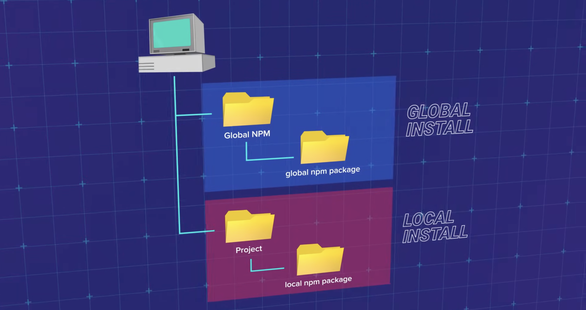
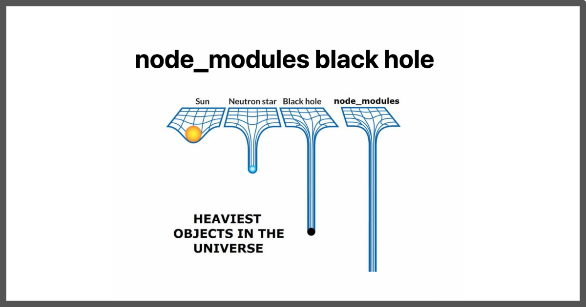

# NPM & Package Management

Understanding NPM and package management is essential for working with Node.js projects and managing dependencies effectively.

---

## Core Terminology

### What is NPM and Why Do We Need It?

**NPM** (Node Package Manager) is the main package manager for Node.js, helping to manage libraries and tools in the JavaScript/Node.js development environment. It is also the world's largest repository of open-source software for JavaScript, available for free use.

NPM consists of two main parts:

1. **NPM Registry** - A large public database of JavaScript packages
2. **NPM CLI** - Command-line tool to interact with the registry and manage packages

NPM comes bundled with Node.js installation, so you get it automatically when you install Node.js.

**Why NPM was created:** NPM was created in September 2009 by **Isaac Z. Schlueter**, one of the early developers who joined the founding and development team of Node.js.


In an interview with [Increment](https://increment.com/development/interview-with-isaac-z-schlueter-ceo-of-npm/), Isaac shared that while working at Yahoo, he was familiar with using package managers in the development workflow. However, when he transitioned to Node.js, he had to manually perform operations to integrate other people's code into projects - a manual and time-consuming process.

Recognizing the need to automate this process, Isaac wrote a Node program to do what he was still doing manually. That was the first version of npm. By early 2010, npm had evolved into a truly useful and usable tool, marking an important turning point in the JavaScript ecosystem.

> _"I can't with a clean conscience say that npm really prevents ever reinventing the wheel because there are so, so many wheels on npm. My hope is that it makes wheel reinvention easy and efficient, and keeps you from doing it unnecessarily."_

**Why we need NPM:**

NPM has revolutionized the JavaScript developer community, making sharing, reusing, and updating libraries extremely simple and efficient.

Thanks to npm, developers worldwide can easily access a repository of millions of open-source packages, saving development time and focusing on solving problems rather than rebuilding things that already exist. Moreover, npm helps projects maintain consistency, increase collaboration, and accelerate innovation in software development.

### Types of Packages in NPM

The npm repository contains millions of packages ranging from small to large scale:

- **Small Packages**: Like `chalk` - a library for coloring text in the terminal

- **Large Packages**: Like `tailwindcss` - a utility-first CSS framework with hundreds of utility classes

- **Frameworks**: Like `react`, `vue`, `angular` - popular JavaScript frameworks

- **Tools**: Like `webpack`, `vite` - build and bundling tools

### Installing Packages: Local vs Global

**Local Installation** (default):

```bash
npm install express
# or
npm install express --save
```

**Global Installation**:

```bash
npm install -g nodemon
# or
npm install --global nodemon
```



**Key Differences:**

| Aspect       | Local Installation       | Global Installation                                 |
| ------------ | ------------------------ | --------------------------------------------------- |
| Location     | `./node_modules`         | System-wide (usually `/usr/local/lib/node_modules`) |
| Availability | Only in current project  | System-wide, accessible from anywhere               |
| package.json | Added to dependencies    | Not added to package.json                           |
| Use case     | Application dependencies | CLI tools, global utilities                         |

### package.json

The `package.json` file is the manifest file for your Node.js project. It contains metadata about your project and its dependencies.


**Key fields in package.json:**

- `name` - Package name
- `version` - Package version (follows semantic versioning)
- `description` - Package description
- `main` - Entry point of the package
- `scripts` - Custom scripts you can run with `npm run`
- `dependencies` - Packages required for production
- `devDependencies` - Packages required only for development
- `keywords` - Keywords for package discovery
- `author` - Package author
- `license` - Package license

### Dependencies vs DevDependencies

**dependencies**: Packages required for your application to run in production. These are installed when someone runs `npm install` in production.

**devDependencies**: Packages required only during development (testing, building, linting, etc.). These are NOT installed in production by default.

### Semantic Versioning (SemVer)

Semantic versioning follows the format: `MAJOR.MINOR.PATCH`

- **MAJOR** - Breaking changes (incompatible API changes)
- **MINOR** - New features (backward compatible)
- **PATCH** - Bug fixes (backward compatible)


**Version ranges:**

- `^1.2.3` - Allows updates to any version >= 1.2.3 and < 2.0.0 (caret)
- `~1.2.3` - Allows updates to any version >= 1.2.3 and < 1.3.0 (tilde)
- `1.2.3` - Exact version
- `*` or `latest` - Latest version
- `>=1.2.3` - Greater than or equal to version

### package-lock.json

`package-lock.json` is automatically generated when you install packages. It locks the exact versions of all dependencies and their sub-dependencies, ensuring consistent installs across different environments.

**Key points:**

- Should be committed to version control
- Ensures everyone gets the same dependency versions
- Speeds up `npm install` by providing exact version information

### Dependencies Tree and node_modules

When you install a package, npm also installs all of its dependencies, and those dependencies' dependencies, creating a **dependency tree**. This tree structure is stored in the `node_modules` folder.

**The "node_modules black hole" meme:**



**Why node_modules gets so large:**

- Each package may have its own dependencies
- Dependencies can have their own sub-dependencies (transitive dependencies)
- Different packages might require different versions of the same dependency
- npm installs each version separately, leading to duplication

### NPM Scripts

NPM scripts are custom commands defined in the `scripts` field of `package.json`. They can be run using `npm run <script-name>`.

**Predefined scripts:**

- `npm start` - Runs the `start` script
- `npm test` - Runs the `test` script
- `npm run <script>` - Runs any custom script

---

## Examples and Explanation

### Example 1: Creating and Understanding package.json

**Initializing a new project:**

```bash
npm init
# or
npm init -y  # Skip questions and use defaults
```

**Example package.json:**

```json
{
  "name": "my-node-app",
  "version": "1.0.0",
  "description": "A sample Node.js application",
  "main": "index.js",
  "scripts": {
    "start": "node index.js",
    "dev": "node index.js",
    "test": "jest"
  },
  "keywords": ["nodejs", "example"],
  "author": "Your Name",
  "license": "MIT",
  "dependencies": {
    "express": "^4.18.2"
  },
  "devDependencies": {
    "jest": "^29.5.0"
  }
}
```

**Explanation:**

- `name` and `version` are required fields
- `scripts` allow you to define custom commands
- `dependencies` lists production packages
- `devDependencies` lists development-only packages

### Example 2: Installing Packages

**Install a production dependency:**

```bash
npm install express
# or
npm install express --save
# or short form
npm i express
```

**Install a development dependency:**

```bash
npm install jest --save-dev
# or short form
npm i jest -D
```

**Install exact version:**

```bash
npm install express@4.18.2
```

**Install from package.json:**

```bash
npm install
# Installs all dependencies listed in package.json
```

**Explanation:**

- `npm install <package>` adds the package to `dependencies` by default
- `--save-dev` or `-D` adds to `devDependencies`
- `npm install` without arguments installs all dependencies from `package.json`

### Example 3: NPM Scripts

**package.json scripts section:**

```json
{
  "scripts": {
    "start": "node index.js",
    "dev": "nodemon index.js",
    "test": "jest",
    "build": "webpack --mode production",
    "lint": "eslint .",
    "prestart": "echo 'Starting application...'",
    "poststart": "echo 'Application started!'"
  }
}
```

**Running scripts:**

```bash
npm start          # Runs "start" script
npm test           # Runs "test" script
npm run dev        # Runs "dev" script
npm run build      # Runs "build" script
npm run lint       # Runs "lint" script
```

**Explanation:**

- Scripts can run any command available in your system
- `pre` and `post` prefixes create lifecycle hooks (e.g., `prestart` runs before `start`)
- `npm start` and `npm test` are special - you can run them without `run`

### Example 4: Semantic Versioning in Practice

**package.json with version ranges:**

```json
{
  "dependencies": {
    "express": "^4.18.2",
    "lodash": "~4.17.21",
    "axios": "1.4.0",
    "moment": "*"
  }
}
```

**What gets installed:**

- `express`: Any version >= 4.18.2 and < 5.0.0 (e.g., 4.19.0, 4.20.1)
- `lodash`: Any version >= 4.17.21 and < 4.18.0 (e.g., 4.17.22, 4.17.25)
- `axios`: Exactly version 1.4.0
- `moment`: Latest available version

**Explanation:**

- `^` (caret) allows minor and patch updates
- `~` (tilde) allows only patch updates
- Exact version locks to that specific version
- `*` always installs the latest version

### Example 5: Updating and Removing Packages

**Update a specific package:**

```bash
npm update express
# or
npm up express
```

**Update all packages:**

```bash
npm update
```

**Check outdated packages:**

```bash
npm outdated
```

**Remove a package:**

```bash
npm uninstall express
# or
npm un express
# or
npm remove express
```

**Explanation:**

- `npm update` respects version ranges in `package.json`
- `npm outdated` shows which packages have newer versions available
- `npm uninstall` removes the package and updates `package.json` and `package-lock.json`

---

## References

- [NPM Official Documentation](https://docs.npmjs.com/)
- [package.json Documentation](https://docs.npmjs.com/cli/v9/configuring-npm/package-json)
- [Semantic Versioning](https://semver.org/)
- [NPM CLI Commands](https://docs.npmjs.com/cli/v9/commands)
