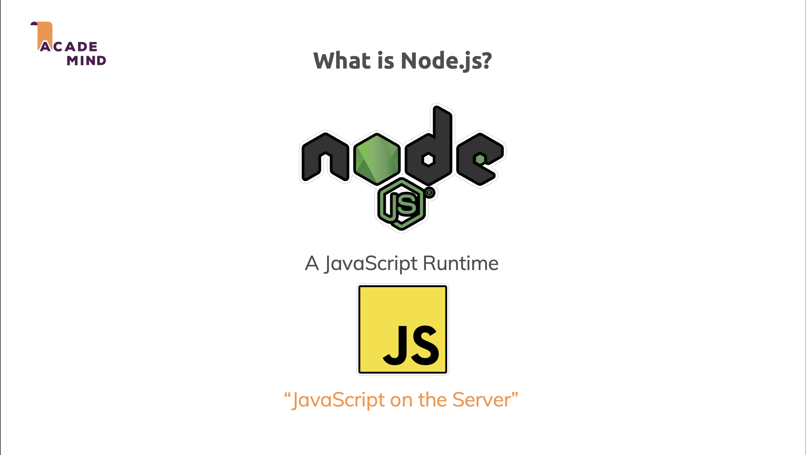
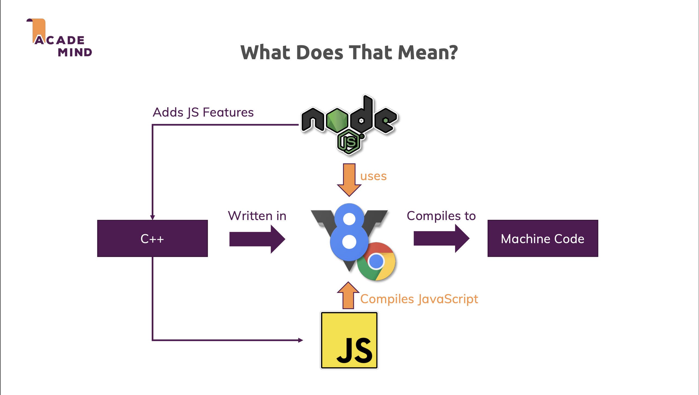
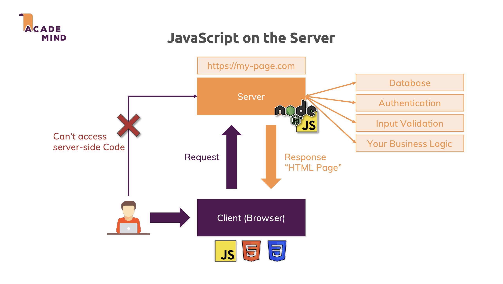
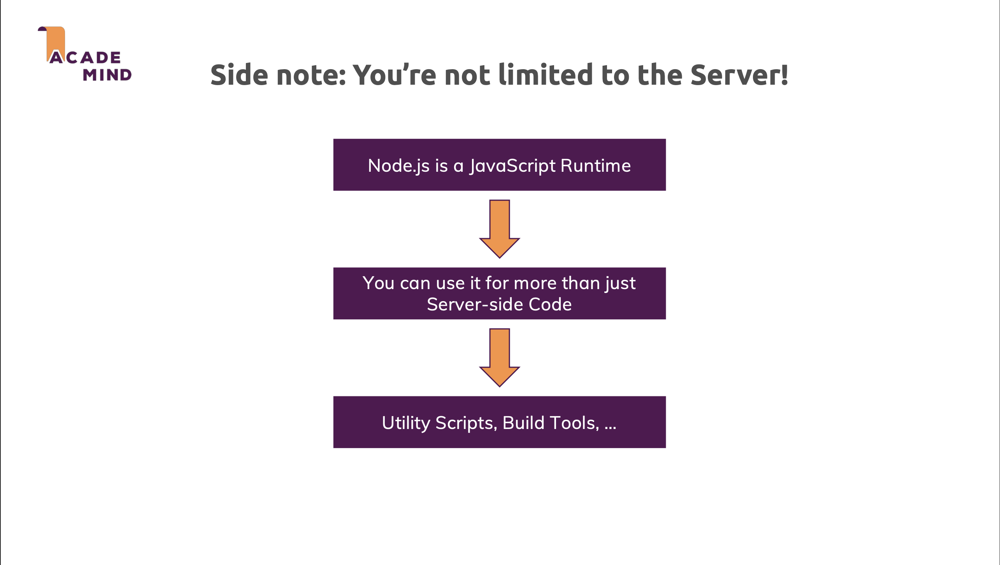
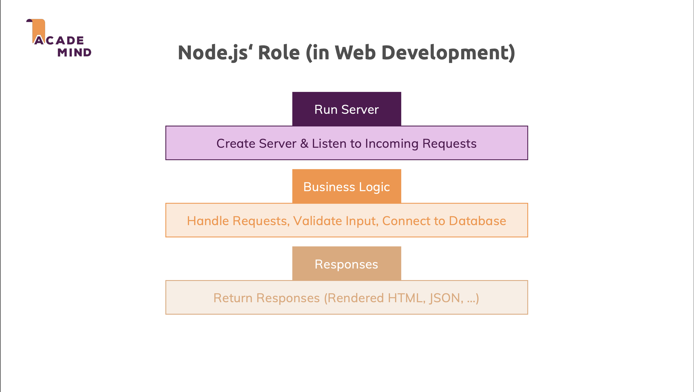
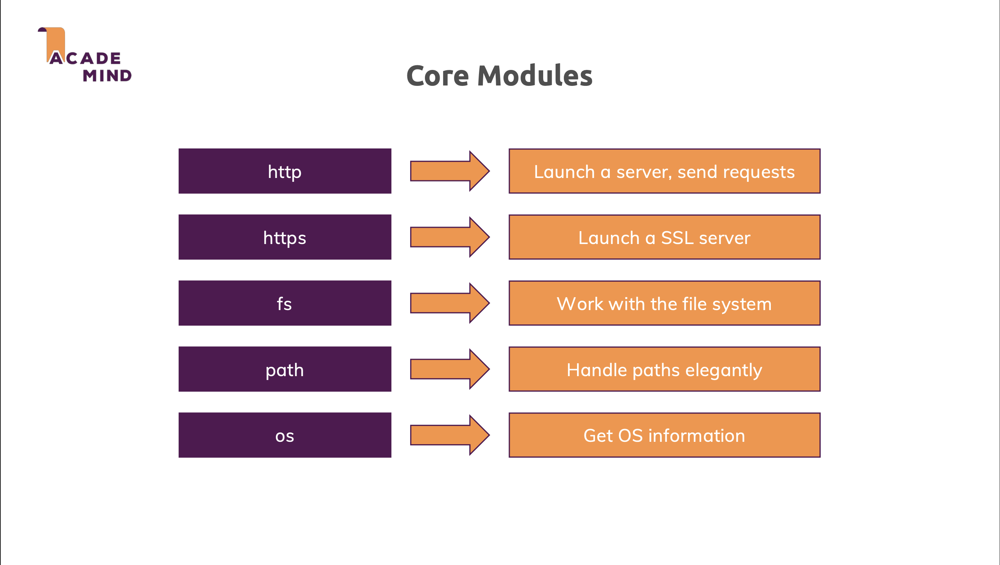
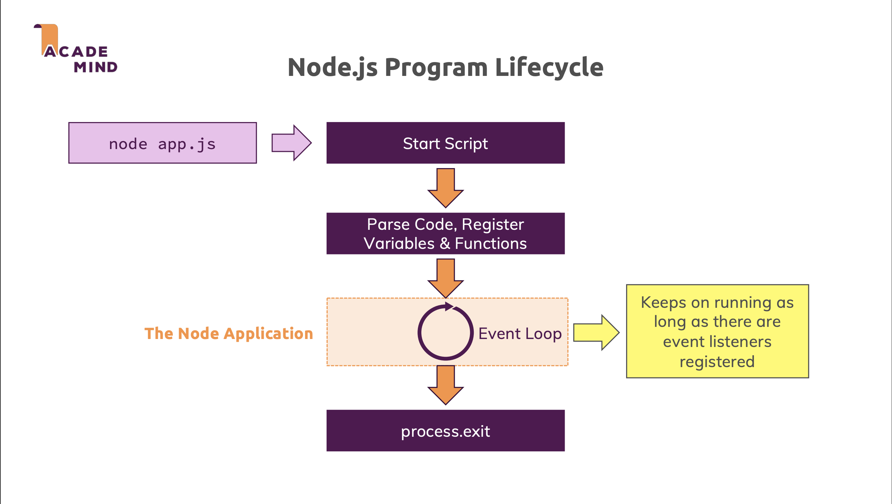
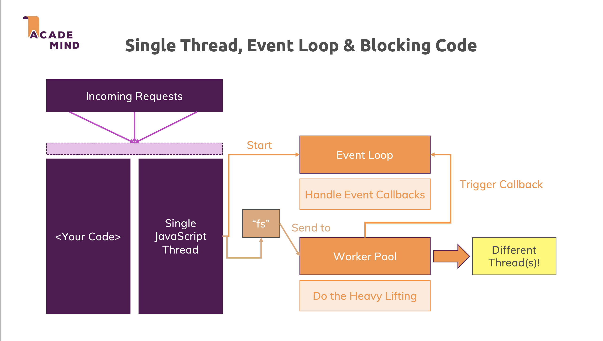
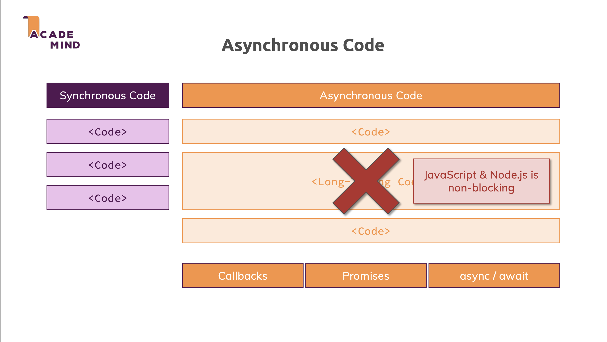
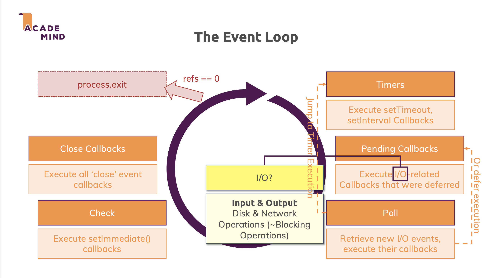

# Node.js Core Concepts

Node.js is a JavaScript runtime built on Chrome's V8 JavaScript engine. It uses an event-driven, non-blocking I/O model that makes it lightweight and efficient. Understanding Node.js core architecture is essential for writing performant applications and debugging effectively.

---

## Core Terminology

### What is Node.js?

**Node.js is a JavaScript Runtime** that enables **"JavaScript on the Server"**. While JavaScript was originally designed to run only in browsers, Node.js brings JavaScript to the server-side, allowing developers to use the same language for both frontend and backend development.



### Creator of Node.js

Node.js was created by **Ryan Dahl** in 2009. Dahl was frustrated with the limitations of existing server-side technologies and wanted to create a platform that could handle many concurrent connections efficiently. He presented Node.js at the JSConf EU conference in 2009, introducing the concept of event-driven, non-blocking I/O for server-side JavaScript.

**Ryan Dahl's Vision:**

- Enable JavaScript to run on the server
- Provide a simple way to build scalable network applications
- Leverage the asynchronous nature of JavaScript for I/O operations

### How Node.js Works



As shown in the diagram:

- **V8 Engine** is written in **C++** and compiles **JavaScript** code into **Machine Code**
- **Node.js** uses the **V8 Engine** to execute JavaScript
- **Node.js** is built with **C++**, which adds new features to JavaScript (like file system access, networking, etc.) that aren't available in browser JavaScript, enabling server-side functionality

### JavaScript on the Server



**Client-Server Interaction:**

- The **Client (Browser)** sends a **Request** to the **Server**
- The **Server** (powered by Node.js) processes the request and sends back a **Response** (typically JSON data)

**Server-side Capabilities (handled by Node.js):**

- **Database** - Data storage and retrieval
- **Authentication** - Verifying user identities
- **Input Validation** - Ensuring data integrity and security
- **Your Business Logic** - Implementing the core functionality of the application

> **Note:** The diagram shows "Response 'HTML Page'" which reflects older web architecture. Modern Node.js backends typically return JSON data (or other data formats) rather than HTML pages. The client-side JavaScript then handles rendering the UI based on this data.

### Side Note: You're not limited to the Server



**Node.js is a JavaScript Runtime** - You can use it for more than just server-side code. Beyond building web servers, Node.js is also commonly used for:

- **Utility Scripts** - Automation scripts, file processing, data manipulation
- **Build Tools** - Task runners, bundlers, and build automation (e.g., Webpack, Gulp, Grunt)
- **CLI Tools** - Command-line applications and developer tools
- **Desktop Applications** - Using frameworks like Electron
- **IoT Applications** - Internet of Things device programming

### Node.js' Role (in Web Development)



**Run Server**: creates a server and listens to incoming requests. This involves setting up an HTTP server that can accept connections from clients and wait for requests to be sent.

**Business Logic**: handles requests by processing them according to your application's business logic. This includes validating input data to ensure it meets requirements, and connecting to databases to retrieve or store data as needed.

**Responses**: returns responses to clients, which can be in various formats such as rendered HTML pages, JSON data, or other data formats depending on the application's needs.

### Core Modules



### Node.js Program Lifecycle



Every Node.js application follows a specific lifecycle from startup to termination. The program begins by parsing and registering code, then enters an Event Loop that processes asynchronous operations, and finally exits when there are no more active event listeners.

1. **Start Script**: When you run `node app.js`, Node.js starts executing your application.

2. **Parse Code, Register Variables & Functions**: Node.js parses the code and registers all variables and functions before execution begins.

3. **The Node Application / Event Loop**: The application enters the Event Loop, which keeps on running as long as there are event listeners registered. This is the core mechanism that allows Node.js to handle asynchronous operations and keep the application alive.

4. **process.exit**: The program terminates when there are no more active event listeners or when `process.exit()` is explicitly called.

### Single Thread, Event Loop & Blocking Code



Node.js uses a **Single JavaScript Thread** to execute your application code. When **Incoming Requests** arrive, they are processed through this single thread. The **Event Loop** handles event callbacks and manages asynchronous operations.

When your code encounters blocking operations (like file system operations with `fs`), Node.js doesn't wait for these operations to complete before executing other code. Instead, Node.js treats these blocking operations as **asynchronous code** and immediately sends them to a **Worker Pool** that performs the heavy lifting on **Different Thread(s)**. The main JavaScript thread continues executing other code without waiting. Once the blocking operation completes in the Worker Pool, it triggers a callback that returns to the Event Loop, which then handles the callback on the Single JavaScript Thread.

This architecture allows Node.js to handle many concurrent requests efficiently without blocking the main thread, even though JavaScript execution happens on a single thread.

### Asynchronous Code



**Synchronous Code**: In synchronous execution, code blocks execute one after another in a strict sequence. Each `<Code>` block must complete before the next one begins. If a long-running operation occurs, it blocks all subsequent code from executing until it finishes.

**Asynchronous Code**: JavaScript & Node.js is non-blocking. When Node.js encounters blocking operations (which are handled as asynchronous code), it doesn't wait for them to complete. Instead, Node.js immediately delegates these operations to the Worker Pool and continues executing subsequent code. The long-running operation is processed in the background on different threads, allowing other code to continue running. This is how Node.js achieves non-blocking behavior - by treating potentially blocking operations as asynchronous and offloading them to the Worker Pool.

**Asynchronous Patterns**: Node.js provides several patterns to handle asynchronous operations:

- **Callbacks** - Functions passed as arguments to be executed after an operation completes
- **Promises** - Objects representing the eventual completion or failure of an asynchronous operation
- **async / await** - Syntactic sugar built on Promises that makes asynchronous code look and behave more like synchronous code

### The Event Loop



The Event Loop is Node.js's core mechanism for handling asynchronous operations. It works by monitoring the **Call Stack** and moving functions from various queues into the Call Stack for execution.

**How Event Loop Works:**

1. **Call Stack is Empty**: The Event Loop only processes tasks when the Call Stack is empty. This ensures that synchronous code always completes before asynchronous callbacks are executed.

2. **Microtask Queue** (higher priority): Contains callbacks that need to be executed immediately after the current operation completes:

   - `process.nextTick()` callbacks (highest priority)
   - Promise callbacks (`.then()`, `.catch()`, `.finally()`)

   The Event Loop processes **all** microtasks before moving to macrotasks.

3. **Macrotask Queue** (lower priority): Contains callbacks that are executed after microtasks:
   - **Timers**: `setTimeout()` and `setInterval()` callbacks
   - **I/O Callbacks**: File system, network operations
   - **setImmediate()**: Callbacks scheduled with `setImmediate()`
   - **Close Callbacks**: `close` event handlers

**Execution Flow:**

1. Execute synchronous code (fills Call Stack)
2. When Call Stack is empty, Event Loop checks microtask queue first
3. Process ALL microtasks until the queue is empty
4. Then process ONE macrotask from the macrotask queue
5. Repeat from step 2

> **Note:** Within each queue (microtask or macrotask), callbacks are executed in the order they were added (FIFO - First In First Out). There is no priority system within the same queue - the execution order depends solely on which callback entered the queue first. Priority only exists between different queue types (microtasks are processed before macrotasks).

**Process Termination**: The Event Loop continues running as long as there are active references (pending timers, I/O operations, or other active handles). When `refs == 0` (no more active references), the process exits.

---

## Examples and Explanation

### Event Loop Order Examples

#### Example 1: Basic Event Loop Order

```javascript
console.log("1. Start");

setTimeout(() => {
  console.log("2. setTimeout");
}, 0);

setImmediate(() => {
  console.log("3. setImmediate");
});

process.nextTick(() => {
  console.log("4. nextTick");
});

Promise.resolve().then(() => {
  console.log("5. Promise");
});

console.log("6. End");
```

**Output:**

```plaintext
1. Start
6. End
4. nextTick
5. Promise
2. setTimeout
3. setImmediate
```

**Explanation:**

- Synchronous code runs first (`1. Start`, `6. End`)
- `process.nextTick()` has the highest priority in the microtask queue
- Promise callbacks run after `nextTick` but before timers
- `setTimeout` and `setImmediate` order can vary depending on the context

#### Example 2: Microtask vs Macrotask Priority

```javascript
console.log("1. Start");

setTimeout(() => console.log("2. setTimeout"), 0);

Promise.resolve().then(() => {
  console.log("3. Promise 1");
  Promise.resolve().then(() => {
    console.log("4. Promise 2 (nested)");
  });
});

setTimeout(() => console.log("5. setTimeout 2"), 0);

process.nextTick(() => {
  console.log("6. nextTick 1");
  process.nextTick(() => {
    console.log("7. nextTick 2 (nested)");
  });
});

console.log("8. End");
```

**Output:**

```plaintext
1. Start
8. End
6. nextTick 1
7. nextTick 2 (nested)
3. Promise 1
4. Promise 2 (nested)
2. setTimeout
5. setTimeout 2
```

**Explanation:**

- Synchronous code runs first (`1. Start`, `8. End`)
- All microtasks (`nextTick` and Promises) are processed completely before any macrotask
- `nextTick` has higher priority than Promises within microtasks
- Nested microtasks are processed immediately, not deferred
- Macrotasks (`setTimeout`) are processed only after all microtasks are done

#### Example 3: Event Loop Phases in I/O Callbacks

```javascript
const fs = require("fs");

console.log("1. Start");

setTimeout(() => console.log("2. Timer"), 0);
setImmediate(() => console.log("3. Immediate"));

fs.readFile(__filename, () => {
  console.log("4. I/O callback");

  setTimeout(() => console.log("5. Timer in I/O"), 0);
  setImmediate(() => console.log("6. Immediate in I/O"));

  process.nextTick(() => console.log("7. nextTick in I/O"));
});

process.nextTick(() => console.log("8. nextTick"));

Promise.resolve().then(() => console.log("9. Promise"));

console.log("10. End");
```

**Output:**

```plaintext
1. Start
10. End
8. nextTick
9. Promise
2. Timer
3. Immediate
4. I/O callback
7. nextTick in I/O
6. Immediate in I/O
5. Timer in I/O
```

**Explanation:**

- Shows the order of execution across different event loop phases
- Demonstrates how `nextTick` and Promises are prioritized
- Shows that `setImmediate` runs before `setTimeout` in I/O callbacks

### Example 4: Blocking vs Non-blocking I/O

**Blocking (Synchronous):**

```javascript
const fs = require("fs");

console.log("Start reading file");
const data = fs.readFileSync("large-file.txt", "utf8");
console.log("File read complete");
console.log("Do other work");
```

**Non-blocking (Asynchronous):**

```javascript
const fs = require("fs");

console.log("Start reading file");
fs.readFile("large-file.txt", "utf8", (err, data) => {
  if (err) throw err;
  console.log("File read complete");
});
console.log("Do other work");
```

**Explanation:**

- Synchronous operations block the event loop until completion
- Asynchronous operations allow other code to execute while waiting for I/O
- Non-blocking approach is essential for handling multiple concurrent operations

---

## References

- [Node.js Official Documentation](https://nodejs.org/docs)
- [The Node.js Event Loop](https://nodejs.org/en/docs/guides/event-loop-timers-and-nexttick/)
- [Blocking vs Non-blocking](https://nodejs.org/en/docs/guides/blocking-vs-non-blocking/)
- [libuv Documentation](http://docs.libuv.org/)
- [V8 Engine Documentation](https://v8.dev/docs)
