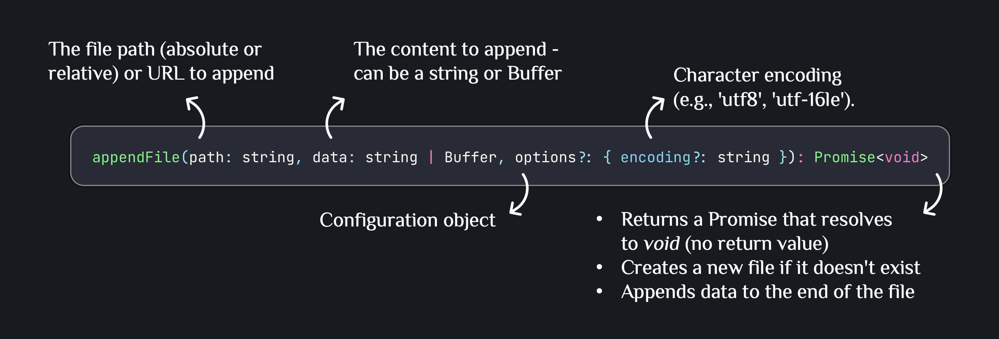
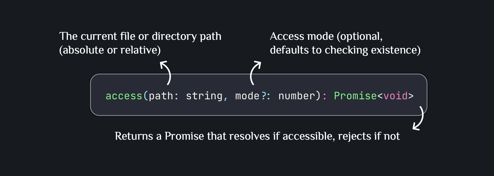
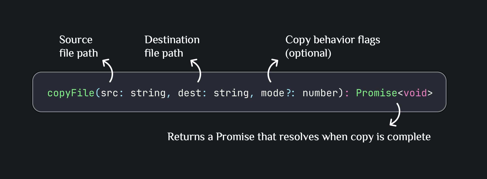

# Node.js File System Guide

## Core Terminology

### What is the fs Module?

The `fs` (file system) module is a built-in Node.js module that provides both **synchronous** and **asynchronous** methods for file system operations. It enables your Node.js application to interact with files and directories on your computer.

### Key Concepts

**File System Operations**: Actions performed on files and directories such as reading, writing, creating, deleting, and modifying.

**Buffer**: A temporary storage area for binary data. When reading files without specifying an encoding, Node.js returns a Buffer object.

**Encoding**: The character encoding used to interpret file contents as text (e.g., `utf8`, `ascii`, `base64`).

**Dirent**: Directory entry object that contains information about files and directories, including their type.

### Synchronous vs Asynchronous Operations

| Aspect            | Asynchronous (Recommended)                     | Synchronous (Limited use)                                  |
| ----------------- | ---------------------------------------------- | ---------------------------------------------------------- |
| Execution         | Returns a Promise; executed with `async/await` | Blocks execution until complete                            |
| Event Loop        | Does not block the event loop                  | Blocks the event loop                                      |
| Production Use    | Preferred for production backend code          | Avoid in runtime code (acceptable for startup or CLI only) |
| Method Naming     | Methods without `Sync` suffix                  | Methods with `Sync` suffix                                 |
| Examples          | `readFile`, `writeFile`, `readdir`             | `readFileSync`, `writeFileSync`, `readdirSync`             |
| Error Handling    | `try/catch` on Promise rejection               | `try/catch` for thrown errors                              |
| Concurrency       | Scales well with concurrent requests           | Prevents concurrency while running                         |
| Typical Use Cases | API handlers, services, background jobs        | App bootstrap, scripts, tooling                            |
| Recommendation    | Default choice                                 | Exception only                                             |

### Real-world Applications

**File Upload & Storage**: Saving user-uploaded files (images, PDFs, documents) to the server.

**Logging Systems**: Writing application logs, error reports, and audit trails to files.

**Data Export**: Generating reports in various formats (CSV, JSON, Excel) for download.

**File Processing**: Reading, transforming, and writing data files in batch operations.

**Caching**: Storing computed results or API responses to disk for faster retrieval.

**Configuration Management**: Reading and writing application configuration files.

---

## Common File System Methods

### 1. `readFile()`

**Purpose**: Reads the entire contents of a file into memory.


#### Example 1: Reading a text file

```typescript
import { readFile } from "fs/promises";

async function readConfigFile() {
  try {
    const content = await readFile("config.json", "utf8");
    const config = JSON.parse(content);
    console.log("Configuration loaded:", config);
  } catch (error) {
    console.error("Error reading config:", error);
  }
}

readConfigFile();
```

**Explanation**: Reads the entire file into memory as a string when encoding is specified. This is ideal for small to medium files like configuration files, but not suitable for very large files (use streams for those).

#### Example 2: Reading without encoding (Buffer)

```typescript
import { readFile } from "fs/promises";

async function readImageFile() {
  try {
    const buffer = await readFile("avatar.png");
    console.log("File size:", buffer.length, "bytes");
    console.log("First 10 bytes:", buffer.slice(0, 10));
  } catch (error) {
    console.error("Error reading image:", error);
  }
}

readImageFile();
```

**Explanation**: Without encoding, `readFile()` returns a Buffer containing raw binary data. This is useful for images, videos, or any non-text files that need to be processed or transmitted.

---

### 2. `writeFile()`

**Purpose**: Writes data to a file, creating the file if it doesn't exist or overwriting it if it does.


#### Example 1: Writing JSON data

```typescript
import { writeFile } from "fs/promises";

async function saveUserData(userId: string, userData: object) {
  try {
    const jsonData = JSON.stringify(userData, null, 2);
    await writeFile(`users/${userId}.json`, jsonData, "utf8");
    console.log("User data saved successfully");
  } catch (error) {
    console.error("Error saving user data:", error);
  }
}

const user = { name: "John Doe", email: "john@example.com", age: 30 };
saveUserData("user123", user);
```

**Explanation**: Converts an object to JSON and writes it to a file. The file is created if it doesn't exist, or completely overwritten if it does. Parent directories must exist beforehand.

#### Real-world Example: Generating CSV export

```typescript
import { writeFile } from "fs/promises";

interface Product {
  id: string;
  name: string;
  price: number;
  stock: number;
}

async function exportProductsToCSV(products: Product[]) {
  try {
    const headers = "ID,Name,Price,Stock\n";
    const rows = products
      .map((p) => `${p.id},${p.name},${p.price},${p.stock}`)
      .join("\n");

    const csv = headers + rows;
    const filename = `products_export_${Date.now()}.csv`;

    await writeFile(`exports/${filename}`, csv, "utf8");
    console.log(`Export completed: ${filename}`);
  } catch (error) {
    console.error("Export failed:", error);
  }
}

const products = [
  { id: "P001", name: "Laptop", price: 999.99, stock: 15 },
  { id: "P002", name: "Mouse", price: 29.99, stock: 50 },
];

exportProductsToCSV(products);
```

**Explanation**: Creates a CSV file from structured data. This pattern is common in admin panels, reporting systems, or data export features where users need to download data.

---

### 3. `appendFile()`

**Purpose**: Appends data to a file, creating the file if it doesn't exist.



#### Real-world Example: Application logging

```typescript
import { appendFile } from "fs/promises";

interface LogEntry {
  timestamp: Date;
  level: "INFO" | "WARN" | "ERROR";
  message: string;
  context?: object;
}

async function log(entry: LogEntry) {
  try {
    const logLine = `[${entry.timestamp.toISOString()}] ${entry.level}: ${
      entry.message
    }\n`;
    await appendFile("app.log", logLine, "utf8");
  } catch (error) {
    console.error("Failed to write log:", error);
  }
}

// Usage
log({
  timestamp: new Date(),
  level: "INFO",
  message: "User logged in",
  context: { userId: "user123" },
});

log({
  timestamp: new Date(),
  level: "ERROR",
  message: "Database connection failed",
});
```

**Explanation**: Appends log entries to a file without overwriting existing content. This is essential for logging systems where you need to preserve historical data. Each call adds to the end of the file.

---

### 4. `readdir()`

**Purpose**: Reads the contents of a directory, returning an array of file and directory names.


#### Example 1: List directory contents

```typescript
import { readdir } from "fs/promises";

async function listFiles() {
  try {
    const files = await readdir("./uploads");
    console.log("Files in uploads:", files);
  } catch (error) {
    console.error("Error reading directory:", error);
  }
}

listFiles();
```

**Explanation**: Returns an array of file and folder names in the specified directory. This is non-recursive, meaning it only shows direct children, not nested contents.

#### Real-world Example: File organization by type

```typescript
import { readdir } from "fs/promises";
import { extname } from "path";

async function organizeFilesByType(directory: string) {
  try {
    const entries = await readdir(directory, { withFileTypes: true });

    const organized = {
      images: [] as string[],
      documents: [] as string[],
      videos: [] as string[],
      others: [] as string[],
    };

    for (const entry of entries) {
      if (!entry.isFile()) continue;

      const ext = extname(entry.name).toLowerCase();

      if ([".jpg", ".jpeg", ".png", ".gif"].includes(ext)) {
        organized.images.push(entry.name);
      } else if ([".pdf", ".doc", ".docx", ".txt"].includes(ext)) {
        organized.documents.push(entry.name);
      } else if ([".mp4", ".avi", ".mov"].includes(ext)) {
        organized.videos.push(entry.name);
      } else {
        organized.others.push(entry.name);
      }
    }

    console.log("Organized files:", organized);
    return organized;
  } catch (error) {
    console.error("Error organizing files:", error);
  }
}

organizeFilesByType("./uploads");
```

**Explanation**: Uses `withFileTypes: true` to get `Dirent` objects, which provide `isFile()` and `isDirectory()` methods without additional `stat` calls. This is more efficient than checking each entry separately.

---

### 5. `mkdir()`

**Purpose**: Creates a directory, optionally creating parent directories.


#### Example: Creating nested directories

```typescript
import { mkdir } from "fs/promises";

async function setupProjectStructure() {
  try {
    await mkdir("project/src/components", { recursive: true });
    await mkdir("project/src/utils", { recursive: true });
    await mkdir("project/public/images", { recursive: true });
    await mkdir("project/config", { recursive: true });

    console.log("Project structure created successfully");
  } catch (error) {
    console.error("Error creating directories:", error);
  }
}

setupProjectStructure();
```

**Explanation**: With `recursive: true`, `mkdir()` creates all necessary parent directories. If the directory already exists, no error is thrown. This is perfect for ensuring required folder structures exist before file operations.

---

### 6. `rm()`

**Purpose**: Removes files or directories, with options for recursive deletion.


#### Example: Remove a single file

```typescript
import { rm } from "fs/promises";

async function deleteOldLog() {
  try {
    await rm("logs/old-app.log");
    console.log("Old log file deleted");
  } catch (error) {
    console.error("Error deleting file:", error);
  }
}

deleteOldLog();
```

**Explanation**: Removes a single file. Throws an error if the file doesn't exist unless `force: true` is used.

### 7. `stat()`

**Purpose**: Retrieves information about a file or directory.


#### Example: File information checker

```typescript
import { stat } from "fs/promises";

async function getFileInfo(filePath: string) {
  try {
    const info = await stat(filePath);

    console.log("File information:");
    console.log("Size:", info.size, "bytes");
    console.log("Created:", info.birthtime);
    console.log("Modified:", info.mtime);
    console.log("Is file:", info.isFile());
    console.log("Is directory:", info.isDirectory());
  } catch (error) {
    console.error("Error getting file info:", error);
  }
}

getFileInfo("data.txt");
```

**Explanation**: Provides detailed metadata about a file or directory. Use `isFile()` and `isDirectory()` to determine the type without additional checks.

#### Real-world Example: File size validation before upload

```typescript
import { stat } from "fs/promises";

async function validateFileSize(
  filePath: string,
  maxSizeMB: number
): Promise<boolean> {
  try {
    const info = await stat(filePath);
    const maxSizeBytes = maxSizeMB * 1024 * 1024;

    if (info.size > maxSizeBytes) {
      console.error(`File exceeds ${maxSizeMB}MB limit`);
      return false;
    }

    console.log(`File size: ${(info.size / 1024 / 1024).toFixed(2)}MB - Valid`);
    return true;
  } catch (error) {
    console.error("Error validating file:", error);
    return false;
  }
}

validateFileSize("upload.pdf", 5); // Max 5MB
```

**Explanation**: Checks file size before processing to prevent uploading files that exceed size limits. This helps maintain storage quotas and prevents performance issues.

---

### 8. `rename()`

**Purpose**: Renames a file or moves it to a different location.


#### Example: Simple file rename

```typescript
import { rename } from "fs/promises";

async function renameFile() {
  try {
    await rename("draft.txt", "final.txt");
    console.log("File renamed successfully");
  } catch (error) {
    console.error("Error renaming file:", error);
  }
}

renameFile();
```

**Explanation**: Changes the file name or moves it to a new location on the same file system. Overwrites the destination if it already exists.

### 9. `access()`

**Purpose**: Tests whether a file or directory exists and is accessible.



#### Example: Check if file exists

```typescript
import { access } from "fs/promises";

async function fileExists(filePath: string): Promise<boolean> {
  try {
    await access(filePath);
    return true;
  } catch {
    return false;
  }
}

// Usage
const exists = await fileExists("config.json");
console.log("Config exists:", exists);
```

**Explanation**: Attempts to access the file. If successful, the file exists and is accessible. If it throws an error, the file doesn't exist or isn't accessible.

#### Real-world Example: Safe file operations

```typescript
import { access, readFile, writeFile } from "fs/promises";

async function updateConfigSafely(newConfig: object) {
  const configPath = "config.json";
  const backupPath = "config.backup.json";

  try {
    // Check if config exists
    const exists = await access(configPath)
      .then(() => true)
      .catch(() => false);

    if (exists) {
      // Backup existing config
      const currentConfig = await readFile(configPath, "utf8");
      await writeFile(backupPath, currentConfig, "utf8");
      console.log("Backup created");
    }

    // Write new config
    await writeFile(configPath, JSON.stringify(newConfig, null, 2), "utf8");
    console.log("Config updated successfully");
  } catch (error) {
    console.error("Error updating config:", error);
    throw error;
  }
}

updateConfigSafely({ apiUrl: "https://api.example.com", timeout: 5000 });
```

**Explanation**: Creates a backup before modifying important files. Using `access()` to check existence prevents errors and allows graceful handling of missing files.

---

### 10. `copyFile()`

**Purpose**: Copies a file from one location to another.



#### Example: Simple file copy

```typescript
import { copyFile } from "fs/promises";

async function backupFile() {
  try {
    await copyFile("important.txt", "important.backup.txt");
    console.log("Backup created");
  } catch (error) {
    console.error("Error creating backup:", error);
  }
}

backupFile();
```

**Explanation**: Creates a copy of the file at the destination. Overwrites the destination if it already exists.

#### Real-world Example: Backup system

```typescript
import { copyFile, mkdir } from "fs/promises";
import { basename, join } from "path";

async function createBackup(filePath: string): Promise<string> {
  try {
    const backupDir = join("backups", new Date().toISOString().split("T")[0]);
    await mkdir(backupDir, { recursive: true });

    const filename = basename(filePath);
    const timestamp = Date.now();
    const backupName = `${timestamp}_${filename}`;
    const backupPath = join(backupDir, backupName);

    await copyFile(filePath, backupPath);
    console.log(`Backup created: ${backupPath}`);
    return backupPath;
  } catch (error) {
    console.error("Backup failed:", error);
    throw error;
  }
}

// Usage
createBackup("database.json");
// Creates: backups/2024-01-04/1704380400000_database.json
```

**Explanation**: Creates dated backups with timestamps to prevent overwrites. This pattern is useful for versioning important files or implementing backup rotations.

---

## Best Practices

1. **Always use async methods in production**: Avoid blocking the event loop with synchronous operations.

```typescript
// ❌ Bad - Blocks event loop
import { readFileSync } from "fs";
const data = readFileSync("file.txt", "utf8");

// ✅ Good - Non-blocking
import { readFile } from "fs/promises";
const data = await readFile("file.txt", "utf8");
```

2. **Handle errors appropriately**: Always wrap file operations in try-catch blocks.

```typescript
// ✅ Good
try {
  const content = await readFile("config.json", "utf8");
  const config = JSON.parse(content);
} catch (error) {
  console.error("Failed to load config:", error);
  // Provide fallback or exit gracefully
}
```

3. **Check file existence before operations**: Use `access()` to prevent errors.

```typescript
import { access, readFile } from "fs/promises";

async function safeRead(path: string) {
  try {
    await access(path);
    return await readFile(path, "utf8");
  } catch {
    console.log("File not found, using defaults");
    return "{}";
  }
}
```

4. **Create parent directories before writing**: Ensure the directory structure exists.

```typescript
import { mkdir, writeFile } from "fs/promises";
import { dirname } from "path";

async function safeWrite(path: string, content: string) {
  await mkdir(dirname(path), { recursive: true });
  await writeFile(path, content, "utf8");
}
```

5. **Use appropriate encodings**: Specify encoding for text files, omit for binary files.

```typescript
// Text files
const text = await readFile("data.txt", "utf8");

// Binary files
const buffer = await readFile("image.png");
```

6. **Clean up temporary files**: Remove temporary files after use to prevent disk space issues.

```typescript
import { rm } from "fs/promises";

async function processWithCleanup(tempPath: string) {
  try {
    // Process file
    const data = await readFile(tempPath);
    // ... processing logic
  } finally {
    // Always clean up, even if processing fails
    await rm(tempPath, { force: true });
  }
}
```

---

## References

- [Node.js fs Module Documentation](https://nodejs.org/api/fs.html)
- [fs.promises API](https://nodejs.org/api/fs.html#fs_fs_promises_api)
- [File System Best Practices](https://nodejs.org/en/docs/guides/working-with-different-filesystems/)
- [Node.js Error Handling Best Practices](https://github.com/goldbergyoni/nodebestpractices#2-error-handling-practices)
