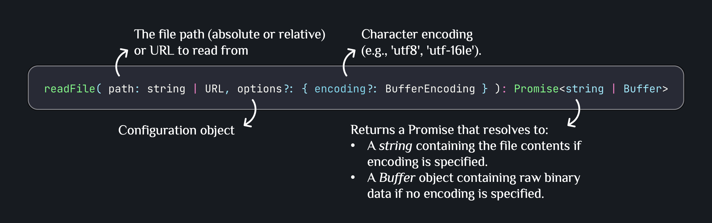
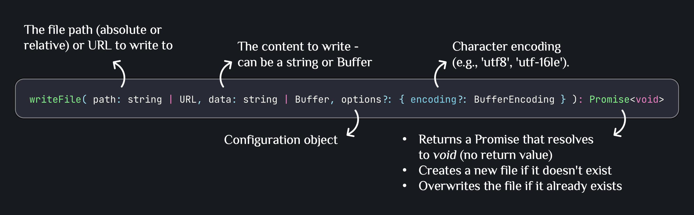
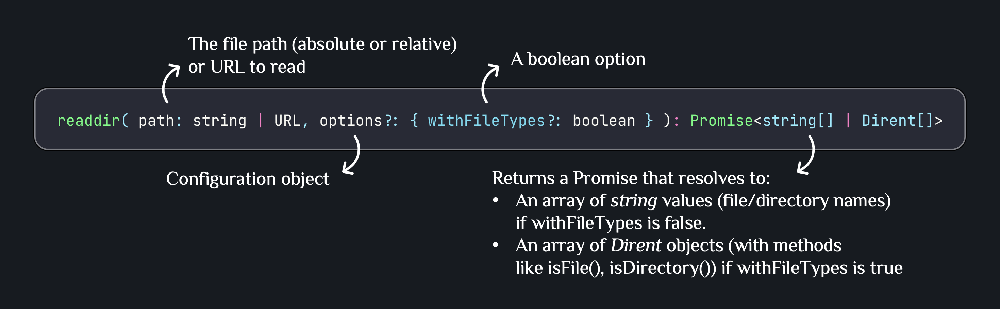
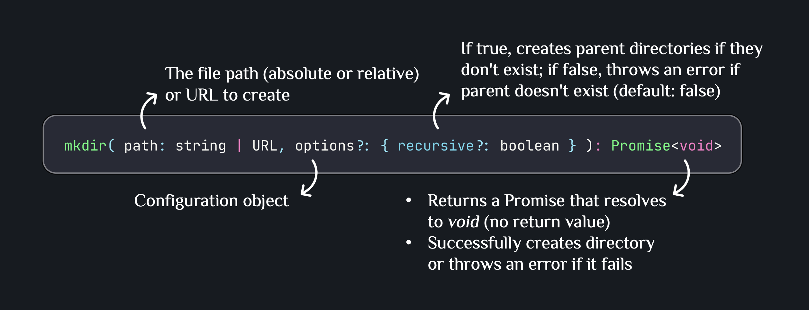
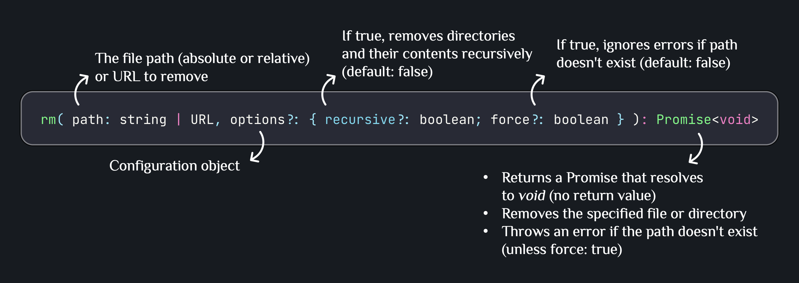
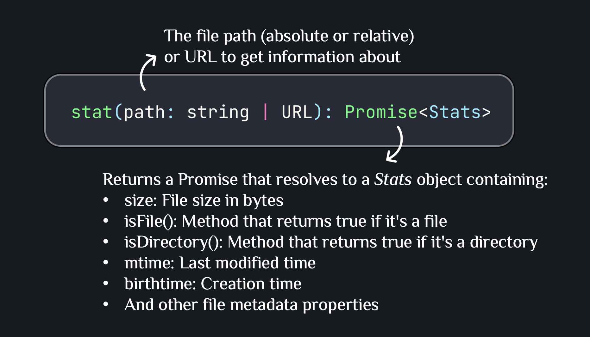
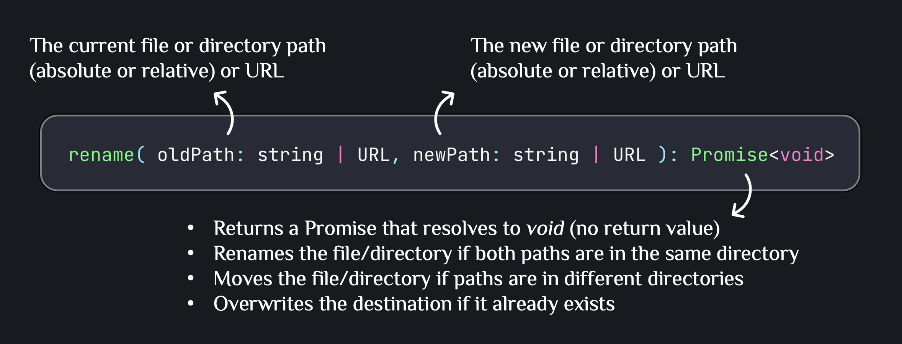

# File System Basics

The `fs` module in Node.js provides an API for interacting with the file system. It allows you to read, write, create, delete, and manipulate files and directories. Understanding file system operations is crucial for building applications that need to persist or process data.

---

## Core Terminology

### What is the fs Module?

The `fs` (file system) module is a built-in Node.js module that provides both **synchronous** and **asynchronous** methods for file system operations. It enables your Node.js application to interact with files and directories on your computer.

### Synchronous vs Asynchronous Operations (Modern Node.js)

| Aspect            | Asynchronous (Non-blocking – Recommended)               | Synchronous (Blocking – Limited use)                       |
| ----------------- | ------------------------------------------------------- | ---------------------------------------------------------- |
| Execution         | Returns a Promise; executed with `async/await`          | Blocks execution until the operation completes             |
| Event Loop        | Does not block the event loop                           | Blocks the event loop                                      |
| Production Use    | Preferred for production backend code                   | Avoid in runtime code (acceptable for startup or CLI only) |
| Method Naming     | Methods without `Sync` suffix                           | Methods with `Sync` suffix                                 |
| Examples          | `readFile`, `writeFile`, `readdir` (from `fs/promises`) | `readFileSync`, `writeFileSync`, `readdirSync`             |
| Error Handling    | `try/catch` on Promise rejection                        | `try/catch` for thrown errors                              |
| Concurrency       | Scales well with concurrent requests                    | Prevents concurrency while running                         |
| Typical Use Cases | API handlers, services, background jobs                 | App bootstrap, scripts, tooling                            |
| Recommendation    | Default choice                                          | Exception only                                             |

### Where is fs used in real applications?

- Upload & save user files (images, PDFs)
- Logging (write logs to files)
- Export reports (CSV, JSON)
- Temporary file processing
- Server-side caching

### Importing the fs module (ES Modules (Node.js 14+)):

```typescript
import {
  readFile,
  writeFile,
  readdir,
  mkdir,
  rm,
  stat,
  rename,
} from "fs/promises";
```

---

## Examples and Explanation

### Example 1: Read a File



**Basic async read (text file):**

```typescript
import { readFile } from "fs/promises";

async function readFileExample() {
  try {
    const content = await readFile("data.txt", "utf8");
    console.log(content);
  } catch (error) {
    console.error("Error reading file:", error);
  }
}

readFileExample();
```

**Explanation:**

- Reads the entire file into memory; not ideal for very large files (consider streams for those)
- Returns a string when an encoding is provided; otherwise you get a `Buffer`
- Throws if the path is missing or inaccessible, so wrap in `try/catch`
- Non-blocking, making it safe for request handlers and background jobs

### Example 2: Write a File



**Write or overwrite text file:**

```typescript
import { writeFile } from "fs/promises";

async function writeFileExample() {
  try {
    await writeFile("output.txt", "Hello Node.js", "utf8");
    console.log("File written successfully");
  } catch (error) {
    console.error("Error writing file:", error);
  }
}

writeFileExample();
```

**Explanation:**

- Creates a new file or overwrites an existing one in a single call
- Does not create parent folders—ensure the target directory exists first
- Uses the provided encoding when writing strings; also accepts `Buffer`
- Commonly used to persist API responses, exports, or cached data

### Example 3: Read Directory Contents



**List current directory (names only):**

```typescript
import { readdir } from "fs/promises";

async function readdirExample() {
  try {
    const files = await readdir("./");
    console.log(files);
  } catch (error) {
    console.error("Error reading directory:", error);
  }
}

readdirExample();
```

**List with Dirent metadata:**

```typescript
async function readdirWithTypesExample() {
  try {
    const entries = await readdir("./", { withFileTypes: true });

    entries.forEach((entry) => {
      console.log(entry.isDirectory() ? "Dir:" : "File:", entry.name);
    });
  } catch (error) {
    console.error("Error reading directory:", error);
  }
}

readdirWithTypesExample();
```

**Explanation:**

- Reads directory entries non-recursively; use `path.join` for nested paths
- `withFileTypes: true` returns `Dirent` objects so you can check `isFile()`/`isDirectory()` without extra `stat` calls
- Does not sort results; order is filesystem-dependent
- Useful for folder scans, simple file browsers, or filtering by type

### Example 4: Create a Directory



**Create nested directory safely:**

```typescript
import { mkdir } from "fs/promises";

async function mkdirExample() {
  try {
    await mkdir("uploads/images", { recursive: true });
    console.log("Directory created successfully");
  } catch (error) {
    console.error("Error creating directory:", error);
  }
}

mkdirExample();
```

**Explanation:**

- Creates the target path; with `recursive: true` it builds any missing parents
- No error is thrown if the folder already exists
- Still fails on permission issues, so handle errors when writing system paths
- Pair with `path.resolve` to avoid accidental relative-path surprises

### Example 5: Remove Files or Directories



**Remove a path (file or directory):**

```typescript
import { rm } from "fs/promises";

async function rmExample() {
  try {
    await rm("temp", { recursive: true, force: true });
    console.log("Removed successfully");
  } catch (error) {
    console.error("Error removing:", error);
  }
}

rmExample();
```

**Explanation:**

- Removes files or entire directory trees when `recursive: true` is set
- `force: true` skips errors for missing paths but still fails on permission problems
- Destructive and non-recoverable; double-check paths before calling
- Useful for cleanup scripts, temp folders, or reset commands

### Example 6: Get File Statistics



**Inspect file metadata:**

```typescript
import { stat } from "fs/promises";

async function statExample() {
  try {
    const info = await stat("data.txt");

    console.log(info.size);
    console.log(info.isFile());
    console.log(info.isDirectory());
  } catch (error) {
    console.error("Error getting file stats:", error);
  }
}

statExample();
```

**Explanation:**

- Retrieves size, timestamps, and type checks for a path
- Use `isFile()`/`isDirectory()` to branch logic without extra I/O
- Throws if the path is missing; catch to treat absence as "not found"
- Handy for validation before reads/writes or for basic health checks

### Example 7: Rename or Move a File



**Rename or move a path:**

```typescript
import { rename } from "fs/promises";

async function renameExample() {
  try {
    await rename("old-name.txt", "new-name.txt");
    console.log("File renamed successfully");
  } catch (error) {
    console.error("Error renaming file:", error);
  }
}

renameExample();
```

**Explanation:**

- Renames or moves files/directories; works across folders on the same volume
- Overwrites the destination if it exists, so pick target paths carefully
- Can fail when moving across devices or when the target is in use
- Use to implement simple moves, archival rotations, or temporary file swaps

---

## References

- [Node.js fs Module Documentation](https://nodejs.org/api/fs.html)
- [File System Best Practices](https://nodejs.org/en/docs/guides/working-with-different-filesystems/)
- [fs.promises API](https://nodejs.org/api/fs.html#fs_fs_promises_api)
