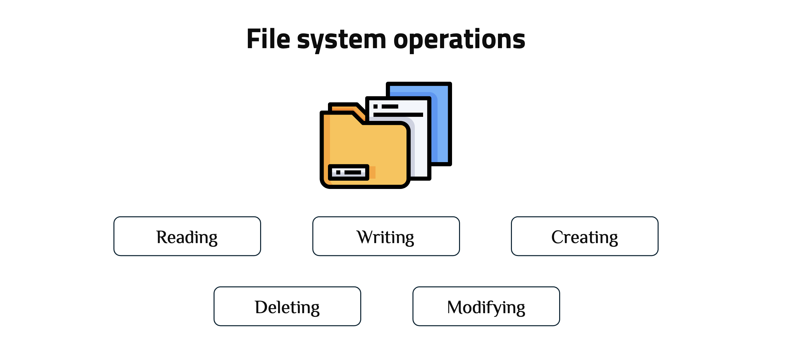

# Node.js File System Guide

## Core Terminology

### What is the fs Module?

The `fs` (file system) module is a built-in Node.js module that provides both **synchronous** and **asynchronous** methods for file system operations. It enables your Node.js application to interact with files and directories on your computer.



### Synchronous vs Asynchronous Operations

| Aspect            | Asynchronous (Recommended)                     | Synchronous (Limited use)                                  |
| ----------------- | ---------------------------------------------- | ---------------------------------------------------------- |
| Execution         | Returns a Promise; executed with `async/await` | Blocks execution until complete                            |
| Method Naming     | Methods without `Sync` suffix                  | Methods with `Sync` suffix                                 |
| Examples          | `readFile`, `writeFile`, `readdir`             | `readFileSync`, `writeFileSync`, `readdirSync`             |
| Error Handling    | `try/catch` on Promise rejection               | `try/catch` for thrown errors                              |
| Concurrency       | Scales well with concurrent requests           | Prevents concurrency while running                         |
| Typical Use Cases | API handlers, services, background jobs        | App bootstrap, scripts, tooling                            |

---

## Common File System Methods

### 1. `readFile()`

**Purpose**: Reads the entire contents of a file into memory.


#### Example 1: Reading a text file

```typescript
import { readFile } from "fs/promises";

async function readConfigFile() {
  try {
    // Read config.json and return its content as a UTF-8 string
    const content = await readFile("config.json", "utf8");

    // Parse JSON string into a JavaScript object
    const config = JSON.parse(content);

    console.log("Configuration loaded:", config);
  } catch (error) {
    // Handle file read or JSON parse errors
    console.error("Error reading config:", error);
  }
}
```

#### Example 2: Reading without encoding (Buffer)

```typescript
import { readFile } from "fs/promises";

async function readImageFile() {
  try {
    // Read the image file as raw binary data (Buffer)
    const buffer = await readFile("avatar.png");

    console.log("File size:", buffer.length, "bytes");
    console.log("First 10 bytes:", buffer.slice(0, 10));
  } catch (error) {
    console.error("Error reading image:", error);
  }
}
```

**Explanation**: Without encoding, `readFile()` returns a **Buffer** (temporary storage area for binary data). This is useful for images, videos, or any non-text files that need to be processed or transmitted.

---

### 2. `writeFile()`

**Purpose**: Writes data to a file, creating the file if it doesn't exist or overwriting it if it does.


#### Example: Writing JSON data

```typescript
import { writeFile } from "fs/promises";

async function saveUserData(userId: string, userData: object) {
  try {
    // `null, 2` formats the JSON with 2-space indentation for readability
    const jsonData = JSON.stringify(userData, null, 2);

    // Write the JSON string to a file
    await writeFile(`users/${userId}.json`, jsonData, "utf8");

    console.log("User data saved successfully");
  } catch (error) {
    console.error("Error saving user data:", error);
  }
}

const user = { name: "John Doe", email: "john@example.com", age: 30 };
saveUserData("user123", user);
```

**Explanation**: Converts an object to JSON and writes it to a file. The file is created if it doesn't exist, or completely overwritten if it does. Parent directories must exist beforehand.

### 3. `appendFile()`

**Purpose**: Appends data to a file, creating the file if it doesn't exist.


#### Real-world Example: Application logging

```typescript
import { appendFile } from "fs/promises";

interface LogEntry {
  timestamp: Date;
  level: "INFO" | "WARN" | "ERROR";
  message: string;
  context?: object;
}

async function log(entry: LogEntry) {
  try {
    const logLine = `[${entry.timestamp.toISOString()}] ${entry.level}: ${
      entry.message
    }\n`;
    await appendFile("app.log", logLine, "utf8");
  } catch (error) {
    console.error("Failed to write log:", error);
  }
}

// Usage
log({
  timestamp: new Date(),
  level: "INFO",
  message: "User logged in",
  context: { userId: "user123" },
});

log({
  timestamp: new Date(),
  level: "ERROR",
  message: "Database connection failed",
});
```

**Explanation**: Appends log entries to a file without overwriting existing content. This is essential for logging systems where you need to preserve historical data.

---

### 4. `readdir()`

**Purpose**: Reads the contents of a directory, returning an array of file and directory names.


#### Example: List directory contents

```typescript
import { readdir } from "fs/promises";

async function listFiles() {
  try {
    const files = await readdir("./uploads");
    console.log("Files in uploads:", files);
  } catch (error) {
    console.error("Error reading directory:", error);
  }
}
```

**Explanation**: Returns an array of file and folder names in the specified directory. This is non-recursive, meaning it only shows direct children, not nested contents.

### 5. `mkdir()`

**Purpose**: Creates a directory, optionally creating parent directories.


#### Example: Creating nested directories

```typescript
import { mkdir } from "fs/promises";

async function setupProjectStructure() {
  try {
    await mkdir("project/src/components", { recursive: true });
    await mkdir("project/src/utils", { recursive: true });
    await mkdir("project/public/images", { recursive: true });
    await mkdir("project/config", { recursive: true });

    console.log("Project structure created successfully");
  } catch (error) {
    console.error("Error creating directories:", error);
  }
}
```

**Explanation**: With `recursive: true`, `mkdir()` creates all necessary parent directories. If the directory already exists, no error is thrown. This is perfect for ensuring required folder structures exist before file operations.

---

### 6. `rm()`

**Purpose**: Removes files or directories, with options for recursive deletion.


#### Example: Remove a single file

```typescript
import { rm } from "fs/promises";

async function deleteOldLog() {
  try {
    await rm("logs/old-app.log");
    console.log("Old log file deleted");
  } catch (error) {
    console.error("Error deleting file:", error);
  }
}
```

**Explanation**: Removes a single file. Throws an error if the file doesn't exist unless `force: true` is used.

### 7. `stat()`

**Purpose**: Retrieves information about a file or directory.


#### Example: File information checker

```typescript
import { stat } from "fs/promises";

async function getFileInfo(filePath: string) {
  try {
    const info = await stat(filePath);

    console.log("File information:");
    console.log("Size:", info.size, "bytes");
    console.log("Created:", info.birthtime);
    console.log("Modified:", info.mtime);
    console.log("Is file:", info.isFile());
    console.log("Is directory:", info.isDirectory());
  } catch (error) {
    console.error("Error getting file info:", error);
  }
}
```

**Explanation**: Provides detailed metadata about a file or directory. Use `isFile()` and `isDirectory()` to determine the type without additional checks.

### 8. `rename()`

**Purpose**: Renames a file or moves it to a different location.


#### Example: Simple file rename

```typescript
import { rename } from "fs/promises";

async function renameFile() {
  try {
    await rename("draft.txt", "final.txt");
    console.log("File renamed successfully");
  } catch (error) {
    console.error("Error renaming file:", error);
  }
}
```

**Explanation**: Changes the file name or moves it to a new location on the same file system. Overwrites the destination if it already exists.

### 9. `access()`

**Purpose**: Tests whether a file or directory exists and is accessible.


#### Example: Check if file exists

```typescript
import { access } from "fs/promises";

async function fileExists(filePath: string): Promise<boolean> {
  try {
    await access(filePath);
    return true;
  } catch {
    return false;
  }
}

// Usage
const exists = await fileExists("config.json");
console.log("Config exists:", exists);
```

**Explanation**: Attempts to access the file. If successful, the file exists and is accessible. If it throws an error, the file doesn't exist or isn't accessible.

### 10. `copyFile()`

**Purpose**: Copies a file from one location to another.


#### Example: Simple file copy

```typescript
import { copyFile } from "fs/promises";

async function backupFile() {
  try {
    await copyFile("important.txt", "important.backup.txt");
    console.log("Backup created");
  } catch (error) {
    console.error("Error creating backup:", error);
  }
}
```

**Explanation**: Creates a copy of the file at the destination. Overwrites the destination if it already exists.

## References

- [Node.js fs Module Documentation](https://nodejs.org/api/fs.html)
- [fs.promises API](https://nodejs.org/api/fs.html#fs_fs_promises_api)
- [File System Best Practices](https://nodejs.org/en/docs/guides/working-with-different-filesystems/)
