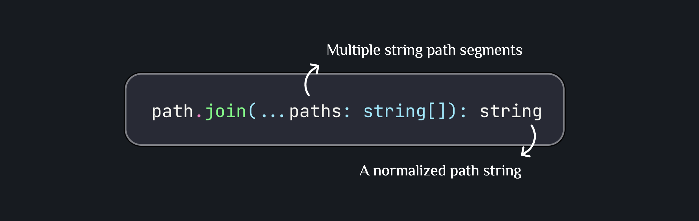
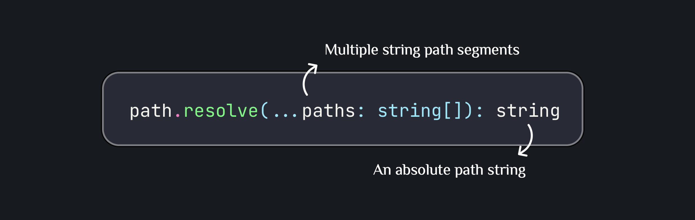
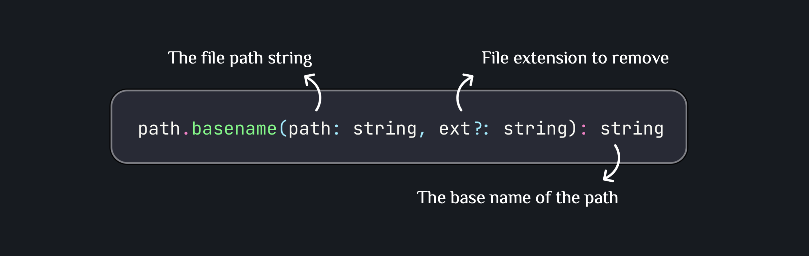
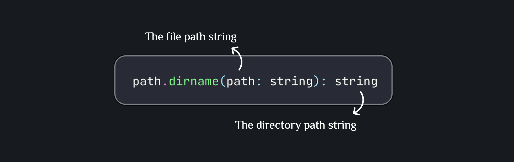
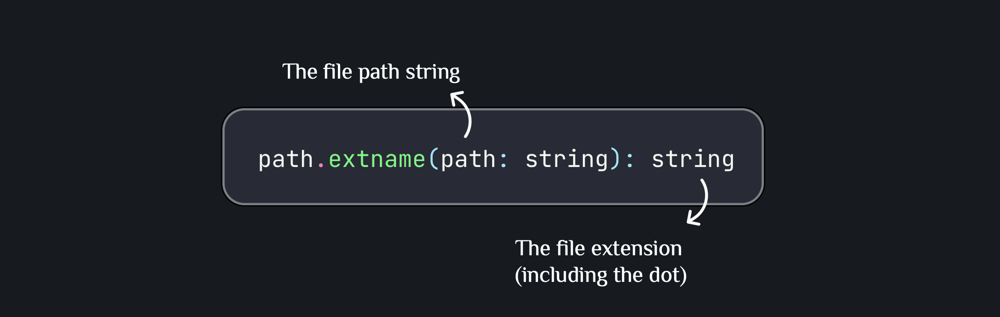
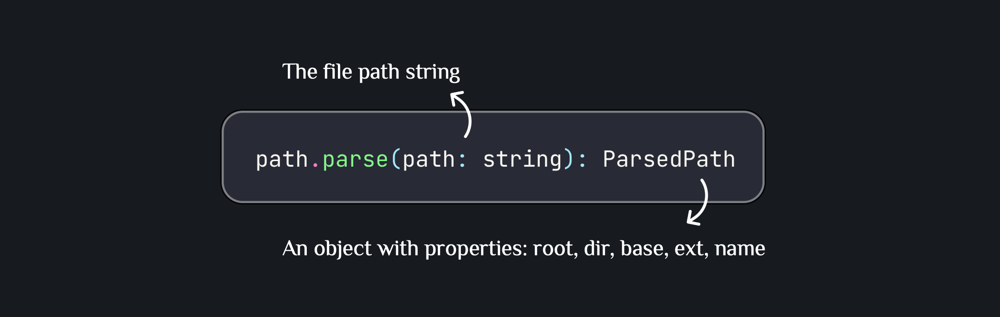
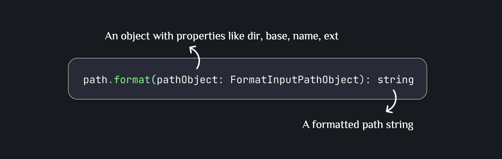
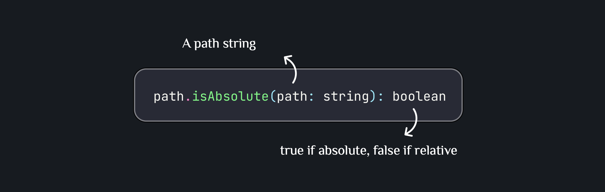
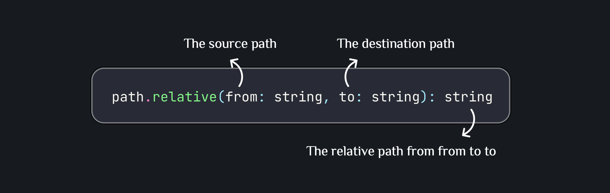

# Node.js Path Manipulation Guide

## Core Terminology

### What is Path Manipulation?

Path manipulation refers to the process of working with file and directory paths in a programmatic way. The Node.js `path` module provides utilities for handling and transforming file paths across different operating systems.

### Key Concepts

**Absolute Path**: A complete path from the root directory to a specific file or folder.

- Example (POSIX): `/home/user/project/src/index.ts`
- Example (Windows): `C:\Users\user\project\src\index.ts`

**Relative Path**: A path relative to the current working directory.

- Example: `./src/index.ts` or `../config/settings.json`

**Path Segment**: Individual parts of a path separated by delimiters.

- Example: In `/home/user/docs`, the segments are `home`, `user`, and `docs`

**Path Delimiter**: The character used to separate path segments.

- Example (POSIX): `/`
- Example (Windows): `\`

**Path Separator**: The character used to separate multiple paths in environment variables.

- Example (POSIX): `:` (e.g., `/usr/bin:/bin`)
- Example (Windows): `;` (e.g., `C:\Windows;C:\Program Files`)

---

## Common Path Methods

### 1. `path.join()`

**Purpose**: Joins multiple path segments into a single path, normalizing the result.



#### Example 1: Building a file path

```typescript
import path from "path";

const projectRoot = "/home/user/myapp";
const configFile = path.join(projectRoot, "config", "database.json");

console.log(configFile);
// Output: /home/user/myapp/config/database.json
```

**Explanation**: `join()` combines the segments and handles the correct path delimiters. It's perfect for building paths dynamically without worrying about trailing or leading slashes.

#### Example 2: Navigating up directories

```typescript
import path from "path";

const currentFile = "/home/user/myapp/src/controllers/user.controller.ts";
const utilsPath = path.join(currentFile, "..", "..", "utils", "validation.ts");

console.log(utilsPath);
// Output: /home/user/myapp/src/utils/validation.ts
```

**Explanation**: The `..` segments move up the directory tree. `join()` automatically normalizes the path, removing unnecessary segments.

---

### 2. `path.resolve()`

**Purpose**: Resolves a sequence of paths into an absolute path, treating each segment as a navigation instruction.



#### Example 1: Getting absolute path from relative

```typescript
import path from "path";

// Assume current working directory is: /home/user/myapp
const absolutePath = path.resolve("src", "models", "user.model.ts");

console.log(absolutePath);
// Output: /home/user/myapp/src/models/user.model.ts
```

**Explanation**: `resolve()` starts from the current working directory and builds an absolute path. This is useful when you need to ensure you're working with absolute paths.

#### Example 2: Using \_\_dirname equivalent in ES modules

```typescript
import path from "path";
import { fileURLToPath } from "url";

const __filename = fileURLToPath(import.meta.url);
const __dirname = path.dirname(__filename);

const configPath = path.resolve(__dirname, "../config/app.config.ts");

console.log(configPath);
// Output: /home/user/myapp/config/app.config.ts 
// (assuming __dirname is /home/user/myapp/src)
```

**Explanation**: In ES modules, `__dirname` isn't available by default. This pattern converts the module URL to a file path, then uses `resolve()` to navigate to other files relative to the current module.

---

### 3. `path.basename()`

**Purpose**: Returns the last portion of a path (the file or directory name).



#### Example 1: Getting filename

```typescript
import path from "path";

const filePath = "/home/user/documents/report.pdf";
const fileName = path.basename(filePath);

console.log(fileName);
// Output: report.pdf
```

**Explanation**: Extracts just the filename from a full path. Useful for logging or displaying file names to users.

#### Example 2: Getting filename without extension

```typescript
import path from "path";

const filePath = "/home/user/documents/report.pdf";
const fileNameNoExt = path.basename(filePath, ".pdf");

console.log(fileNameNoExt);
// Output: report
```

**Explanation**: By providing the extension as the second argument, you get the filename without its extension. This is helpful for renaming files or creating related files.

---

### 4. `path.dirname()`

**Purpose**: Returns the directory name of a path (everything except the last segment).



#### Example: Getting parent directory

```typescript
import path from "path";

const filePath = "/home/user/myapp/src/controllers/user.controller.ts";
const directory = path.dirname(filePath);

console.log(directory);
// Output: /home/user/myapp/src/controllers
```

**Explanation**: Returns the containing directory of a file or folder. Essential when you need to work with files in the same directory or navigate to parent directories.

### 5. `path.extname()`

**Purpose**: Returns the file extension of a path.



#### Example: Getting file extension

```typescript
import path from "path";

const filePath = "/home/user/documents/report.pdf";
const extension = path.extname(filePath);

console.log(extension);
// Output: .pdf
```

**Explanation**: Extracts the file extension including the dot. Returns an empty string if there's no extension.

### 6. `path.parse()`

**Purpose**: Returns an object with all the components of a path.



#### Example: Parsing a complete path

```typescript
import path from "path";

const filePath = "/home/user/myapp/src/models/user.model.ts";
const parsed = path.parse(filePath);

console.log(parsed);
/* Output:
{
  root: '/',
  dir: '/home/user/myapp/src/models',
  base: 'user.model.ts',
  ext: '.ts',
  name: 'user.model'
}
*/
```

**Explanation**: Breaks down a path into all its components. This is invaluable when you need to manipulate multiple parts of a path or understand its structure.

### 7. `path.format()`

**Purpose**: Returns a path string from an object (opposite of `path.parse()`).



#### Example: Building a path from components

```typescript
import path from "path";

const pathObject = {
  dir: "/home/user/myapp/src",
  name: "database",
  ext: ".config.ts",
};

const fullPath = path.format(pathObject);

console.log(fullPath);
// Output: /home/user/myapp/src/database.config.ts
```

**Explanation**: Constructs a path from an object. Note that `base` takes precedence over `name` + `ext` if both are provided.

### 8. `path.isAbsolute()`

**Purpose**: Determines whether a path is an absolute path.



#### Example: Checking path types

```typescript
import path from "path";

console.log(path.isAbsolute("/home/user/file.txt")); // Output: true
console.log(path.isAbsolute("./src/index.ts")); // Output: false
console.log(path.isAbsolute("../config/app.json")); // Output: false
console.log(path.isAbsolute("C:\\Users\\file.txt")); // Output: true (on Windows)
```

**Explanation**: Helps validate paths before operations that require absolute paths, preventing errors from relative path usage.

### 9. `path.relative()`

**Purpose**: Returns the relative path from one location to another.



#### Example: Finding relative path

```typescript
import path from "path";

const from = "/home/user/myapp/src/controllers";
const to = "/home/user/myapp/src/models/user.model.ts";

const relativePath = path.relative(from, to);

console.log(relativePath);
// Output: ../models/user.model.ts
```

**Explanation**: Calculates how to navigate from one path to another using relative references. Essential for creating portable path references.

## References

- [Node.js Official Documentation - Path Module](https://nodejs.org/api/path.html)
- [MDN Web Docs - File and Directory Paths](https://developer.mozilla.org/en-US/docs/Learn/Server-side/Node_server_without_framework)
