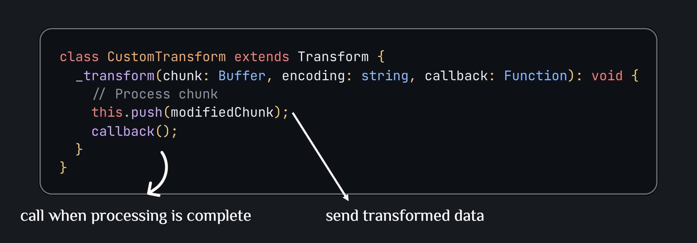

# Node.js Streams Guide

## Core Terminology

### What are Streams?

Streams are collections of data that might not be available all at once and don't have to fit in memory. Think of them like a conveyor belt where data arrives and is processed piece by piece, rather than as a whole batch.


In Node.js, streams are instances of **EventEmitter**, which means they emit events like `data`, `end`, `error`, `drain`, etc. that can be used to read and write data. There are four fundamental stream types in Node.js:

- Readable - streams from which data can be read (e.g., reading a file, HTTP response, stdin)
- Writable - streams to which data can be written (e.g., writing to a file, HTTP request, stdout)
- Duplex - streams that are both Readable and Writable (e.g., TCP sockets, WebSockets)
- Transform - Duplex streams that can modify or transform data as it's written or read (e.g., compression, encryption, data transformation)

**Stream Modes**:

- **Binary Mode** (default): Data is processed as **Buffer** objects, suitable for any file type.

- **Object Mode**: Data can be any JavaScript object (set with `objectMode: true`), useful for processing structured data.

### Benefits of Streams

- **Memory Efficiency**: Process large files without loading them entirely into memory. A 1GB file can be processed with only 16KB of memory at a time.

- **Time Efficiency**: Start processing data as soon as the first chunk is available, rather than waiting for the entire file to load.

- **Composability**: Chain multiple operations together using pipes, creating powerful data processing pipelines.

- **Backpressure Handling**: The mechanism that prevents a fast data source from overwhelming a slow consumer. When the writable stream's buffer is full, it signals the readable stream to pause until space is available.

---

## Common Stream Methods

### 1. `createReadStream()`

**Purpose**: Creates a readable stream for reading data from a file in **chunks**.

Chunk is a small piece of data transferred at a time. Instead of loading an entire file (e.g., 1GB) into memory, streams break it down into smaller chunks (typically 16KB by default) and process them sequentially.


#### Example: Reading a large log file

```typescript
import { createReadStream } from "fs";

async function readLargeLog() {
  try {
    const stream = createReadStream("application.log", {
      encoding: "utf8",
      highWaterMark: 16384, // 16KB chunks
    });

    let lineCount = 0;
    let errorCount = 0;

    stream.on("data", (chunk: string) => {
      const lines = chunk.split("\n");
      lineCount += lines.length;
      errorCount += lines.filter((line) => line.includes("ERROR")).length;
    });

    stream.on("end", () => {
      console.log(`Processed ${lineCount} lines`);
      console.log(`Found ${errorCount} errors`);
    });

    stream.on("error", (error) => {
      console.error("Error reading file:", error);
    });
  } catch (error) {
    console.error("Failed to create stream:", error);
  }
}

readLargeLog();
```

**Explanation**: Reads a large log file in small chunks without loading the entire file into memory. This allows processing files that are larger than available RAM. Perfect for log analysis or data processing.

### 2. `createWriteStream()`

**Purpose**: Creates a writable stream for writing data to a file in chunks.


#### Example: Writing large dataset

```typescript
import { createWriteStream } from "fs";

async function writeStreamExample() {
  try {
    const stream = createWriteStream("output.txt", { encoding: "utf8" });

    for (let i = 0; i < 1000000; i++) {
      const canContinue = stream.write(`Line ${i + 1}: ${Math.random()}\n`);

      // Handle backpressure
      if (!canContinue) {
        await new Promise((resolve) => stream.once("drain", resolve));
      }
    }

    stream.end(() => {
      console.log("Writing completed");
    });

    stream.on("error", (error) => {
      console.error("Error writing:", error);
    });
  } catch (error) {
    console.error("Failed to create write stream:", error);
  }
}

writeStreamExample();
```

**Explanation**: Writes a large amount of data while respecting backpressure. When `write()` returns `false`, it means the buffer is full, so we wait for the `drain` event before continuing. This prevents memory overflow.

### 3. `pipe()`

**Purpose**: Connects a readable stream to a writable stream, automatically managing data flow and backpressure.


#### Example 1: Copy file efficiently

```typescript
import { createReadStream, createWriteStream } from "fs";

async function copyFile(source: string, destination: string) {
  try {
    const readStream = createReadStream(source);
    const writeStream = createWriteStream(destination);

    readStream.pipe(writeStream);

    return new Promise<void>((resolve, reject) => {
      writeStream.on("finish", () => {
        console.log("File copied successfully");
        resolve();
      });

      readStream.on("error", reject);
      writeStream.on("error", reject);
    });
  } catch (error) {
    console.error("Copy failed:", error);
    throw error;
  }
}

copyFile("source.txt", "destination.txt");
```

**Explanation**: The simplest way to transfer data between streams. `pipe()` automatically manages backpressure and data flow, making it ideal for file copying operations.

#### Example 2: File download with progress

```typescript
import { createReadStream, createWriteStream } from "fs";
import { stat } from "fs/promises";

async function downloadWithProgress(source: string, destination: string) {
  try {
    const stats = await stat(source);
    const totalSize = stats.size;
    let downloaded = 0;

    const readStream = createReadStream(source);
    const writeStream = createWriteStream(destination);

    readStream.on("data", (chunk: Buffer) => {
      downloaded += chunk.length;
      const progress = ((downloaded / totalSize) * 100).toFixed(2);
      process.stdout.write(`\rProgress: ${progress}%`);
    });

    readStream.pipe(writeStream);

    return new Promise<void>((resolve, reject) => {
      writeStream.on("finish", () => {
        console.log("\nDownload complete!");
        resolve();
      });

      readStream.on("error", reject);
      writeStream.on("error", reject);
    });
  } catch (error) {
    console.error("Download failed:", error);
    throw error;
  }
}

downloadWithProgress("large-file.zip", "downloaded.zip");
```

**Explanation**: Shows download progress by tracking bytes transferred. The `data` event allows monitoring progress while `pipe()` handles the actual data transfer efficiently.

---

### 4. `pipeline()`

**Purpose**: Safely composes multiple streams together with proper error handling and cleanup. **Always use pipeline() instead of pipe() for production code**: Better error handling and automatic cleanup.


#### Example 1: Compress file

```typescript
import { createReadStream, createWriteStream } from "fs";
import { pipeline } from "stream/promises";
import { createGzip } from "zlib";

async function compressFile(input: string, output: string) {
  try {
    await pipeline(
      createReadStream(input),
      createGzip(),
      createWriteStream(output)
    );

    console.log("File compressed successfully");
  } catch (error) {
    console.error("Compression failed:", error);
    throw error;
  }
}

compressFile("large-file.txt", "large-file.txt.gz");
```

**Explanation**: Preferred over `.pipe()` for better error handling. `pipeline()` automatically destroys all streams if any stream in the chain fails, preventing memory leaks.

#### Example 2: Image processing pipeline

```typescript
import { createReadStream, createWriteStream } from "fs";
import { pipeline } from "stream/promises";
import { Transform } from "stream";
import { createGzip } from "zlib";

// Custom transform stream for image metadata
class ImageMetadataExtractor extends Transform {
  constructor() {
    super();
  }

  _transform(chunk: Buffer, encoding: string, callback: Function) {
    // Extract metadata (simplified example)
    const metadata = {
      size: chunk.length,
      timestamp: new Date().toISOString(),
    };

    // Add metadata as header
    if (!this.headerWritten) {
      this.push(`Metadata: ${JSON.stringify(metadata)}\n`);
      this.headerWritten = true;
    }

    this.push(chunk);
    callback();
  }

  private headerWritten = false;
}

async function processImage(input: string, output: string) {
  try {
    await pipeline(
      createReadStream(input),
      new ImageMetadataExtractor(),
      createGzip(),
      createWriteStream(output)
    );

    console.log("Image processed and compressed");
  } catch (error) {
    console.error("Processing failed:", error);
  }
}

processImage("photo.jpg", "photo.processed.gz");
```

**Explanation**: Chains multiple transformations together. The pipeline reads the image, extracts metadata, compresses it, and writes to disk—all while using minimal memory through streaming.

---

### 5. `Transform Stream`

**Purpose**: Creates a custom stream that can modify data as it passes through.



#### Example: Uppercase transform

```typescript
import { Transform } from "stream";
import { createReadStream, createWriteStream } from "fs";
import { pipeline } from "stream/promises";

class UppercaseTransform extends Transform {
  _transform(chunk: Buffer, encoding: string, callback: Function) {
    const uppercased = chunk.toString().toUpperCase();
    this.push(uppercased);
    callback();
  }
}

async function convertToUppercase(input: string, output: string) {
  try {
    await pipeline(
      createReadStream(input, { encoding: "utf8" }),
      new UppercaseTransform(),
      createWriteStream(output)
    );

    console.log("File converted to uppercase");
  } catch (error) {
    console.error("Conversion failed:", error);
  }
}

convertToUppercase("input.txt", "output.txt");
```

**Explanation**: Creates a custom transformation that converts all text to uppercase. Transform streams are perfect for data manipulation, filtering, or formatting.

## References

- [Node.js Stream Documentation](https://nodejs.org/api/stream.html)
- [Node.js Pipeline API](https://nodejs.org/api/stream.html#stream_stream_pipeline_streams_callback)
