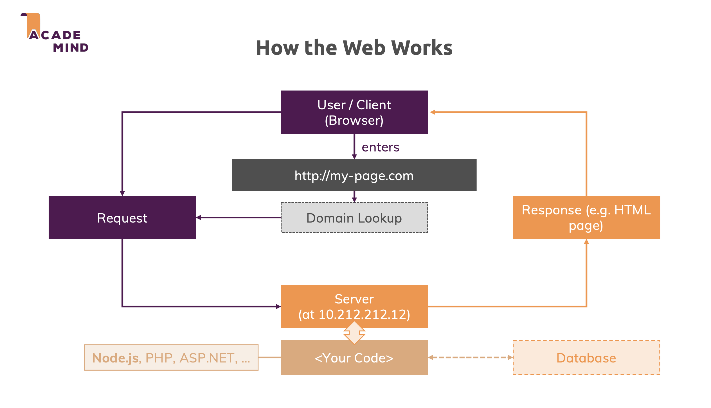
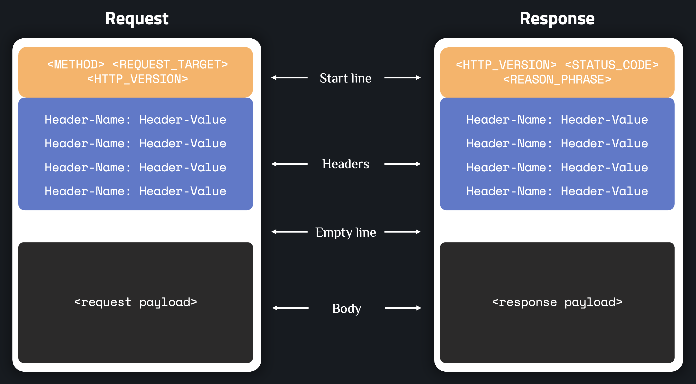
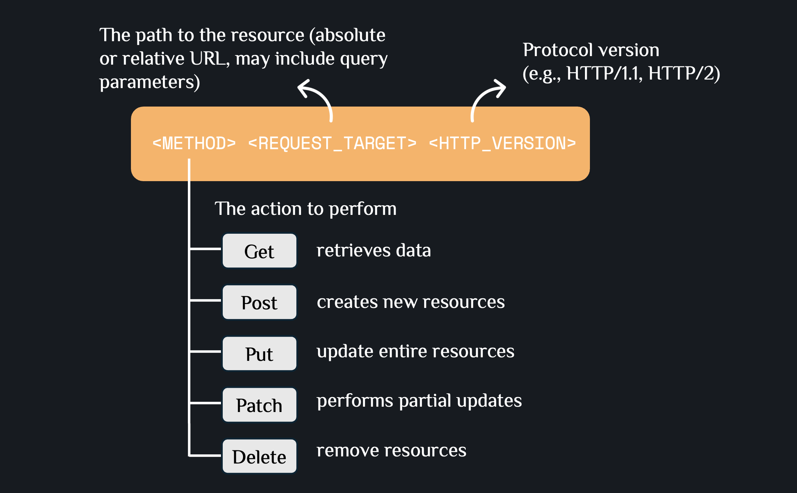
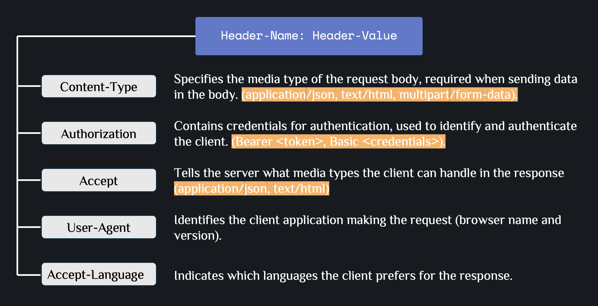
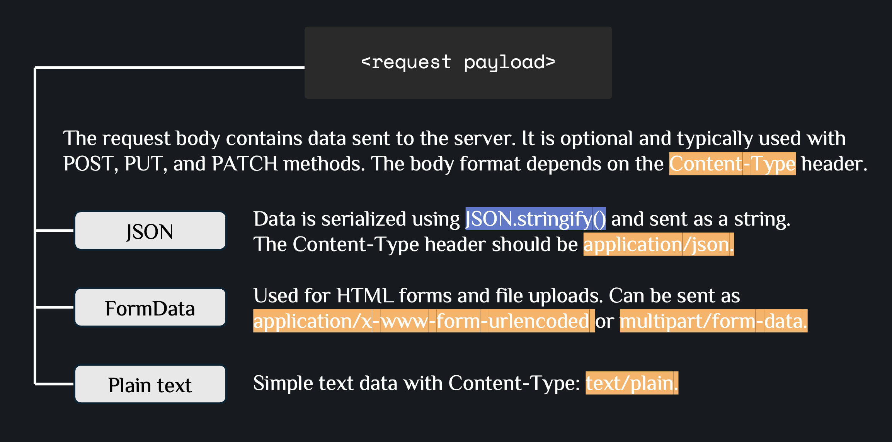
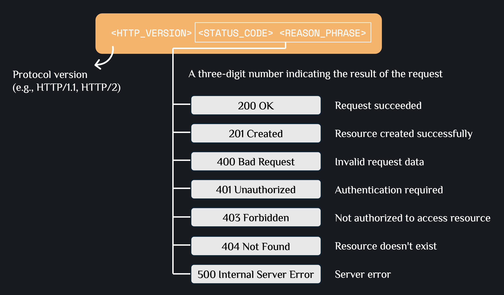
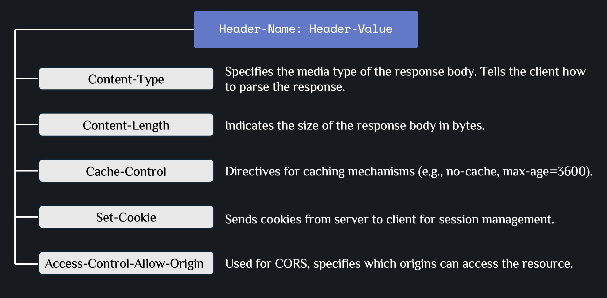
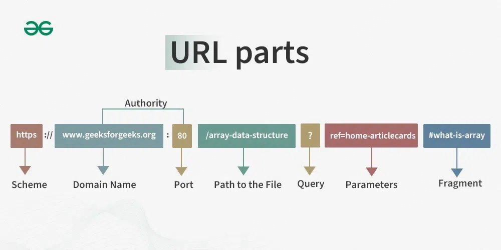

# Understanding the Basics

## 1. How the Web Works

**Client-Server Interaction**: The user (client) accesses a website via a browser by entering a URL. The browser sends a request to the DNS to resolve the domain to an IP address, then forwards the request to the server.

**Server Role**: The server processes incoming requests, validates and authenticates data for security, communicates with the database, and sends responses back to the client (HTML, JSON, files).



## 2. HTTP message

Both requests and responses share a similar structure:

- **Start line** is a single line that describes the HTTP version along with request method or the outcome of the request.
- An optional set of **HTTP headers** containing metadata that describes the message. For example, a request for a resource might include the allowed formats of that resource, while the response might include headers to indicate the actual format returned.
- An **empty line** indicating the metadata of the message is complete.
- An optional **body** containing data associated with the message. This might be POST data to send to the server in a request, or some resource returned to the client in a response. Whether a message contains a body or not is determined by the start-line and HTTP headers.



The start-line and headers of the HTTP message are collectively known as the `head` of the requests, and the part afterwards that contains its content is known as the `body`.

### HTTP requests

**Request start-line**: The start line of an HTTP request contains three parts: the **HTTP method**, the **request target** (usually a URL path), and the **HTTP version**.



Example: `GET /user-places HTTP/1.1` means: use GET method to retrieve the resource at `/user-places` using HTTP version 1.1.

**Request Headers**: Headers provide metadata about the request and the client making it. Common headers include `Content-Type`, `Authorization`, `Accept`, `User-Agent`, `Accept-Language`.



> **Note**: Headers can be categorized into different types (request headers, representation headers, etc.), but for most web development tasks, knowing the common headers and how to use them is sufficient.

**Request Body**:



---

### HTTP responses

**Response start-line**: The status line of an HTTP response contains three parts: the **HTTP version**, the **status code**, and the **reason phrase**.



Example: `HTTP/1.1 200 OK` means: HTTP version 1.1, status code 200 (success), with reason phrase "OK".

**Response Headers**: provide metadata about the response and the server. Common headers include:



**Response Body**:


## 3. Creating a Simple Server with HTTP Module

Use `createServer` from `http` module to create a server that listens for incoming requests, with a callback function to handle them. The `listen()` method keeps the server running and listening on a port (default: 3000).

```typescript
import { IncomingMessage, ServerResponse, createServer } from "http";

const server = createServer(
  (req: IncomingMessage, res: ServerResponse) => {
    res.statusCode = 200;
    res.setHeader("Content-Type", "text/plain");
    res.end("Hello, World!\n");
  }
);

server.listen(3000, "localhost", () => {
  console.log(`Server running at http://localhost:3000`);
});
```

## 4. URL parts



- **Scheme**: The protocol used to access the resource (`https`).

- **Domain Name**: The address of the website on the internet (`www.geeksforgeeks.org`). It consists of the **Subdomain** (www), **Second-level domain** (geeksforgeeks), and **Top-level domain** (.org).

- **Port**: A technical gate used to connect to the server (`:80`).

- **Path**: The specific location of the page or file (`/array-data-structure`).

- **Query**: The beginning of the parameters, marked by a question mark (`?`).

- **Parameters**: Data sent to the server to provide specific information (`ref=home-articlecards`).

- **Fragments**: A reference to a specific section within the page, marked by a hash (`#what-is-array`).
