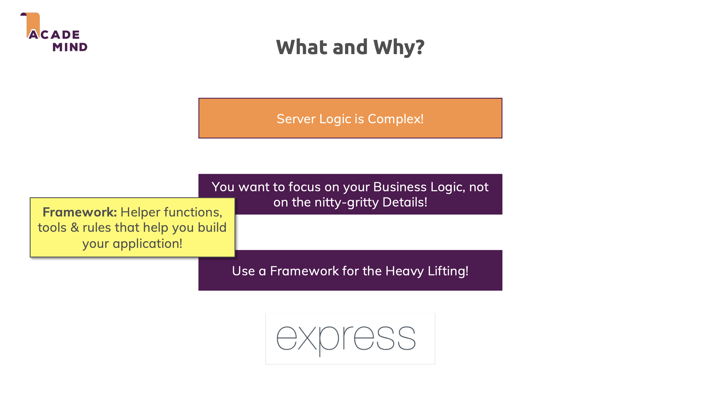
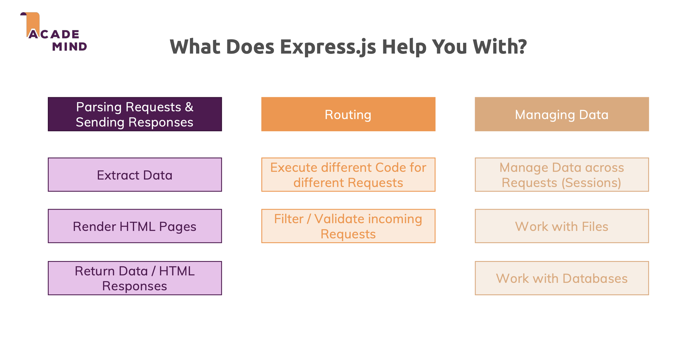
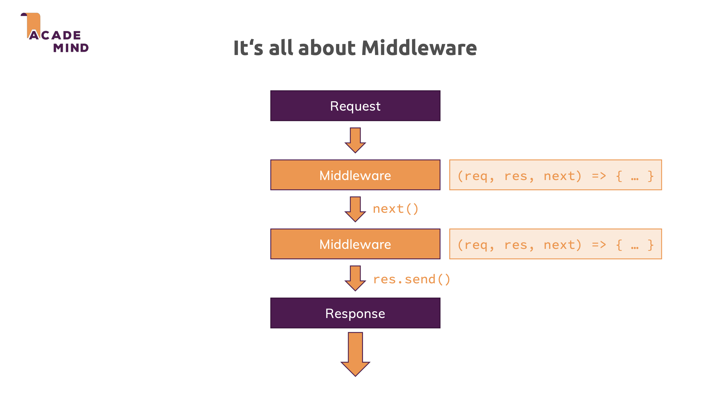
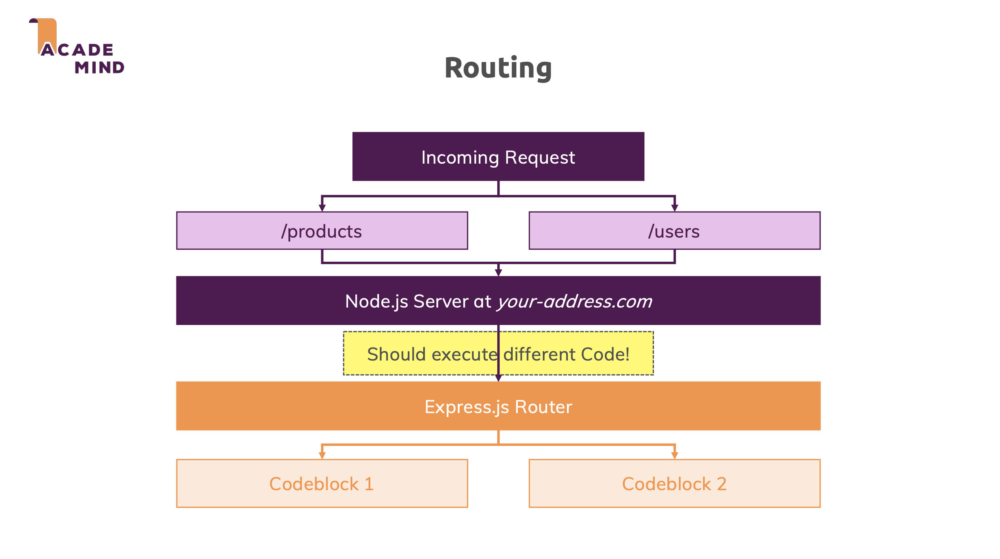

# Working with Express.js

## Express.js Introduction

### What is Express.js?

Express.js is a minimal and flexible Node.js web application framework for building web applications. It's the most popular server framework for Node.js, providing essential tools without unnecessary complexity.

### Why Use Express.js?

**Focus on Business Logic**: Server logic is complex. Express handles the heavy lifting of HTTP operations, routing, and middleware management, so you can concentrate on your application's core functionality instead of infrastructure details.

**Express** is a framework that offers helper functions, tools, and rules to build your application, including routing, middleware support, template engine integration, and error handling.



**Express** simplifies building web servers by handling HTTP requests and responses, routing requests to appropriate handlers, extracting and validating data via middleware, rendering or returning responses, and supporting session, file, and database interactions.



## Middleware

Middleware is a function that receives `(req, res, next)` and controls the request-response lifecycle. Middleware functions run **in the order** they are registered in the Express app. Each middleware has access to the req and res objects and can either call `next()` to pass control to the next middleware or terminate the request–response cycle by sending a response directly.



Middleware is commonly used for authentication and authorization, validating incoming data, logging requests, parsing request bodies, and handling errors in a centralized way.

> **Note**: Calling `next()` passes control to the next middleware or route handler in the stack; if you neither send a response nor call `next()`, the request will hang.

**Example of a middleware function:**

```typescript
app.use(express.json());
app.use(express.urlencoded({ extended: true }));
```

These are built‑in middleware functions that parse the body and must be registered before routes that use `req.body`.

### Request Object

Express servers receive data from the client side through the **req object** in three instances: the `req.params`, `req.query`, and `req.body` objects.

- `req.params`: Contains route parameters extracted from the URL path. For example, in the route `/users/:id`, `req.params.id` would contain the value of the `id` parameter.
- `req.query`: Contains query parameters extracted from the URL. For example, in the route `/users?name=John&age=30`, `req.query.name` would contain the value of the `name` parameter and `req.query.age` would contain the value of the `age` parameter.
- `req.body`: Contains the body of the request. For example, in a POST request, `req.body` would contain the data sent in the request body.

Analyzing additional properties on the req object with `req.method`, `req.headers`, `req.cookies`.

- To access the HTTP methods, whether it's a GET, POST, PUT, DELETE, etc., you can use the `req.method` property.
- The `req.header()` method will return the header type such as `Content-Type` and `Authorization`. The argument for `req.header()` is case-insensitive so you can use `req.header('Content-Type')` and `req.header('content-type')` interchangeably.
- If you’ve added **cookie-parser** as a dependency in your Express server, the `req.cookies` property will store values from your parser.

Properties on the **req object** can also return the parts of a URL based on the anatomy. This includes the `protocol`, `hostname`, `path`, `originalUrl`, and `subdomains`.

```typescript
// https://ocean.example.com/creatures?filter=sharks

app.get("/creatures", (req, res) => {
  console.log(req.protocol); // "https"
  console.log(req.hostname); // "example.com"
  console.log(req.path); // "/creatures"
  console.log(req.originalUrl); // "/creatures?filter=sharks"
  console.log(req.subdomains); // "['ocean']"
});
```

### Response Object

The response object, often abbreviated as `res`, give us a simple way to respond to HTTP requests. There are some common methods:

- `res.status(code)`: sets HTTP status code.
- `res.sendStatus(code)`: sets HTTP status code and sends its string representation.
- `res.header(name, value)`: sets a response header.
- `res.send(body)`: sends a response body (string, object, Buffer or HTML)
- `res.json(data)`: sends a JSON response.
- `res.redirect(url)`: redirects to a different URL.
- `res.end()`: ends the response process.

### The app

In Express, `app` is the main application object. `app` is created by calling `const app = express()` and represents the whole web server. You can use `app` to:

- Register global middleware functions: `app.use(middleware)`.
- Define top-level routes: `app.get(path, handler)`, `app.post(path, handler)`, etc.
- Mount routes to a specific path: `app.use(path, router)`.
- Start the server: `app.listen(3000)`. Only `app` can listen on a port, not a router.

### The router

`router` is created by `const router = express.Router()` and is described as a **mini app** that only handles routing + middleware for a subset of the application. You can use `router` to:

- Group related routes in a separate file (e.g. all `/users` routes).
- Add middleware that applies only to those routes: `router.use(authMiddleware)`.
- Export and mount it into the main app.

## Routing

Routing in Express defines how an application responds to client requests for specific URLs and HTTP methods. Routes are matched based on the request path and method, and the corresponding handler function is executed when a match is found.

Routing is used to organize application endpoints, map HTTP methods to business logic, separate concerns by feature or resource, and structure RESTful APIs in a clear and maintainable way.


