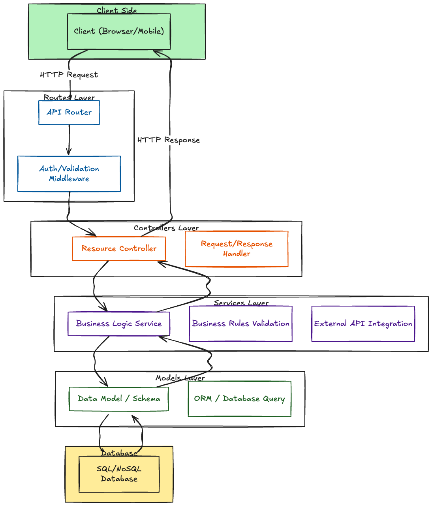

# How to set up TypeScript with Node.js and Express

## 1. What is Express TypeScript?

**Express TypeScript** refers to using the Express framework within a TypeScript project. It involves writing your Express server code in TypeScript, leveraging type definitions (often provided via `@types/express`) to enable type checking, auto-completion, and better documentation. Essentially, it's about combining Express's flexibility with TypeScript's safety and developer tooling benefits.


TypeScript is a great companion for Express because it provides static typing, which can catch potential bugs during development. With TypeScript, you can define interfaces for requests, responses, and even middleware, making your Express code more predictable and maintainable. This leads to improved developer productivity and more robust applications.

## 2. Implementation Steps

### 2.1. Initialize the project

Start with the following:

```bash
cd to your project directory
npm init -y
```

Then install dependencies:

```bash
npm install express dotenv
npm install -D typescript tsx @types/node @types/express nodemon eslint prettier
```

The DotEnv package is used to read environment variables from a `.env` file.

The `-D`, or `--dev`, flag directs the package manager to install these libraries as development dependencies.

- **`tsx`** — Enables running TypeScript files directly with better ESM support
- **`@types/node`** — Provides TypeScript type definitions for Node.js core modules
- **`@types/express`** — Adds TypeScript type definitions for the Express framework
- `nodemon` — Automatically restarts the server when file changes are detected during development
- `eslint` — Lints the code to catch errors and enforce coding standards
- **`prettier`** — Formats the code to ensure consistent style across the project

### 2.2. Create .gitignore file

Create a [`.gitignore`](../.gitignore) file at the root to exclude unnecessary files

### 2.3. Configure TypeScript

Every TypeScript project utilizes a configuration file to manage various project settings. The `tsconfig.json` file, which serves as the TypeScript configuration file, outlines these default options and offers the flexibility to modify or customize compiler settings to suit your needs.

The [`tsconfig.json`](./tsconfig.json) file is usually placed at the project's root. To generate this file, use the following `tsc` command, initiating the TypeScript compiler:

```bash
npx tsc --init
```

**Configuration notes:**

**Module System Options**: Before starting, decide whether to compile to **CommonJS** or **ESM** with `"module": "commonjs"` or `"module": "es2022"`.

- **CommonJS**: File extensions are not required in imports.
- **ESM**: You **MUST** add `"type": "module"` to `package.json`. Additionally, when compiling with `tsc`, you **must include file extensions** (e.g., `.js`). Node.js ESM requires this.

> Note that `tsx` can handle imports without extensions during development, thus `"type": "module"` is not strictly required for development, but the production build will fail to run if extensions are missing.

**Other compiler options**:

- **`target`**: Specifies the ECMAScript version of the output JavaScript (e.g., `ES2022`).
- **`moduleResolution`**: Determines how TypeScript resolves module imports (e.g., `node`).

### 2.4. Layered Architecture Pattern



Layered architecture separates concerns into distinct layers, each with specific responsibilities:

- **Routes Layer**: Defines API endpoints and applies middleware. Routes map HTTP methods and paths to controller functions.

- **Controllers Layer**: Handles HTTP requests and responses. Controllers extract data from requests, call service functions, and format responses. They should be thin and delegate business logic to services.

- **Services Layer**: Contains business logic and data operations. Services interact with models to perform database operations and implement business rules. This layer is reusable across different controllers.

- **Models Layer**: Defines data structures and database schemas. Models represent entities in the database and provide methods for data access.

This separation improves maintainability, testability, and code organization. Each layer has a single responsibility, making the codebase easier to understand and modify. Example project structure:

```text
ts-node-express/
├── src/
│   ├── config/
│   │   └── config.ts        // Load and type environment variables
│   ├── controllers/
│   ├── middlewares/
│   │   └── error.middleware.ts    // Global typed error handling middleware
│   ├── models/
│   ├── routes/
│   ├── app.ts               // Express app configuration (middlewares, routes)
│   └── server.ts            // Start the server
├── .env                     // Environment variables
├── package.json             // Project scripts, dependencies, etc.
├── tsconfig.json            // TypeScript configuration
├── .eslintrc.js             // ESLint configuration
└── .prettierrc              // Prettier configuration
```

### 2.5. Configure ESLint and Prettier (Optional but Recommended)

**Install additional ESLint dependencies:**

```bash
npm install -D @typescript-eslint/parser @typescript-eslint/eslint-plugin
```

**File:** `.eslintrc.js`:

```javascript
module.exports = {
  parser: "@typescript-eslint/parser",
  extends: ["eslint:recommended", "plugin:@typescript-eslint/recommended"],
  parserOptions: {
    ecmaVersion: 2022,
    sourceType: "module",
  },
  env: {
    node: true,
    es2022: true,
  },
};
```

**File:** `.prettierrc`:

```json
{
  "semi": true,
  "trailingComma": "es5",
  "singleQuote": true,
  "printWidth": 80,
  "tabWidth": 2
}
```

### 2.6. Environment configuration (typed environment variables)

**File:** `src/config/config.ts`:

```typescript
import dotenv from "dotenv";

dotenv.config();

interface Config {
  port: number;
  nodeEnv: string;
}

const config: Config = {
  port: Number(process.env.PORT) || 3000,
  nodeEnv: process.env.NODE_ENV || "development",
};

export default config;
```

This file loads your environment variables from a `.env` file and provides type checking. **Create file:** `.env` at the root of your project:

```text
PORT=3000
NODE_ENV=development
```

### 2.7. Global error handling middleware

**File:** `src/middlewares/error.middleware.ts`:

```typescript
import type { Request, Response, NextFunction } from "express";

export class AppError extends Error {
  status?: number;

  constructor(message: string, status: number = 500) {
    super(message);
    this.status = status;
    this.name = "AppError";
  }
}

export const errorHandler = (
  err: AppError | Error,
  req: Request,
  res: Response,
  next: NextFunction
) => {
  if (err instanceof AppError) {
    return res.status(err.status || 500).json({
      success: false,
      message: err.message,
    });
  }

  console.error(err);
  res.status(500).json({
    success: false,
    message: "Internal Server Error",
  });
};
```

This middleware catches errors thrown in your routes/controllers and sends a consistent, type-safe JSON error response. The `AppError` class allows you to throw errors with custom status codes, and the error handler distinguishes between `AppError` instances and generic `Error` instances to provide appropriate responses.

### 2.8. App setup

**File:** `src/app.ts`:

```typescript
import express from "express";
import { errorHandler } from "./middlewares/error.middleware";

const app = express();

app.use(express.json());

// Routes

app.get("/", (req, res) => {
  res.send("Hello World");
});

// Global error handler (should be after routes)
app.use(errorHandler);

export default app;
```

### 2.9. Server entry point

**File:** `src/server.ts`:

```typescript
import app from "./app";
import config from "./config/config";

app.listen(config.port, () => {
  console.log(`Server running on port ${config.port}`);
});
```

### 2.10. Watchers and development scripts

In your `package.json`, add scripts for TypeScript compilation and automatic server restart:

```json
{
  "scripts": {
    "build": "tsc",
    "start": "node dist/server.js",
    "dev": "tsx watch src/server.ts",
    "format": "prettier --write \"src/**/*.ts\""
  }
}
```

- **`build`** — Compiles TypeScript to JavaScript
- **`start`** — Runs the compiled JavaScript in production
- **`dev`** — Runs the server in development mode with auto-reload (using `tsx watch`)
- **`format`** — Formats code using Prettier

Start the server:

```bash
npm run dev
```

## 3. Summary of Implementation steps

1. **[Initialize the project](#21-initialize-the-project)** - Start a new Node.js project and install necessary dependencies.
2. **[Create .gitignore file](#22-create-gitignore-file)** - Exclude unnecessary files and folders from version control.
3. **[Configure TypeScript](#23-configure-typescript)** - Initialize and customize TypeScript compiler options.
4. **[Layered Architecture Pattern](#24-layered-architecture-pattern)** - Organize code structure into Routes, Controllers, Services, and Models.
5. **[Configure ESLint and Prettier](#25-configure-eslint-and-prettier-optional-but-recommended)** - Set up tools for code linting and consistent formatting.
6. **[Environment configuration](#26-environment-configuration-typed-environment-variables)** - Manage environment variables with type safety.
7. **[Global error handling middleware](#27-global-error-handling-middleware)** - Implement a centralized system to handle errors gracefully.
8. **[App setup](#28-app-setup)** - Configure the Express application instance and middlewares.
9. **[Server entry point](#29-server-entry-point)** - Create the entry point to launch the server.
10. **[Watchers and development scripts](#210-watchers-and-development-scripts)** - Define npm scripts for running in development and building for production.
