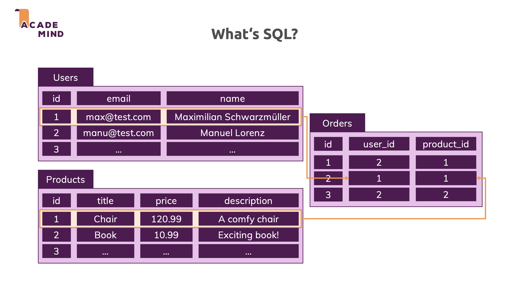
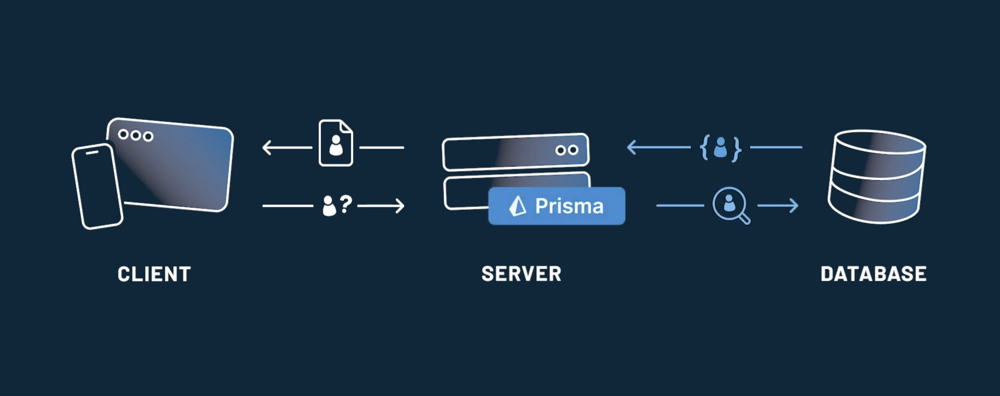

# SQL Database

## Table, columns and constraints

A table is a named structure with columns (name, type, constraints) and rows (data).



Each column has a data type that controls what values are valid and how they are stored. There are common data types:

- **Integer-like**: INT, BIGINT, SERIAL/BIGSERIAL for ids, counts.
- **Text**: VARCHAR(n) for bounded strings, TEXT for long free text.
- **Date/time**: DATE, TIMESTAMP for created_at, updated_at.
- **Boolean**: BOOLEAN / BOOL for true/false flags.

Contraints are rules attached to columns or tables that enforce data integrity. They can be column-level (written directly after the column) or table-level (written after the table definition and can involve multiple columns).

- **NOT NULL**: Value must exist, cannot be `NULL`.
- **UNIQUE**: Values in that column (or combination) must be unique.
- **CHECK**: Custom condition, e.g. `CHECK (age >= 0 AND age <= 120)`.
- **DEFAULT**: Auto-fill a value if none is provided, e.g. `created_at TIMESTAMP DEFAULT NOW()`.

```sql
CREATE TABLE users (
  id          SERIAL       PRIMARY KEY,
  username    VARCHAR(50)  NOT NULL UNIQUE,
  email       VARCHAR(255) NOT NULL UNIQUE,
  age         INT          CHECK (age >= 13),
  created_at  TIMESTAMP    NOT NULL DEFAULT NOW()
);
```

This design ensures every user has an id, a unique username/email, a reasonable age, and an automatic create time.

## Primary Key, Foreign Key and Relationships

**A primary key** is a column (or set of columns) that uniquely identifies each row. Most tables use a single auto-increment integer or UUID primary key, and SQL engines automatically index primary keys. Primary key properties:

- **Unique**: No two rows have the same primary key value.
- **Non-NULL**: Every row must have a primary key value.
- **Stable**: Should not change frequently (or at all).

**A foreign key** is a column that references the primary key (or unique key) of another table. It enforces that the referenced row actually exists, preventing "orphan" records.

```sql
CREATE TABLE matches (
  id         SERIAL PRIMARY KEY,
  user_id    INT    NOT NULL REFERENCES users(id),
  hero_name  VARCHAR(50) NOT NULL,
  result     VARCHAR(10) NOT NULL CHECK (result IN ('win', 'loss')),
  played_at  TIMESTAMP   NOT NULL DEFAULT NOW()
);
```

Here `matches.user_id` is a foreign key pointing to `users.id`, creating a **one-to-many** relationship: one user can play multiple matches.

Main relationship types:

- **One-to-one**: **Rare**; Each record in Table A is associated with one and only one record in Table B, and vice versa. **Setup**: include a foreign key in one of the tables that references the primary key of the other table.
- **One-to-many**: **The most common**; Each record in Table A can be associated with multiple records in Table B, but each record in Table B is associated with only one record in Table A. **Setup**: Include a foreign key in the "many" side table (Table B) that references the primary key of the "one" side table (Table A).
- **Many-to-many**: Each record in Table A can be associated with multiple records in Table B, and vice versa. **Setup**: Create an intermediate table (also known as a junction or linking table) that contains foreign keys referencing both related tables.

Example of a **many-to-many** relationship: One user can participate in many tournaments, and one tournament can have many users:

```sql
CREATE TABLE tournaments (
  id   SERIAL PRIMARY KEY,
  name VARCHAR(100) NOT NULL
);

CREATE TABLE user_tournaments (
  user_id       INT NOT NULL REFERENCES users(id),
  tournament_id INT NOT NULL REFERENCES tournaments(id),
  PRIMARY KEY (user_id, tournament_id)
);
```

The `user_tournaments` is intermediate table that connects `users` and `tournaments` and the composite primary key prevents duplicate pairs.

## Core querying

- [Basic SQL SELECT](./Query_Syntax/02_Basic_SQL_Statements.md)
- [Aggregation and grouping](./Query_Syntax/03_GROUP_BY_Aggregations.md)
- [Joins and subqueries](./Query_Syntax/05_SQL_Joins.md)
- [Advanced SQL commands](./Query_Syntax/06_Advanced_SQL_Commands.md)
- [Modifying and designing data](./Query_Syntax/08_Creating_Databases_Tables.md)
- [Conditional expressions and procedures](./Query_Syntax/10_Conditional_Expressions_Procedures.md)

## Indexes and performance

Indexes in SQL are special database structures that speed up data retrieval by allowing quick access to records instead of scanning the entire table. They act like a lookup system and play an important role in improving query performance and database efficiency.

- Speed up queries (SELECT, JOIN, WHERE, ORDER BY).
- Reduce disk I/O and improve efficiency in large tables.
- Ensure data integrity with unique indexes.

> **Note:** Primary Key and Unique constraints automatically create indexes.

There are some types of indexes:

### 1. Single-column index

A single-column index is created on just one column. It’s the most basic type of index and helps speed up queries when you frequently search, filter or sort by that column. Syntax:

```sql
CREATE INDEX index_name ON TABLE column;
```

### 2. Multi-column index

A multi-column index is created on two or more columns. It improves performance when queries filter or join based on multiple columns together. Syntax:

```sql
CREATE INDEX index_name ON TABLE (column1, column2,.....);
```

### 3. Unique index

A unique index ensures that all values in a column (or combination of columns) are unique preventing duplicates and maintaining data integrity. Syntax:

```sql
CREATE UNIQUE INDEX index_name ON table_name (column_name);
```

### Index Mechanism

When an index is created on a column (for example, email), the database builds a separate data structure—most commonly a B-tree. The index contains the values of the column and a pointer (reference) to the rows in the table that have those values. Let see how query uses the index:

```sql
SELECT name FROM users WHERE email = 'a@gmail.com';
```

1. **Index lookup**: The database searches the B-tree to locate `a@gmail.com`. This operation is logarithmic time (O(log n)).
2. **Row lookup**: Using the pointer found in the index, the database jumps directly to the corresponding row in the table.
3. **Return result**: The database reads the required columns (name) from that row and returns the result.

> **Notes**: Indexes are used automatically, an index is a separate data structure that the database uses to speed up queries (not part of the table) and indexes have trade-offs (slow down write operations).

| When to Create Indexes                                                                        | When to Avoid or Be Careful with Indexes                                       |
| --------------------------------------------------------------------------------------------- | ------------------------------------------------------------------------------ |
| Columns frequently used in WHERE or JOIN conditions (e.g. user_id on matches, email on users) | Very small tables (full scan is already cheap)                                 |
| Columns often used in ORDER BY or GROUP BY on large tables                                    | Columns that change constantly (lots of updates will be expensive)             |
| Foreign key columns (for fast joins from child to parent)                                     | Low-selectivity columns like boolean flags where most rows have the same value |

## Prisma ORM

**Prisma** is a database toolkit for Node.js and TypeScript that provides a type-safe way for server code to read and write data. It sits between application and the database, translating high-level queries into SQL and mapping results back into strongly typed JavaScript/TypeScript objects.



### Setup Project

- **[Quickstart with Prisma ORM and Prisma Postgres](https://www.prisma.io/docs/getting-started/prisma-orm/quickstart/postgresql)**

- **[Add Prisma ORM to an existing PostgreSQL project](https://www.prisma.io/docs/getting-started/prisma-orm/add-to-existing-project/postgresql)**

### Overview of Prisma Schema

The Prisma Schema ([prisma/schema.prisma](./dvd_rental_prisma/prisma/schema.prisma)) is the main method of configuration for your Prisma ORM setup. It consists of the following parts:

- Data sources: Specify the details of the data sources Prisma ORM should connect to (e.g. PostgreSQL, MySQL, SQLite, etc.)
- Generators: Specifies what clients should be generated based on the data model (e.g. Prisma Client, Prisma Client JS, etc.)
- Data model definition: Specifies application models (the shape of the data) and their relations (1-1, 1-many, many-many).

### Data model

- **[Prisma Models](https://www.prisma.io/docs/orm/prisma-schema/data-model/models)**
- **[One-to-many relationships](https://www.prisma.io/docs/orm/prisma-schema/data-model/relations/one-to-many-relations)**
- **[Many-to-many relationships](https://www.prisma.io/docs/orm/prisma-schema/data-model/relations/many-to-many-relations)**

### Prisma Client

- **[Queries](https://www.prisma.io/docs/orm/prisma-client/queries)**
- **[Observability and logging](https://www.prisma.io/docs/orm/prisma-client/observability-and-logging)**

### Prisma Migrate

- **[Understanding Prisma Migrate](https://www.prisma.io/docs/orm/prisma-migrate/understanding-prisma-migrate)**
