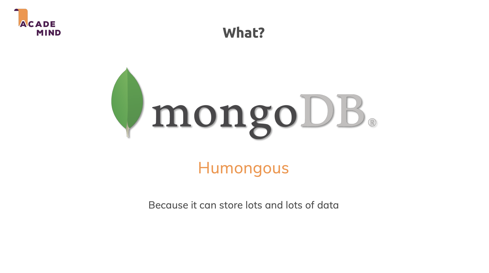
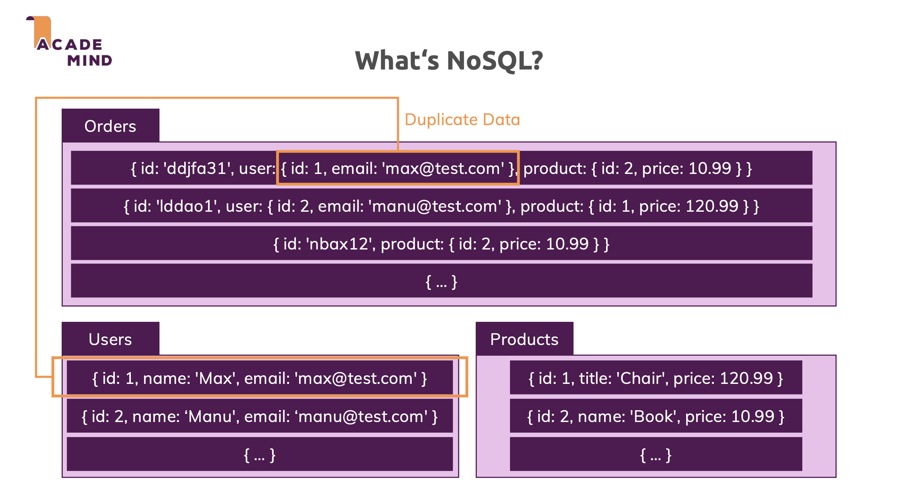
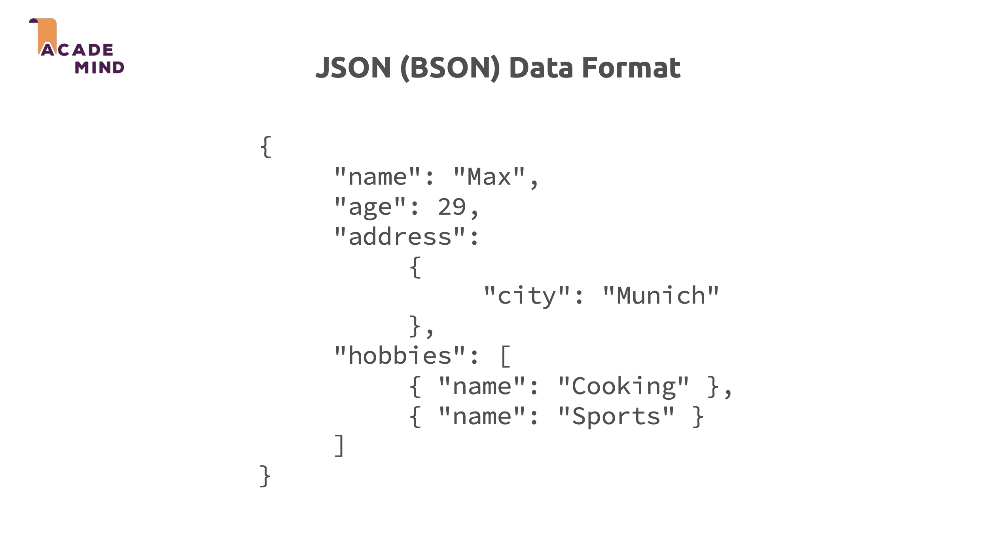
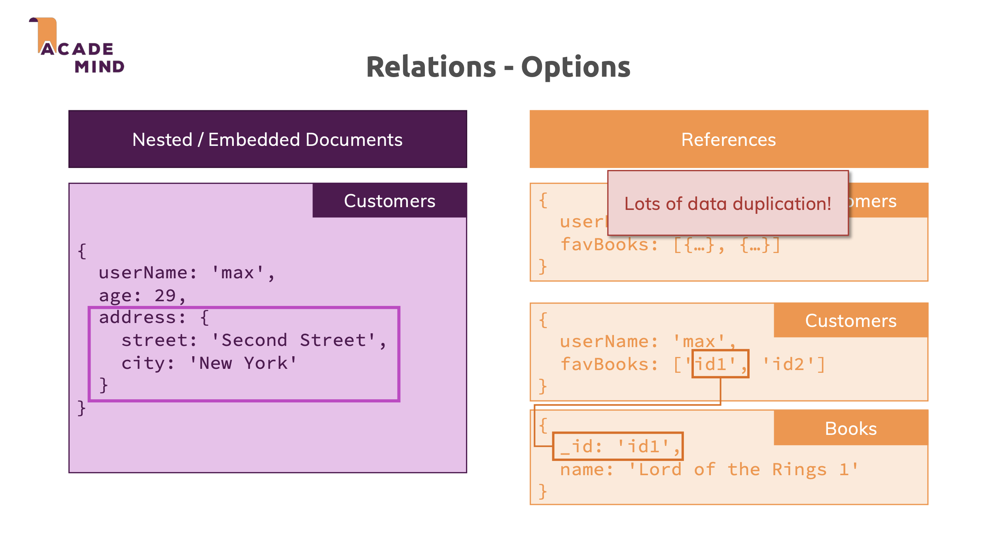
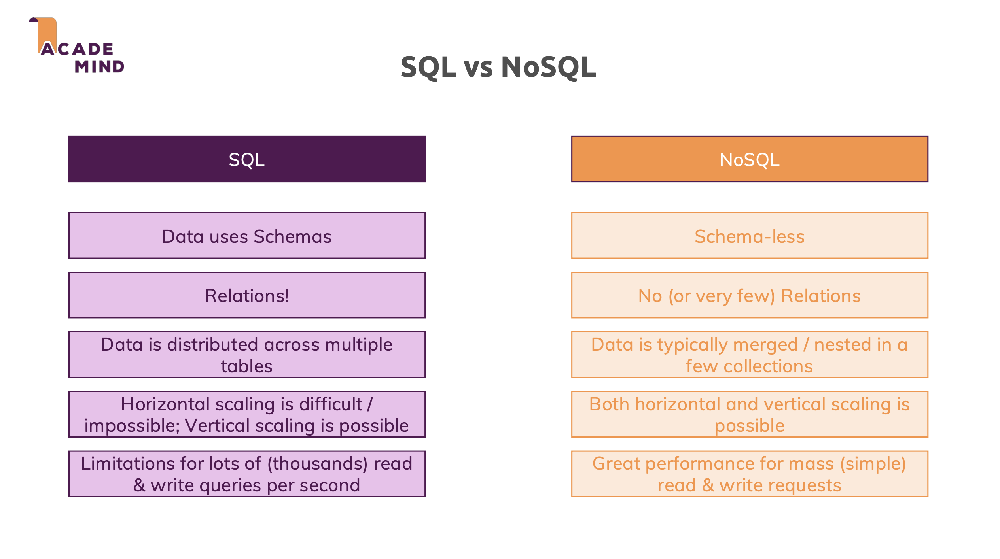
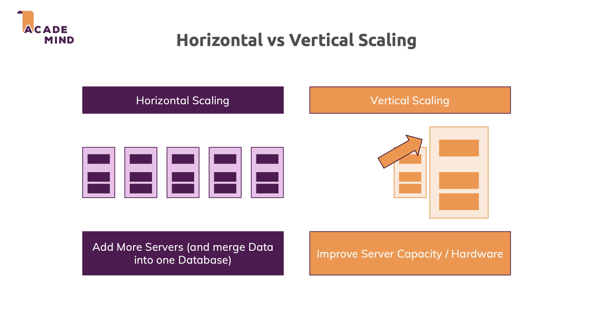

# NoSQL Fundamentals

## Overview of NoSQL and MongoDB

**NoSQL (Not Only SQL)** databases are designed to handle large volumes of unstructured and semi-structured data. Unlike traditional relational databases that rely on fixed schemas and tables, NoSQL offers flexible data models and supports horizontal scaling. Use of NoSQL:

- Big Data Applications: Efficiently stores and processes massive amounts of unstructured and semi-structured data.
- Real-Time Analytics: Supports fast queries and analysis for use cases like recommendation engines or fraud detection.
- Scalable Web Applications: Handles high traffic and large user bases by scaling horizontally across servers.
- Flexible Data Storage: Manages diverse data formats (JSON, key-value, documents, graphs) without rigid schemas.

**MongoDB** is a document-oriented NoSQL database that stores data as BSON documents (binary JSON), grouped into collections inside databases. It focuses on a flexible schema and JSON-like documents, which makes it a natural fit for JavaScript/TypeScript applications.



## Databases, Collections, and Documents

MongoDB organizes data in three main levels: database → collection → document. This is similar to relational DBs but with different terminology and more flexible structure.



- **Database**: A logical container for collections, similar to a database in PostgreSQL/MySQL. You can have multiple databases (for example app_dev, app_test, analytics) on the same MongoDB server.
- **Collection**: A collection is a group of documents, roughly equivalent to a table in SQL. Collections are schemaless by default: documents in the same collection do not need to share the same fields or structure.
- **Document**: A document is the basic unit of data stored in a collection, similar to a row in SQL, but represented as a BSON object (binary JSON). A document is a set of key–value pairs and can contain nested objects and arrays.



## Data modeling and relationships in MongoDB

In MongoDB you design your model around how the application reads and writes data, not only around normalization rules. That often means grouping related data together in a single document to reduce "joins". Instead of foreign keys and JOINs, there are two main strategies to represent relationships between entities:



## The Challenge

Because MongoDB doesn’t enforce relationships between collections, there’s nothing built-in to guarantee data consistency across them. For example:

- A `id` in a `customers` collection might not actually exist in the `books` collection.
- There are no automatic checks, constraints, or warnings if data goes out of sync.
- Joining related data requires manual `$lookup` queries - and those can get complex, especially as your data grows.

This flexibility is part of what makes MongoDB powerful - but without structure, it can also become a hidden risk. You lose some of the clarity and safety that comes from defined relationships in relational databases.

## Comparison with SQL Databases





## Indexes and performance in MongoDB

Indexes in MongoDB are special data structures that store a small portion of the collection’s data in a way that makes queries faster, similar to indexes in SQL. They allow the database to avoid scanning every document and instead jump directly to matching entries based on the index keys. Important points:

- `_id` is automatically indexed and unique for every document.
- You can create **single-field indexes**, **compound indexes** (on multiple fields), **unique indexes** (no duplicates), **text indexes** (for search), and **geospatial indexes**.
- Indexes speed up read-heavy operations but add overhead for writes (insert/update/delete must also update the index).

## Mongoose overview (ODM)

**Mongoose** is an Object Data Modeling (ODM) library for Node.js that provides a structured, schema-based way to interact with MongoDB documents. It sits between your application and MongoDB, offering schemas, models, validation, and middleware similar to what Prisma does for SQL databases

### Setup Project

- **[Quickstart with Mongoose](https://www.slingacademy.com/article/how-to-set-up-and-use-mongoose-with-typescript/)**

### Overview of Mongoose Schema

A Schema in Mongoose defines the structure of documents in a collection: field names, field types, constraints (required, default, enum, min/max), and options like timestamps.

```typescript
import { Schema, model } from "mongoose";

const userSchema = new Schema(
  {
    username: { type: String, required: true, unique: true },
    email: { type: String, required: true, unique: true },
    age: { type: Number, min: 13 },
  },
  { timestamps: true } // adds createdAt, updatedAt
);

export const User = model("User", userSchema);
```

- **SchemaTypes**: String, Number, Boolean, Date, Array, Map, Schema.Types.ObjectId, etc.
- **Model**: Created via `model('User', userSchema)`, representing a collection; used for operations like `User.find()`, `User.create()`, `User.findById()`.
- **Options**: Schema options such as timestamps, versionKey, toJSON/toObject transforms, and indexes.

### Mongoose Models and Queries

- **[Models](https://mongoosejs.com/docs/models.html)** are fancy constructors compiled from Schema definitions. An instance of a model is called a document. Models are responsible for creating and reading documents from the underlying MongoDB database.

- Mongoose models provide several static helper functions for CRUD operations. Each of these functions returns a mongoose Query object. **[Mongoose queries](https://mongoosejs.com/docs/queries.html)** can be executed by using `await`, or by using `then()` to handle the promise returned by the query.

### Populate

- MongoDB has the join-like `$lookup` aggregation operator in versions >= 3.2. Mongoose has a more powerful alternative called `populate()`, which lets you reference documents in other collections.

- **[Population](https://mongoosejs.com/docs/populate.html)** is the process of automatically replacing the specified paths in the document with document(s) from other collection(s). We may populate a single document, multiple documents, a plain object, multiple plain objects, or all objects returned from a query.

### Middleware (hooks) and Validation

- **[Middleware](https://mongoosejs.com/docs/middleware.html)** (also called pre and post hooks) are functions which are passed control during execution of asynchronous functions. Middleware is specified on the schema level and is useful for writing plugins.

- Mongoose provides built-in validation based on the schema definition and allows custom validators. **[Validation](https://mongoosejs.com/docs/validation.html)** ensures that only documents that satisfy your constraints are persisted, similar to constraints in SQL but implemented in application logic.
