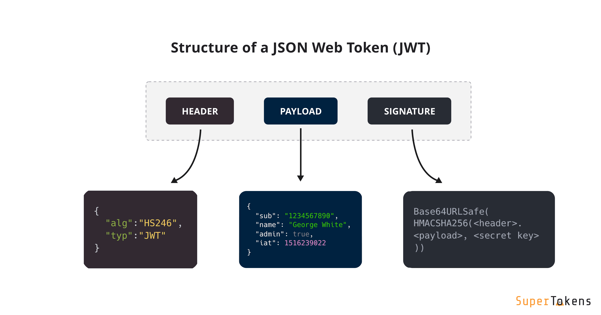
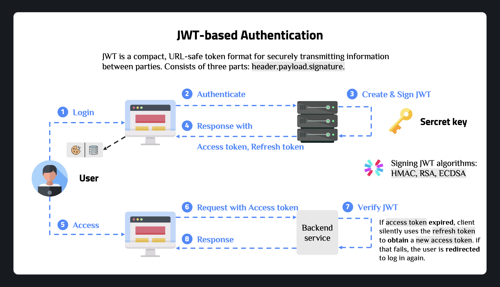
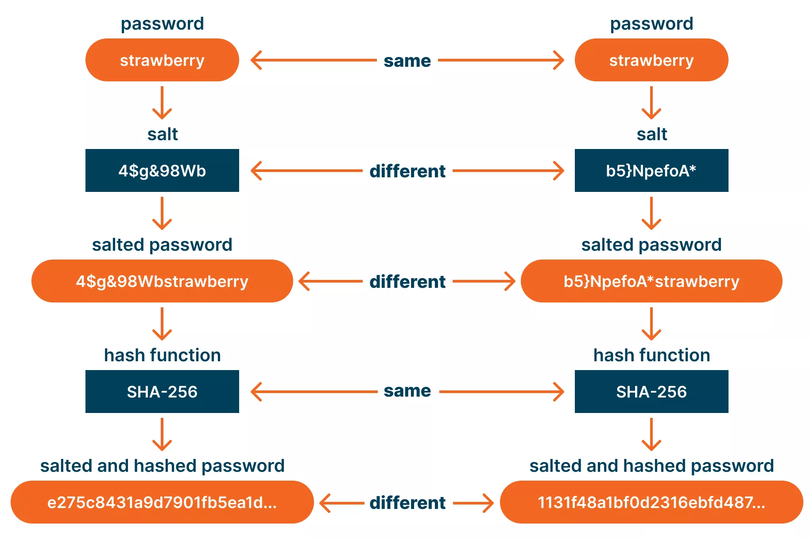
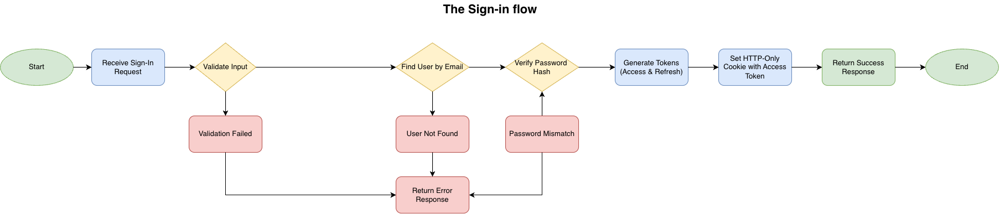
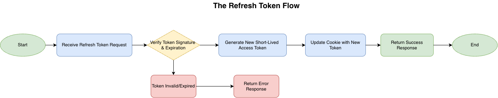

# JWT Authentication with Express and TypeScript

A comprehensive guide to implementing JWT (JSON Web Token) authentication in a Node.js/Express application with TypeScript.

---

## 1. Core Terminology

### What is JWT?

**JSON Web Token (JWT)** is an open standard (RFC 7519) that defines a compact and self-contained way for securely transmitting information between parties as a JSON object. This information can be verified and trusted because it is digitally signed. JWTs can be signed using a secret (with the HMAC algorithm) or a public/private key pair using RSA or ECDSA.

### JWT Structure

A JWT consists of three parts separated by dots (`.`): `header.payload.signature`

- **Header**: Contains metadata about the token, including the type of token and the hashing algorithm used.
- **Payload**: Contains claims (statements about the user) and additional data.
- **Signature**: Ensures that the token hasn't been altered.



> Use **[jwt.io Debugger](https://jwt.io/)** to decode, verify, and generate JWTs.

### How do JSON Web Tokens work?

In authentication, when the user successfully logs in using their credentials, a JSON Web Token will be returned in the body of response. Also, the token is typically small, so it can be easily stored in a browser cookie.



Whenever the user wants to access a protected route or resource, the user agent should send the JWT, typically in the Authorization header using the Bearer schema. The content of the header should look like the following: `Authorization: Bearer <token>`.

In cookie-based flows, the browser can also automatically attach the access token if it has been set as an HTTP cookie, and the server can read the token from that cookie instead of the header.

### Why should we use JWT?

- **Stateless**: servers don’t need to store session data, which makes scaling easier.​
- **Portable**: a compact, JSON-based token that any service or client (web, mobile, microservice) can read and verify.
- **Verifiable**: signed tokens let servers detect tampering and trust the embedded claims (user id, roles, expiry) without extra DB lookups.

### Token Expiration

Token expiration is controlled by the `exp` claim in a JWT, which sets the time after which the token is no longer valid. Short‑lived access tokens reduce the risk window: if an attacker steals one, they can only use it for a limited time before it expires and becomes useless.


​
Refresh tokens typically live longer because they are sent much less often and are stored more carefully (for example in HttpOnly cookies or secure storage). This lets users stay logged in for days or weeks while still using short‑lived access tokens for each API call, balancing security (short access token life) and usability (longer refresh token life).

---

## 2. Implementation Guide

### 2.1. Project Setup & Dependencies

Follow the steps in the **[Express.js Setup](../04_Working_with_Express/SETUP.md)** guide to set up the project. Then install the dependencies:

```bash
npm install express jsonwebtoken bcrypt cookie-parser cors dotenv helmet express-rate-limit uuid
npm install -D typescript @types/node @types/express @types/jsonwebtoken @types/bcrypt @types/cookie-parser @types/cors tsx nodemon
```

- **jsonwebtoken**: Library for creating and verifying JWT tokens
- **bcrypt**: Password hashing library for secure password storage
- **cookie-parser**: Middleware to parse cookies from requests
- **dotenv**: Loads environment variables from `.env` file
- **helmet**: Security middleware that sets various HTTP headers
- **express-rate-limit**: Rate limiting middleware to prevent brute force attacks
- **uuid**: Generates unique identifiers for users

---

### 2.2. Configuration Setup

**Generate JWT Secrets:** Generate secure random secrets using the following command:

```bash
node -e "console.log(require('crypto').randomBytes(64).toString('hex'))"
```

**Environment Variables**: Create a `.env` file in the root directory:

```env
# Server Configuration
PORT=3000
NODE_ENV=development
CORS_ORIGIN=http://localhost:3000

# JWT Secrets (copy and paste the generated secrets here)
JWT_SECRET=your_access_token_secret_here
JWT_REFRESH_SECRET=your_refresh_token_secret_here

# JWT Expiration Times
JWT_EXPIRES_IN=15m
JWT_REFRESH_EXPIRES_IN=7d

# Cookie Configuration, used to sign cookies for additional security
COOKIE_SECRET=your_cookie_secret_here
```

> **Important**: Never use weak or predictable secrets in production and never use the same secret for both access and refresh tokens.

**Configuration Module**: Create `src/config/config.ts`:

```typescript
import dotenv from 'dotenv';

dotenv.config();

interface Config {
  port: number;
  nodeEnv: string;
  jwtSecret: string;
  jwtRefreshSecret: string;
  jwtExpiresIn: string;
  jwtRefreshExpiresIn: string;
  cookieSecret: string;
  cookieMaxAge: number;
  corsOrigin: string;
}

function requireEnv(key: string): string {
  const value = process.env[key];
  if (!value) {
    throw new Error(`Missing environment variable: ${key}`);
  }
  return value;
}

const config: Config = {
  port: Number(process.env.PORT) || 3000,
  nodeEnv: process.env.NODE_ENV || 'development',
  jwtSecret: requireEnv('JWT_SECRET'),
  jwtRefreshSecret: requireEnv('JWT_REFRESH_SECRET'),
  jwtExpiresIn: process.env.JWT_EXPIRES_IN || '15m',
  jwtRefreshExpiresIn: process.env.JWT_REFRESH_EXPIRES_IN || '7d',
  cookieSecret: requireEnv('COOKIE_SECRET'),
  cookieMaxAge: 15 * 60 * 1000, // 15 minutes in milliseconds
  corsOrigin: process.env.CORS_ORIGIN || 'http://localhost:3000',
};

export default config;
```

---

### 2.3. Password Security (Password Hashing)

Never store passwords in plain text because if someone gets your database, they instantly see every user’s real password. Hashing converts the password into a fixed, one-way value, so even if attackers steal the database they only get hashes, which are much harder to crack with strong algorithms.



**Implementation**: Create `src/utils/password.util.ts`:

```typescript
import bcrypt from 'bcrypt';

const SALT_ROUNDS = 10;

export async function hashPassword(plainPassword: string): Promise<string> {
  const hashedPassword = await bcrypt.hash(plainPassword, SALT_ROUNDS);
  return hashedPassword;
}

export async function comparePassword(
  plainPassword: string,
  hashedPassword: string
): Promise<boolean> {
  const isMatch = await bcrypt.compare(plainPassword, hashedPassword);
  return isMatch;
}
```

#### How It Works

- `hashPassword` uses `bcrypt.hash(plainPassword, SALT_ROUNDS)` to generate a salted, hashed version of the plaintext password, and you store that returned string in the database instead of the real password.

- `comparePassword` uses `bcrypt.compare(plainPassword, hashedPassword)` to hash the login password with the same parameters embedded in the stored hash and returns true if they match, false if they do not.

- `SALT_ROUNDS = 10`: because it makes bcrypt slow enough to resist brute‑force attacks, but still fast enough that login/signup stays responsive on typical servers.

---

### 2.4. JWT Utilities Implementation

**Token Generation**: Create `src/utils/jwt.util.ts`:

```typescript
import jwt, { type SignOptions } from 'jsonwebtoken';
import type { StringValue } from 'ms';
import config from '../config/config';

export interface TokenPayload {
  userId: string;
  email: string;
}

export function generateAccessToken(payload: TokenPayload): string {
  const options: SignOptions = {
    expiresIn: config.jwtExpiresIn as StringValue,
  };
  return jwt.sign(payload, config.jwtSecret, options);
}

export function generateRefreshToken(payload: TokenPayload): string {
  const options: SignOptions = {
    expiresIn: config.jwtRefreshExpiresIn as StringValue,
  };
  return jwt.sign(payload, config.jwtRefreshSecret, options);
}
```

**Token Verification**:

```typescript
export function verifyAccessToken(token: string): TokenPayload {
  try {
    const decoded = jwt.verify(token, config.jwtSecret);

    if (typeof decoded === 'string') {
      throw new Error('Invalid token format');
    }

    if (!decoded.userId || !decoded.email) {
      throw new Error('Invalid token payload');
    }

    return {
      userId: decoded.userId as string,
      email: decoded.email as string,
    };
  } catch (error) {
    if (error instanceof jwt.JsonWebTokenError) {
      throw new Error('Invalid token');
    }
    if (error instanceof jwt.TokenExpiredError) {
      throw new Error('Token expired');
    }
    throw error;
  }
}

export function verifyRefreshToken(token: string): TokenPayload {
  try {
    const decoded = jwt.verify(token, config.jwtRefreshSecret);

    if (typeof decoded === 'string') {
      throw new Error('Invalid token format');
    }

    if (!decoded.userId || !decoded.email) {
      throw new Error('Invalid token payload');
    }

    return {
      userId: decoded.userId as string,
      email: decoded.email as string,
    };
  } catch (error) {
    if (error instanceof jwt.JsonWebTokenError) {
      throw new Error('Invalid refresh token');
    }
    if (error instanceof jwt.TokenExpiredError) {
      throw new Error('Refresh token expired');
    }
    throw error;
  }
}
```

**Error Handling:**

- `JsonWebTokenError`: Invalid token format or signature
- `TokenExpiredError`: Token has passed expiration time
- Type checking ensures payload structure is correct

---

### 2.5. Authentication Middleware

The authentication middleware protects routes by verifying JWT tokens and attaching user information to the request object. Create `src/middlewares/auth.middleware.ts`:

```typescript
import type { Request, Response, NextFunction } from 'express';
import { verifyAccessToken } from '../utils/jwt.util';
import { AppError } from './error.middleware';

// Extend Express Request to include user
declare global {
  namespace Express {
    interface Request {
      user?: {
        userId: string;
        email: string;
      };
    }
  }
}

export const authenticate = (
  req: Request,
  res: Response,
  next: NextFunction
) => {
  try {
    // Try to get token from Authorization header first
    let token: string | undefined;
    const authHeader = req.headers.authorization;

    if (authHeader && authHeader.startsWith('Bearer ')) {
      token = authHeader.substring(7); // Remove 'Bearer ' prefix
    } else {
      // Fallback to cookie if no Authorization header
      token = req.cookies?.accessToken;
    }

    if (!token) {
      throw new AppError('No token provided', 401);
    }

    const decoded = verifyAccessToken(token);

    req.user = {
      userId: decoded.userId,
      email: decoded.email,
    };

    next();
  } catch (error) {
    if (error instanceof AppError) {
      next(error);
    } else {
      next(new AppError('Invalid or expired token', 401));
    }
  }
};
```

1. The middleware first tries to extract the token from the `Authorization: Bearer <token>` header. If not found, it falls back to reading the `accessToken` cookie. This supports both authentication methods for flexibility.

2. After extracting the token, it verifies the token using `verifyAccessToken()` which checks the signature and expiration. If valid, the decoded user information is attached to `req.user` for use in subsequent middleware and route handlers.

3. The TypeScript global declaration extends the Express `Request` interface to include the optional `user` property, providing type safety throughout the application.

---

### 2.6. Authentication Controllers

Before implementing authentication controllers, we need an error handling middleware. Create `src/middlewares/error.middleware.ts`:

```typescript
import type { Request, Response, NextFunction } from 'express';

export class AppError extends Error {
  status?: number;

  constructor(message: string, status: number = 500) {
    super(message);
    this.status = status;
    this.name = 'AppError';
  }
}

export const errorHandler = (
  err: AppError | Error,
  req: Request,
  res: Response,
  next: NextFunction
) => {
  if (err instanceof AppError) {
    return res.status(err.status || 500).json({
      message: err.message,
    });
  }

  console.error(err);
  res.status(500).json({
    message: 'Internal Server Error',
  });
};
```

Create the user model in `src/models/user.model.ts`:

```typescript
export interface User {
  id: string;
  email: string;
  password: string; // hashed password
  name?: string;
  createdAt: Date;
}

// In-memory storage (temporary - use database in production)
export const users: User[] = [];
```

Now create the authentication controllers in `src/controllers/auth.controller.ts`. Start with the sign up controller:

```typescript
import type { Request, Response } from 'express';
import { v4 as uuidv4 } from 'uuid';
import { users, type User } from '../models/user.model';
import { hashPassword, comparePassword } from '../utils/password.util';
import {
  generateAccessToken,
  generateRefreshToken,
  verifyRefreshToken,
} from '../utils/jwt.util';
import { AppError } from '../middlewares/error.middleware';
import config from '../config/config';

export async function signUpController(req: Request, res: Response) {
  const { email, password, name } = req.body;

  if (!email || !password) {
    throw new AppError('Email and password are required', 400);
  }

  // Check if user exists
  const existingUser = users.find((u) => u.email === email);
  if (existingUser) {
    throw new AppError('User already exists', 409);
  }

  // Hash password
  const hashedPassword = await hashPassword(password);

  // Create user
  const newUser: User = {
    id: uuidv4(),
    email,
    password: hashedPassword,
    name: name || '',
    createdAt: new Date(),
  };

  users.push(newUser);

  // Generate tokens
  const tokenPayload = { userId: newUser.id, email: newUser.email };
  const accessToken = generateAccessToken(tokenPayload);
  const refreshToken = generateRefreshToken(tokenPayload);

  // Set access token in HTTP-only cookie
  res.cookie('accessToken', accessToken, {
    httpOnly: true,
    secure: config.nodeEnv === 'production', // Only send over HTTPS in production
    sameSite: 'strict',
    maxAge: config.cookieMaxAge,
    path: '/',
  });

  res.status(201).json({
    message: 'User created successfully',
    user: {
      id: newUser.id,
      email: newUser.email,
      name: newUser.name,
    },
    refreshToken, // Only send refresh token in response body
  });
}
```


**Sign In Controller:**

```typescript
export async function signInController(req: Request, res: Response) {
  const { email, password } = req.body;

  if (!email || !password) {
    throw new AppError('Email and password are required', 400);
  }

  // Find user
  const user = users.find((u) => u.email === email);
  if (!user) {
    throw new AppError('Invalid credentials', 401);
  }

  // Verify password
  const isPasswordValid = await comparePassword(password, user.password);
  if (!isPasswordValid) {
    throw new AppError('Invalid credentials', 401);
  }

  // Generate tokens
  const tokenPayload = { userId: user.id, email: user.email };
  const accessToken = generateAccessToken(tokenPayload);
  const refreshToken = generateRefreshToken(tokenPayload);

  // Set access token in HTTP-only cookie
  res.cookie('accessToken', accessToken, {
    httpOnly: true,
    secure: config.nodeEnv === 'production',
    sameSite: 'strict',
    maxAge: config.cookieMaxAge,
    path: '/',
  });

  res.json({
    message: 'Sign in successful',
    user: {
      id: user.id,
      email: user.email,
      name: user.name,
    },
    refreshToken,
  });
}
```



**Refresh Token Controller:**

```typescript
export function refreshTokenController(req: Request, res: Response) {
  const { refreshToken } = req.body;

  if (!refreshToken) {
    throw new AppError('Refresh token is required', 400);
  }

  try {
    // Verify refresh token signature and expiration
    const decoded = verifyRefreshToken(refreshToken);

    // Generate new access token
    const newAccessToken = generateAccessToken({
      userId: decoded.userId,
      email: decoded.email,
    });

    // Set new access token in HTTP-only cookie
    res.cookie('accessToken', newAccessToken, {
      httpOnly: true,
      secure: config.nodeEnv === 'production',
      sameSite: 'strict',
      maxAge: config.cookieMaxAge,
      path: '/',
    });

    res.json({
      message: 'Token refreshed successfully',
    });
  } catch (error) {
    throw new AppError('Invalid or expired refresh token', 401);
  }
}
```



**Logout Controller:**

```typescript
export function logoutController(req: Request, res: Response) {
  // Clear access token cookie
  res.clearCookie('accessToken', {
    httpOnly: true,
    secure: config.nodeEnv === 'production',
    sameSite: 'strict',
    path: '/',
  });

  res.json({
    message: 'Logged out successfully',
  });
}
```

The logout flow clears the access token cookie and returns success. Since refresh tokens are not stored server-side, the client should discard the refresh token on logout. The access token in the cookie is cleared, effectively logging the user out on the client side.

**Get Current User Controller:**

```typescript
export function getMeController(req: Request, res: Response) {
  const user = users.find((u) => u.id === req.user?.userId);

  if (!user) {
    throw new AppError('User not found', 404);
  }

  res.json({
    user: {
      id: user.id,
      email: user.email,
      name: user.name,
      createdAt: user.createdAt,
    },
  });
}
```

This protected route uses the `authenticate` middleware which populates `req.user` with the decoded token information. The controller then returns user information excluding the password.

---

### 2.7. Routes Setup

Create `src/routes/auth.route.ts` to define all authentication endpoints:

```typescript
import { Router } from 'express';
import {
  signUpController,
  signInController,
  refreshTokenController,
  logoutController,
  getMeController,
} from '../controllers/auth.controller';
import { authenticate } from '../middlewares/auth.middleware';
import { authLimiter } from '../middlewares/rateLimit.middleware';

const router = Router();

// Apply rate limiting to auth routes
router.post('/signup', authLimiter, signUpController);
router.post('/signin', authLimiter, signInController);
router.post('/refresh', authLimiter, refreshTokenController);
router.post('/logout', logoutController);
router.get('/me', authenticate, getMeController);

export default router;
```

The routes include:

- `POST /api/auth/signup` for registration
- `POST /api/auth/signin` for login
- `POST /api/auth/refresh` for token refresh
- `POST /api/auth/logout` for logout
- `GET /api/auth/me` as a protected route to get current user information

Rate limiting is applied to signup, signin, and refresh endpoints to prevent brute force attacks. The `authenticate` middleware protects the `/me` route.

---

### 2.8. Express App Configuration

Create the rate limiting middleware in `src/middlewares/rateLimit.middleware.ts`:

```typescript
import rateLimit from 'express-rate-limit';

// General API rate limiter
export const apiLimiter = rateLimit({
  windowMs: 15 * 60 * 1000, // 15 minutes
  max: 100, // Limit each IP to 100 requests per windowMs
  message: 'Too many requests from this IP, please try again later.',
  standardHeaders: true,
  legacyHeaders: false,
});

// Auth routes rate limiter (stricter)
export const authLimiter = rateLimit({
  windowMs: 15 * 60 * 1000, // 15 minutes
  max: 5, // Limit each IP to 5 requests per windowMs
  message: 'Too many authentication attempts, please try again later.',
  standardHeaders: true,
  legacyHeaders: false,
  skipSuccessfulRequests: true, // Don't count successful requests
});
```

The general API limiter allows 100 requests per 15 minutes, while the auth limiter is stricter with only 5 requests per 15 minutes to prevent brute force attacks.

Create a simple logger middleware in `src/middlewares/logger.middleware.ts`:

```typescript
import type { Request, Response, NextFunction } from 'express';

export const logger = (req: Request, res: Response, next: NextFunction) => {
  console.log(`${req.method} ${req.path} - ${new Date().toISOString()}`);
  next();
};
```

Now create the main Express app configuration in `src/app.ts`:

```typescript
import express from 'express';
import helmet from 'helmet';
import cors from 'cors';
import cookieParser from 'cookie-parser';
import { errorHandler } from './middlewares/error.middleware';
import { logger } from './middlewares/logger.middleware';
import { apiLimiter } from './middlewares/rateLimit.middleware';
import config from './config/config';
import authRoutes from './routes/auth.route';

const app = express();

// Request logging
app.use(logger);

// Security middleware
app.use(helmet());

// CORS configuration
app.use(
  cors({
    origin: config.corsOrigin,
    credentials: true, // Allow cookies to be sent
  })
);

// Body parser
app.use(express.json());
app.use(express.urlencoded({ extended: true }));

// Cookie parser
app.use(cookieParser(config.cookieSecret));

// Rate limiting
app.use('/api', apiLimiter);

// Routes
app.use('/api/auth', authRoutes);

// Health check route
app.get('/api/health', (req, res) => {
  res.status(200).json({ message: 'Server is running' });
});

// Global error handler (should be after routes)
app.use(errorHandler);

export default app;
```

The middleware order is important. Logger comes first to log all requests, followed by Helmet for security headers, CORS configuration for cross-origin requests, body parsers for JSON and URL-encoded data, cookie parser for cookies, rate limiting, routes, and finally the error handler which must be last to catch all errors.

Key configuration points include setting `credentials: true` in CORS to allow cookies, using `helmet()` for automatic security headers, and ensuring the error handler is placed after all routes.

Create `src/server.ts` to start the server:

```typescript
import app from './app';
import config from './config/config';

app.listen(config.port, () => {
  console.log(`Server running on port ${config.port}`);
});
```

---

### 2.9. Security Best Practices

This implementation includes several security practices:

- HTTP-only cookies prevent XSS attacks by making cookies inaccessible to JavaScript.
- The secure flag in production ensures cookies are only sent over HTTPS, preventing man-in-the-middle attacks.
- The SameSite attribute prevents CSRF attacks by only sending cookies with same-site requests.
- Separate secrets for access and refresh tokens limit damage if one is compromised. Short-lived access tokens (15 minutes) and longer refresh tokens (7 days) reduce the exposure window.
- Passwords are hashed with bcrypt, never stored in plain text.
- Rate limiting prevents brute force attacks with stricter limits on auth endpoints.
- Generic error messages prevent user enumeration and don't reveal system internals.

**Additional recommendations for production**:

- Token blacklisting using Redis or a database
- Refresh token rotation to generate new refresh tokens on each refresh
- Multi-device support with device tracking
- Secure password reset flows
- Two-factor authentication
- Audit logging for authentication events

---

### 2.10. Testing the Implementation

Test the sign up endpoint with a POST request:

```bash
curl -X POST http://localhost:3000/api/auth/signup \
  -H "Content-Type: application/json" \
  -d '{
    "email": "test@example.com",
    "password": "password123",
    "name": "Test User"
  }'
```

The expected response includes a success message, user information, and a refresh token. The access token will be set in an HTTP-only cookie.

Test sign in with credentials:

```bash
curl -X POST http://localhost:3000/api/auth/signin \
  -H "Content-Type: application/json" \
  -d '{
    "email": "test@example.com",
    "password": "password123"
  }' \
  -c cookies.txt
```

This saves cookies to a file for subsequent requests. The response includes user information and a refresh token.

Test the protected route using either the Authorization header or cookies:

```bash
curl -X GET http://localhost:3000/api/auth/me \
  -H "Authorization: Bearer YOUR_ACCESS_TOKEN" \
  -b cookies.txt
```

Or simply use cookies:

```bash
curl -X GET http://localhost:3000/api/auth/me \
  -b cookies.txt
```

Test token refresh by sending the refresh token:

```bash
curl -X POST http://localhost:3000/api/auth/refresh \
  -H "Content-Type: application/json" \
  -d '{
    "refreshToken": "YOUR_REFRESH_TOKEN"
  }' \
  -c cookies.txt
```

Test logout to clear the access token cookie:

```bash
curl -X POST http://localhost:3000/api/auth/logout
```

---

## 3. Summary of Implementation Steps

1. **[Project Setup & Dependencies](#21-project-setup--dependencies)**: Install `express`, `jsonwebtoken`, `bcrypt`, and other necessary packages.
2. **[Configuration Setup](#22-configuration-setup)**: Configure environment variables (`.env`) and create the config module to manage secrets and settings.
3. **[Password Security](#23-password-security-password-hashing)**: Implement `hashPassword` and `comparePassword` utilities using `bcrypt`.
4. **[JWT Utilities](#24-jwt-utilities-implementation)**: Create functions to generate and verify access/refresh tokens.
5. **[Authentication Middleware](#25-authentication-middleware)**: Create middleware to verify tokens from headers or cookies and attach user data to the request.
6. **[Authentication Controllers](#26-authentication-controllers)**: Implement controllers for sign up, sign in (issuing tokens), token refresh, and logout.
7. **[Routes Setup](#27-routes-setup)**: Define API endpoints (`/signup`, `/signin`, `/refresh`, `/logout`, `/me`) and map them to controllers.
8. **[Express App Configuration](#28-express-app-configuration)**: Configure the Express app with middleware (CORS, body parser, cookie parser) and mount the auth routes.

## Resources

- [JWT.io](https://jwt.io/) - JWT debugger and documentation
- [RFC 7519](https://tools.ietf.org/html/rfc7519) - JWT specification
- [OWASP Authentication Cheat Sheet](https://cheatsheetseries.owasp.org/cheatsheets/Authentication_Cheat_Sheet.html)
- [Express Security Best Practices](https://expressjs.com/en/advanced/best-practice-security.html)
