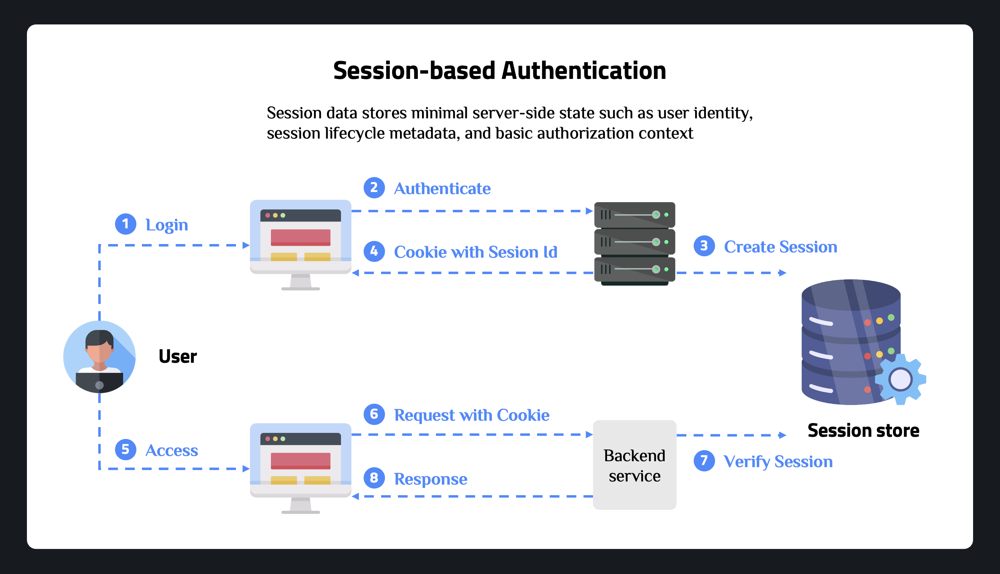
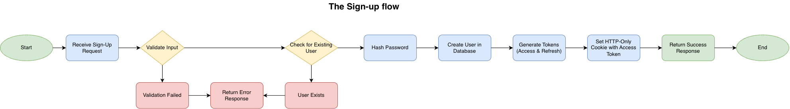

# Session Authentication with Express and TypeScript

A comprehensive guide to implementing session-based authentication in a Node.js/Express application with TypeScript and Redis.

---

## 1. Core Terminology

### What is Cookie

Cookies on a website are small pieces of data that the server asks the browser to store and send back with later requests, allowing the site to remember information between page loads in an otherwise stateless HTTP world. They are typically used to maintain log-in sessions, remember preferences, and support analytics or advertising features.

### What is Session?

In the context of web development, a session refers to a way of maintaining state information about a user’s interactions with a website or web application. When a user visits a website, the server can create a session for that user. Additionally, a session allows the server to keep track of information such as the user’s login status, preferences, and any data entered into forms.

### How Session-based Authentication Works

When a user successfully logs in, the server creates a session and stores session data (like user ID, email) in a server-side store (database, Redis, or memory). The server then sends a session ID to the client, usually in an HTTP-only cookie. On subsequent requests, the client automatically sends this session ID cookie, and the server uses it to retrieve the session data and verify the user's identity.



### Session vs JWT

- **Session-based**: Session data is stored on the server, making it easier to revoke sessions and manage user state. Requires server-side storage (database/Redis).
- **JWT-based**: Token contains all user information and is verified using cryptographic signatures. Stateless but harder to revoke before expiration.

### Why Use Session Authentication?

- **Easy revocation**: Sessions can be immediately invalidated on the server
- **Server-side control**: Full control over session lifecycle and security
- **Better for sensitive applications**: Easier to implement features like "logout all devices"
- **Simpler security model**: No need to manage token secrets and expiration on the client

### Session Storage Options

- **Memory Store**: Fast but lost on server restart, not suitable for production
- **Database Store**: Persistent but slower, requires database queries
- **Redis Store**: Fast, persistent, and scalable - ideal for production applications

---

## 2. Implementation Guide

### 2.1. Project Setup & Dependencies

Follow the steps in the **[Express.js Setup](../04_Working_with_Express/SETUP.md)** guide to set up the project. Then install the dependencies:

```bash
npm install express express-session connect-redis redis bcrypt cors dotenv helmet express-rate-limit uuid
npm install -D typescript @types/node @types/express @types/express-session @types/bcrypt @types/cors tsx nodemon
```

- **express-session**: Middleware for managing sessions in Express
- **connect-redis**: Redis session store for express-session
- **redis**: Redis client for Node.js
- **bcrypt**: Password hashing library for secure password storage
- **dotenv**: Loads environment variables from `.env` file
- **helmet**: Security middleware that sets various HTTP headers
- **express-rate-limit**: Rate limiting middleware to prevent brute force attacks
- **uuid**: Generates unique identifiers for users

---

### 2.2. Configuration Setup

**Generate Session Secret:** Generate a secure random secret using the following command:

```bash
node -e "console.log(require('crypto').randomBytes(64).toString('hex'))"
```

**Environment Variables**: Create a `.env` file in the root directory:

```env
# Server Configuration
PORT=3000
NODE_ENV=development
CORS_ORIGIN=http://localhost:3000

# Session Configuration
SESSION_SECRET=your_session_secret_here
SESSION_MAX_AGE=86400000

# Redis Configuration
REDIS_HOST=localhost
REDIS_PORT=6379
REDIS_PASSWORD=
```

> **Important**: Never use weak or predictable secrets in production. The session secret is used to sign the session ID cookie.

**Configuration Module**: Create `src/config/config.ts`:

```typescript
import dotenv from 'dotenv';

dotenv.config();

interface Config {
  port: number;
  nodeEnv: string;
  sessionSecret: string;
  sessionMaxAge: number;
  corsOrigin: string;
  redisHost: string;
  redisPort: number;
  redisPassword?: string;
}

function requireEnv(key: string): string {
  const value = process.env[key];
  if (!value) {
    throw new Error(`Missing environment variable: ${key}`);
  }
  return value;
}

const config: Config = {
  port: Number(process.env.PORT) || 3000,
  nodeEnv: process.env.NODE_ENV || 'development',
  sessionSecret: requireEnv('SESSION_SECRET'),
  sessionMaxAge: Number(process.env.SESSION_MAX_AGE) || 24 * 60 * 60 * 1000, // 24 hours in milliseconds
  corsOrigin: process.env.CORS_ORIGIN || 'http://localhost:3000',
  redisHost: process.env.REDIS_HOST || 'localhost',
  redisPort: Number(process.env.REDIS_PORT) || 6379,
  redisPassword: process.env.REDIS_PASSWORD,
};

export default config;
```

---

### 2.3. Password Security (Password Hashing)

Never store passwords in plain text because if someone gets your database, they instantly see every user's real password. Hashing converts the password into a fixed, one-way value, so even if attackers steal the database they only get hashes, which are much harder to crack with strong algorithms.

**Implementation**: Create `src/utils/password.util.ts`:

```typescript
import bcrypt from 'bcrypt';

const SALT_ROUNDS = 10;

export async function hashPassword(password: string): Promise<string> {
  return bcrypt.hash(password, SALT_ROUNDS);
}

export async function comparePassword(
  password: string,
  hashedPassword: string
): Promise<boolean> {
  return bcrypt.compare(password, hashedPassword);
}
```

#### How It Works

- `hashPassword` uses `bcrypt.hash(plainPassword, SALT_ROUNDS)` to generate a salted, hashed version of the plaintext password, and you store that returned string in the database instead of the real password.

- `comparePassword` uses `bcrypt.compare(plainPassword, hashedPassword)` to hash the login password with the same parameters embedded in the stored hash and returns true if they match, false if they do not.

- `SALT_ROUNDS = 10`: because it makes bcrypt slow enough to resist brute‑force attacks, but still fast enough that login/signup stays responsive on typical servers.

---

### 2.4. Session Configuration

**Express Session Setup**: The session middleware is configured in `src/app.ts`. Here's how it works:

```typescript
import session from 'express-session';
import { createClient } from 'redis';
import RedisStore from 'connect-redis';

// Redis client configuration
const redisClientConfig: {
  socket: { host: string; port: number };
  password?: string;
} = {
  socket: {
    host: config.redisHost,
    port: config.redisPort,
  },
};

if (config.redisPassword) {
  redisClientConfig.password = config.redisPassword;
}

const redisClient = createClient(redisClientConfig);

redisClient.on('error', (err) => {
  console.error('Redis Client Error:', err);
});

redisClient.on('connect', () => {
  console.log('Connected to Redis');
});

// Connect to Redis
redisClient.connect().catch((err) => {
  console.error('Failed to connect to Redis:', err);
  process.exit(1);
});

// Session configuration with Redis store
app.use(
  session({
    store: new RedisStore({ client: redisClient }),
    secret: config.sessionSecret,
    resave: false,
    saveUninitialized: false,
    name: 'sessionId', // Custom session cookie name
    cookie: {
      httpOnly: true,
      secure: config.nodeEnv === 'production',
      sameSite: 'strict',
      maxAge: config.sessionMaxAge,
    },
  })
);
```

**Session Options Explained:**

- `store`: Redis store for session persistence across server restarts
- `secret`: Used to sign the session ID cookie, preventing tampering
- `resave`: Forces session to be saved back to store even if not modified (set to false)
- `saveUninitialized`: Forces uninitialized sessions to be saved (set to false for security)
- `name`: Custom cookie name (default is 'connect.sid')
- `cookie.httpOnly`: Prevents JavaScript access to the cookie (XSS protection)
- `cookie.secure`: Only send cookie over HTTPS in production
- `cookie.sameSite`: Prevents CSRF attacks by only sending cookie with same-site requests
- `cookie.maxAge`: Session expiration time in milliseconds

---

### 2.5. Authentication Middleware

The authentication middleware protects routes by checking if a valid session exists. Create `src/middlewares/auth.middleware.ts`:

```typescript
import type { Request, Response, NextFunction } from 'express';
import { AppError } from './error.middleware';

// Extend Express Request to include user
declare global {
  namespace Express {
    interface Request {
      user?: {
        userId: string;
        email: string;
      };
    }
  }
}

export const authenticate = (
  req: Request,
  res: Response,
  next: NextFunction
) => {
  // Check if session exists and is authenticated
  if (!req.session || !req.session.isAuthenticated) {
    throw new AppError('Not authenticated', 401);
  }

  // Session data is already in req.session
  req.user = {
    userId: req.session.userId as string,
    email: req.session.email as string,
  };

  next();
};
```

1. The middleware checks if `req.session` exists and if `req.session.isAuthenticated` is true. If not, it throws an authentication error.

2. If authenticated, it extracts user information from the session and attaches it to `req.user` for use in subsequent middleware and route handlers.

3. The TypeScript global declaration extends the Express `Request` interface to include the optional `user` property, providing type safety throughout the application.

---

### 2.6. Authentication Controllers

Before implementing authentication controllers, we need an error handling middleware. Create `src/middlewares/error.middleware.ts`:

```typescript
import type { Request, Response, NextFunction } from 'express';

export class AppError extends Error {
  status?: number;

  constructor(message: string, status: number = 500) {
    super(message);
    this.status = status;
    this.name = 'AppError';
  }
}

export const errorHandler = (
  err: AppError | Error,
  req: Request,
  res: Response,
  next: NextFunction
) => {
  if (err instanceof AppError) {
    return res.status(err.status || 500).json({
      message: err.message,
    });
  }

  console.error(err);
  res.status(500).json({
    message: 'Internal Server Error',
  });
};
```

Create the user model in `src/models/user.model.ts`:

```typescript
export interface User {
  id: string;
  email: string;
  password: string; // hashed password
  name?: string;
  createdAt: Date;
}

// In-memory storage (temporary - use database in production)
export const users: User[] = [];
```

Now create the authentication controllers in `src/controllers/auth.controller.ts`. Start with the sign up controller:

```typescript
import type { Request, Response } from 'express';
import { v4 as uuidv4 } from 'uuid';
import { users, type User } from '../models/user.model';
import { hashPassword, comparePassword } from '../utils/password.util';
import { AppError } from '../middlewares/error.middleware';

// Extend Express Session type
declare module 'express-session' {
  interface SessionData {
    userId?: string;
    email?: string;
    isAuthenticated?: boolean;
  }
}

export async function signUpController(req: Request, res: Response) {
  const { email, password, name } = req.body;

  if (!email || !password) {
    throw new AppError('Email and password are required', 400);
  }

  // Check if user exists
  const existingUser = users.find((u) => u.email === email);
  if (existingUser) {
    throw new AppError('User already exists', 409);
  }

  // Hash password
  const hashedPassword = await hashPassword(password);

  // Create user
  const newUser: User = {
    id: uuidv4(),
    email,
    password: hashedPassword,
    name: name || '',
    createdAt: new Date(),
  };

  users.push(newUser);

  // Create session
  req.session.userId = newUser.id;
  req.session.email = newUser.email;
  req.session.isAuthenticated = true;

  res.status(201).json({
    message: 'User created successfully',
    user: {
      id: newUser.id,
      email: newUser.email,
      name: newUser.name,
    },
  });
}
```



**Sign In Controller:**

```typescript
export async function signInController(req: Request, res: Response) {
  const { email, password } = req.body;

  if (!email || !password) {
    throw new AppError('Email and password are required', 400);
  }

  // Find user
  const user = users.find((u) => u.email === email);
  if (!user) {
    throw new AppError('Invalid credentials', 401);
  }

  // Verify password
  const isPasswordValid = await comparePassword(password, user.password);
  if (!isPasswordValid) {
    throw new AppError('Invalid credentials', 401);
  }

  // Create session
  req.session.userId = user.id;
  req.session.email = user.email;
  req.session.isAuthenticated = true;

  res.json({
    message: 'Sign in successful',
    user: {
      id: user.id,
      email: user.email,
      name: user.name,
    },
  });
}
```


**Refresh Session Controller:**

```typescript
export function refreshSessionController(req: Request, res: Response) {
  if (!req.session || !req.session.isAuthenticated) {
    throw new AppError('Not authenticated', 401);
  }

  // Extend session expiration
  req.session.cookie.maxAge = req.session.cookie.originalMaxAge || undefined;
  req.session.touch(); // Update last access time

  res.json({
    message: 'Session refreshed successfully',
  });
}
```

The refresh session flow checks if the user is authenticated, extends the session expiration time, and updates the last access time. This allows users to stay logged in longer without re-authenticating.

**Logout Controller:**

```typescript
export function logoutController(req: Request, res: Response) {
  req.session.destroy((err) => {
    if (err) {
      throw new AppError('Failed to logout', 500);
    }

    res.clearCookie('connect.sid'); // Default session cookie name
    res.json({
      message: 'Logged out successfully',
    });
  });
}
```

> **Note**: If you set a custom session cookie name using the `name` option in session configuration, make sure to use the same name in `clearCookie()`. The default name is `connect.sid`.

The logout flow destroys the session on the server (removing it from Redis), clears the session cookie on the client using `res.clearCookie()`, and returns success. This effectively logs the user out on both the server and client side.

**Get Current User Controller:**

```typescript
export function getMeController(req: Request, res: Response) {
  const user = users.find((u) => u.id === req.user?.userId);

  if (!user) {
    throw new AppError('User not found', 404);
  }

  res.json({
    user: {
      id: user.id,
      email: user.email,
      name: user.name,
      createdAt: user.createdAt,
    },
  });
}
```

This protected route uses the `authenticate` middleware which populates `req.user` with the session information. The controller then returns user information excluding the password.

---

### 2.7. Routes Setup

Create `src/routes/auth.route.ts` to define all authentication endpoints:

```typescript
import { Router } from 'express';
import {
  signUpController,
  signInController,
  refreshSessionController,
  logoutController,
  getMeController,
} from '../controllers/auth.controller';
import { authenticate } from '../middlewares/auth.middleware';
import { authLimiter } from '../middlewares/rateLimit.middleware';

const router = Router();

// Apply rate limiting to auth routes
router.post('/signup', authLimiter, signUpController);
router.post('/signin', authLimiter, signInController);
router.post('/refresh', authenticate, refreshSessionController);
router.post('/logout', logoutController);
router.get('/me', authenticate, getMeController);

export default router;
```

The routes include:

- `POST /api/auth/signup` for registration
- `POST /api/auth/signin` for login
- `POST /api/auth/refresh` for session refresh (protected)
- `POST /api/auth/logout` for logout
- `GET /api/auth/me` as a protected route to get current user information

Rate limiting is applied to signup and signin endpoints to prevent brute force attacks. The `authenticate` middleware protects the `/refresh` and `/me` routes.

---

### 2.8. Express App Configuration

Create the rate limiting middleware in `src/middlewares/rateLimit.middleware.ts`:

```typescript
import rateLimit from 'express-rate-limit';

// General API rate limiter
export const apiLimiter = rateLimit({
  windowMs: 15 * 60 * 1000, // 15 minutes
  max: 100, // Limit each IP to 100 requests per windowMs
  message: 'Too many requests from this IP, please try again later.',
  standardHeaders: true,
  legacyHeaders: false,
});

// Auth routes rate limiter (stricter)
export const authLimiter = rateLimit({
  windowMs: 15 * 60 * 1000, // 15 minutes
  max: 5, // Limit each IP to 5 requests per windowMs
  message: 'Too many authentication attempts, please try again later.',
  standardHeaders: true,
  legacyHeaders: false,
  skipSuccessfulRequests: true, // Don't count successful requests
});
```

The general API limiter allows 100 requests per 15 minutes, while the auth limiter is stricter with only 5 requests per 15 minutes to prevent brute force attacks.

Create a simple logger middleware in `src/middlewares/logger.middleware.ts`:

```typescript
import type { Request, Response, NextFunction } from 'express';

export const logger = (req: Request, res: Response, next: NextFunction) => {
  console.log(`${req.method} ${req.path} - ${new Date().toISOString()}`);
  next();
};
```

Now create the main Express app configuration in `src/app.ts`:

```typescript
import express from 'express';
import helmet from 'helmet';
import cors from 'cors';
import session from 'express-session';
import { createClient } from 'redis';
import RedisStore from 'connect-redis';
import { errorHandler } from './middlewares/error.middleware';
import { logger } from './middlewares/logger.middleware';
import { apiLimiter } from './middlewares/rateLimit.middleware';
import config from './config/config';
import authRoutes from './routes/auth.route';

const app = express();

// Request logging
app.use(logger);

// Security middleware
app.use(helmet());

// CORS configuration
app.use(
  cors({
    origin: config.corsOrigin,
    credentials: true, // Allow cookies to be sent
  })
);

// Body parser
app.use(express.json());
app.use(express.urlencoded({ extended: true }));

// Redis client configuration
const redisClientConfig: {
  socket: { host: string; port: number };
  password?: string;
} = {
  socket: {
    host: config.redisHost,
    port: config.redisPort,
  },
};

if (config.redisPassword) {
  redisClientConfig.password = config.redisPassword;
}

const redisClient = createClient(redisClientConfig);

redisClient.on('error', (err) => {
  console.error('Redis Client Error:', err);
});

redisClient.on('connect', () => {
  console.log('Connected to Redis');
});

// Connect to Redis
redisClient.connect().catch((err) => {
  console.error('Failed to connect to Redis:', err);
  process.exit(1);
});

// Session configuration with Redis store
app.use(
  session({
    store: new RedisStore({ client: redisClient }),
    secret: config.sessionSecret,
    resave: false,
    saveUninitialized: false,
    name: 'sessionId',
    cookie: {
      httpOnly: true,
      secure: config.nodeEnv === 'production',
      sameSite: 'strict',
      maxAge: config.sessionMaxAge,
    },
  })
);

// Rate limiting
app.use('/api', apiLimiter);

// Routes
app.use('/api/auth', authRoutes);

// Health check route
app.get('/api/health', (req, res) => {
  res.status(200).json({ message: 'Server is running' });
});

// Global error handler (should be after routes)
app.use(errorHandler);

export default app;
```

The middleware order is important. Logger comes first to log all requests, followed by Helmet for security headers, CORS configuration for cross-origin requests, body parsers for JSON and URL-encoded data, session middleware with Redis store, rate limiting, routes, and finally the error handler which must be last to catch all errors.

Key configuration points include setting `credentials: true` in CORS to allow cookies, using `helmet()` for automatic security headers, connecting to Redis before setting up the session store, and ensuring the error handler is placed after all routes.

Create `src/server.ts` to start the server:

```typescript
import app from './app';
import config from './config/config';

app.listen(config.port, () => {
  console.log(`Server running on port ${config.port}`);
  console.log(`Environment: ${config.nodeEnv}`);
  console.log(`Redis: ${config.redisHost}:${config.redisPort}`);
});
```

---

### 2.9. Security Best Practices

This implementation includes several security practices:

- HTTP-only cookies prevent XSS attacks by making cookies inaccessible to JavaScript.
- The secure flag in production ensures cookies are only sent over HTTPS, preventing man-in-the-middle attacks.
- The SameSite attribute prevents CSRF attacks by only sending cookies with same-site requests.
- Session secret is used to sign the session ID cookie, preventing tampering.
- Passwords are hashed with bcrypt, never stored in plain text.
- Rate limiting prevents brute force attacks with stricter limits on auth endpoints.
- Generic error messages prevent user enumeration and don't reveal system internals.
- Redis store provides persistent session storage that survives server restarts.

**Additional recommendations for production**:

- Use Redis password authentication
- Implement session timeout and automatic cleanup
- Monitor Redis memory usage and set appropriate eviction policies
- Use Redis Sentinel or Cluster for high availability
- Implement session activity tracking and suspicious activity detection
- Secure password reset flows
- Two-factor authentication
- Audit logging for authentication events

---

### 2.10. Testing the Implementation

Test the sign up endpoint with a POST request:

```bash
curl -X POST http://localhost:3000/api/auth/signup \
  -H "Content-Type: application/json" \
  -d '{
    "email": "test@example.com",
    "password": "password123",
    "name": "Test User"
  }' \
  -c cookies.txt
```

The expected response includes a success message and user information. The session ID will be set in an HTTP-only cookie and saved to `cookies.txt` for subsequent requests.

Test sign in with credentials:

```bash
curl -X POST http://localhost:3000/api/auth/signin \
  -H "Content-Type: application/json" \
  -d '{
    "email": "test@example.com",
    "password": "password123"
  }' \
  -c cookies.txt
```

This saves cookies to a file for subsequent requests. The response includes user information and a session cookie.

Test the protected route using cookies:

```bash
curl -X GET http://localhost:3000/api/auth/me \
  -b cookies.txt
```

Test session refresh to extend the session expiration:

```bash
curl -X POST http://localhost:3000/api/auth/refresh \
  -b cookies.txt
```

Test logout to destroy the session:

```bash
curl -X POST http://localhost:3000/api/auth/logout \
  -b cookies.txt
```

---

## Resources

- [Express Session Documentation](https://github.com/expressjs/session) - express-session middleware documentation
- [Redis Documentation](https://redis.io/docs/) - Redis official documentation
- [Connect Redis](https://github.com/tj/connect-redis) - Redis session store for Express
- [OWASP Session Management Cheat Sheet](https://cheatsheetseries.owasp.org/cheatsheets/Session_Management_Cheat_Sheet.html)
- [Express Security Best Practices](https://expressjs.com/en/advanced/best-practice-security.html)
