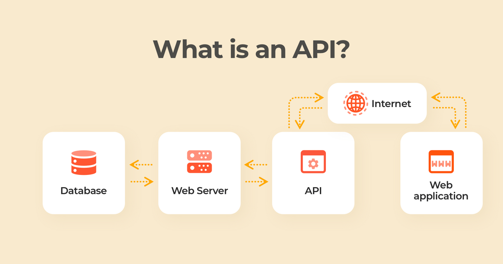
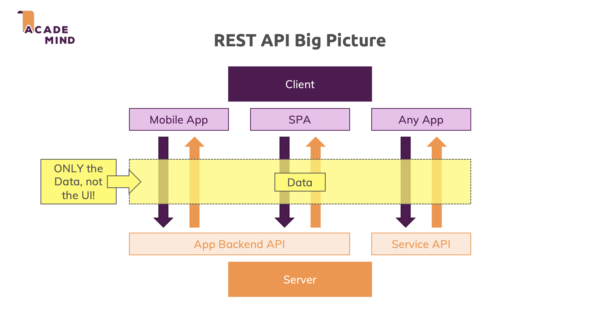
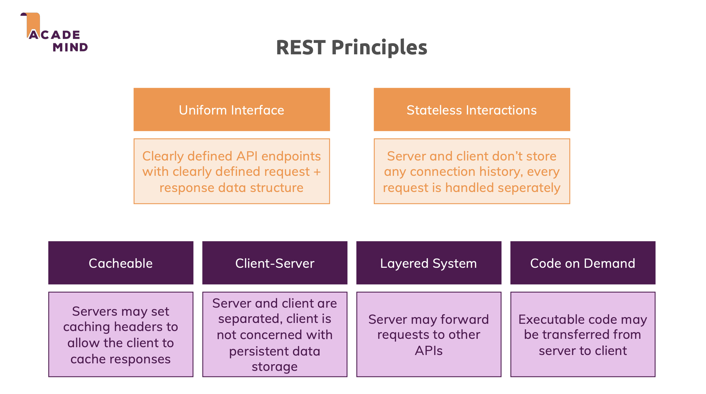
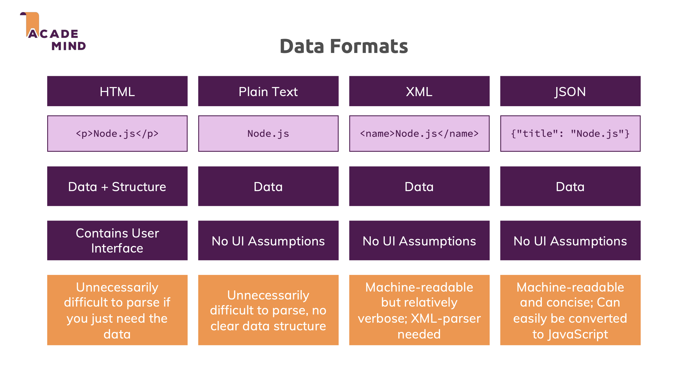

# RESTful API Design

A comprehensive guide to building RESTful APIs with Express, TypeScript, MongoDB, and best practices including layered architecture, schema-based validation, and role-based authorization.

---

## 1. Core Terminology

### What is an API?

An application programming interface (API) defines the rules that you must follow to communicate with other software systems. Developers expose or create APIs so that other applications can communicate with their applications programmatically.

For example, the timesheet application exposes an API that asks for an employee's full name and a range of dates. When it receives this information, it internally processes the employee's timesheet and returns the number of hours worked in that date range.



### What is REST?

**Representational State Transfer (REST)** is a software architecture that imposes conditions on how an API should work. REST was initially created as a guideline to manage communication on a complex network like the internet. You can use REST-based architecture to support high-performing and reliable communication at scale. You can easily implement and modify it, bringing visibility and cross-platform portability to any API system.



### What is RESTful API?

API developers can design APIs using several different architectures. APIs that follow the REST architectural style are called REST APIs. Web services that implement REST architecture are called RESTful web services. The term RESTful API generally refers to RESTful web APIs. However, you can use the terms REST API and RESTful API interchangeably.

### RESTful API Principles



### How do RESTful APIs work?

The basic function of a RESTful API is the same as browsing the internet. The client contacts the server by using the API when it requires a resource. API developers explain how the client should use the REST API in the server application [API documentation](../10_Restful_API_Logging_Documents/README.md) (e.g., OpenAPI, Swagger, Postman Collections). These are the general steps for any REST API call:

1. The client sends a request to the server. The client follows the API documentation to format the request in a way that the server understands.
2. The server authenticates the client and confirms that the client has the right to make that request.
3. The server receives the request and processes it internally.
4. The server returns a response to the client. The response contains information that tells the client whether the request was successful. The response also includes any information that the client requested.

The REST API request and response details vary slightly depending on how the API developers design the API.



### Schema-Based Validation

**Schema-based validation** uses predefined schemas to validate request data. Instead of writing validation logic in each controller, you define validation rules in schemas and reuse them across the application. Benefits of schema-based validation:

- **Reusability**: Define validation rules once and use them multiple times.

- **Type Safety**: Validation schemas can generate TypeScript types automatically.

- **Consistency**: Ensures consistent validation across all endpoints.

- **Maintainability**: Centralized validation logic is easier to update and maintain.

### Role-Based Authorization

**Role-Based Access Control (RBAC)** restricts access to resources based on user roles. Different roles have different permissions, allowing fine-grained control over what users can do. **Authorization middleware** checks user roles before allowing access to protected routes. This ensures that only authorized users can perform certain operations.


---

## 2. Implementation Guide

### 2.1. Project Setup & Dependencies

This project builds upon the setup from **[JWT Authentication](../07_JWT_Authentication/README.md)**. Install additional dependencies:

```bash
npm install zod mongoose
```

- **zod**: Schema-based validation library with TypeScript support.
- **mongoose**: MongoDB object modeling library.

### 2.2. Project Structure

Organize your project with a layered architecture. Example project structure:

```plaintext
src/
├── config/          # Configuration files
│   ├── config.ts    # Environment configuration
│   └── database.ts  # Database connection
├── controllers/     # HTTP request handlers
│   ├── auth.controller.ts
│   └── product.controller.ts
├── middlewares/     # Express middleware
│   ├── auth.middleware.ts      # Authentication
│   ├── authorize.middleware.ts # Authorization
│   ├── error.middleware.ts     # Error handling
│   ├── logger.middleware.ts    # Request logging
│   ├── rateLimit.middleware.ts # Rate limiting
│   └── validation.middleware.ts # Input validation
├── models/          # Mongoose models
│   ├── user.model.ts
│   ├── product.model.ts
│   ├── customer.model.ts
│   └── order.model.ts
├── routes/          # Route definitions
│   ├── auth.route.ts
│   └── product.route.ts
├── services/        # Business logic layer
│   ├── user.service.ts
│   └── product.service.ts
├── types/           # TypeScript type definitions
├── utils/           # Utility functions
│   ├── jwt.util.ts
│   └── password.util.ts
├── validations/     # Zod validation schemas
│   ├── user.validation.ts
│   ├── product.validation.ts
│   └── order.validation.ts
├── app.ts           # Express app configuration
└── server.ts        # Server entry point
```

This structure separates concerns clearly, making the codebase maintainable and scalable.

### 2.3. Schema-Based Validation with Zod

Zod provides a powerful way to define validation schemas with TypeScript support. Create validation schemas in the `validations/` directory.

**Product Validation Schema**: Create `src/validations/product.validation.ts`:

```typescript
import { z } from 'zod';

const productBaseSchema = {
  name: z
    .string()
    .trim()
    .min(2, 'Name must be at least 2 characters')
    .max(100, 'Name cannot exceed 100 characters'),
  price: z.number().min(0, 'Price cannot be negative'),
  description: z
    .string()
    .trim()
    .min(1, 'Description is required')
    .max(1000, 'Description cannot exceed 1000 characters'),
  image: z.string().trim().min(1, 'Image URL is required'),
  category: z.string().trim().min(1, 'Category is required'),
  stock: z
    .number()
    .int('Stock must be an integer')
    .min(0, 'Stock cannot be negative'),
};

export const createProductSchema = z.object({
  body: z.object(productBaseSchema),
});

export const updateProductSchema = z.object({
  body: z.object({
    name: productBaseSchema.name.optional(),
    price: productBaseSchema.price.optional(),
    description: productBaseSchema.description.optional(),
    image: productBaseSchema.image.optional(),
    category: productBaseSchema.category.optional(),
    stock: productBaseSchema.stock.optional(),
  }),
  params: z.object({
    id: z.string().regex(/^[0-9a-fA-F]{24}$/, 'Invalid product ID format'),
  }),
});

export const getProductsQuerySchema = z.object({
  query: z.object({
    page: z
      .string()
      .optional()
      .default('1')
      .transform((val: string) => parseInt(val, 10))
      .pipe(z.number().int().min(1, 'Page must be a positive number')),
    limit: z
      .string()
      .optional()
      .default('10')
      .transform((val: string) => parseInt(val, 10))
      .pipe(
        z
          .number()
          .int()
          .min(1, 'Limit must be a positive number')
          .max(100, 'Limit cannot exceed 100')
      ),
    category: z.string().trim().optional(),
    search: z.string().trim().optional(),
  }),
});
```

**Generic Validation Middleware**: Create `src/middlewares/validation.middleware.ts`:

```typescript
import type { Request, Response, NextFunction } from 'express';
import { z, type ZodSchema } from 'zod';
import { AppError } from './error.middleware';

export const validate = (schema: ZodSchema) => {
  return async (req: Request, res: Response, next: NextFunction) => {
    try {
      await schema.parseAsync({
        body: req.body,
        query: req.query,
        params: req.params,
      });
      next();
    } catch (error: unknown) {
      if (error instanceof z.ZodError) {
        const errorMessages = error.errors.map((err: z.ZodIssue) => {
          const path = err.path.join('.');
          return `${path}: ${err.message}`;
        });
        throw new AppError(
          `Validation failed: ${errorMessages.join(', ')}`,
          400
        );
      }
      next(error);
    }
  };
};
```

This generic middleware can validate any Zod schema, making it reusable across all routes. The middleware validates request body, query parameters, and route parameters according to the schema definition.

### 2.4. Service Layer Implementation

Services contain business logic and database operations. They abstract database access from controllers, making controllers simpler and more focused on HTTP handling.

**Product Service**: Create `src/services/product.service.ts`:

```typescript
import { Product } from '../models/product.model';
import type { Types } from 'mongoose';
import { AppError } from '../middlewares/error.middleware';

export interface ProductFilter {
  category?: string;
  search?: string;
}

export interface PaginationOptions {
  page: number;
  limit: number;
  sort?: Record<string, 1 | -1>;
}

export interface PaginatedResult<T> {
  data: T[];
  pagination: {
    currentPage: number;
    totalPages: number;
    totalItems: number;
    itemsPerPage: number;
    hasNextPage: boolean;
    hasPrevPage: boolean;
  };
}

export async function findProducts(
  filter: ProductFilter,
  options: PaginationOptions
): Promise<PaginatedResult<any>> {
  const { page, limit, sort = { createdAt: -1 } } = options;

  const query: Record<string, any> = {};
  if (filter.category) {
    query.category = filter.category;
  }
  if (filter.search) {
    query.$or = [
      { name: { $regex: filter.search, $options: 'i' } },
      { description: { $regex: filter.search, $options: 'i' } },
    ];
  }

  const skip = (page - 1) * limit;

  const [products, total] = await Promise.all([
    Product.find(query).sort(sort).skip(skip).limit(limit).lean(),
    Product.countDocuments(query),
  ]);

  const totalPages = Math.ceil(total / limit);

  return {
    data: products,
    pagination: {
      currentPage: page,
      totalPages,
      totalItems: total,
      itemsPerPage: limit,
      hasNextPage: page < totalPages,
      hasPrevPage: page > 1,
    },
  };
}

export async function findProductById(id: string | Types.ObjectId) {
  const product = await Product.findById(id);
  return product;
}

export async function createProduct(data: CreateProductData) {
  const existingProduct = await Product.findOne({ name: data.name.trim() });
  if (existingProduct) {
    throw new AppError('Product with this name already exists', 409);
  }

  const product = await Product.create({
    name: data.name.trim(),
    price: data.price,
    description: data.description.trim(),
    image: data.image.trim(),
    category: data.category.trim(),
    stock: data.stock,
  });
  return product;
}

export async function updateProduct(
  id: string | Types.ObjectId,
  data: UpdateProductData,
  currentProductName?: string
) {
  const product = await Product.findById(id);
  if (!product) {
    throw new AppError('Product not found', 404);
  }

  if (data.name && data.name.trim() !== currentProductName) {
    const existingProduct = await Product.findOne({ name: data.name.trim() });
    if (existingProduct) {
      throw new AppError('Product with this name already exists', 409);
    }
  }

  if (data.name !== undefined) product.name = data.name.trim();
  if (data.price !== undefined) product.price = data.price;
  if (data.description !== undefined)
    product.description = data.description.trim();
  if (data.image !== undefined) product.image = data.image.trim();
  if (data.category !== undefined) product.category = data.category.trim();
  if (data.stock !== undefined) product.stock = data.stock;

  await product.save();
  return product;
}

export async function deleteProduct(id: string | Types.ObjectId) {
  const product = await Product.findByIdAndDelete(id);
  if (!product) {
    throw new AppError('Product not found', 404);
  }
  return product;
}
```

Services handle business logic validation, such as checking for duplicate product names, and perform database operations. Controllers call service functions instead of directly accessing models.

### 2.5. Controller Implementation

Controllers are thin layers that handle HTTP requests and responses. They extract data from requests, call service functions, and format responses.

**Product Controller**: Create `src/controllers/product.controller.ts`:

```typescript
import type { Request, Response } from 'express';
import {
  findProducts,
  findProductById,
  createProduct as createProductService,
  updateProduct as updateProductService,
  deleteProduct as deleteProductService,
} from '../services/product.service';

export async function getProductsController(req: Request, res: Response) {
  const { page = '1', limit = '10', category, search } = req.query;

  const pageNum = parseInt(page as string, 10);
  const limitNum = parseInt(limit as string, 10);

  const filter = {
    ...(category && { category: category as string }),
    ...(search && { search: search as string }),
  };

  const result = await findProducts(filter, {
    page: pageNum,
    limit: limitNum,
  });

  res.json({
    message: 'Products retrieved successfully',
    data: {
      products: result.data,
      pagination: result.pagination,
    },
  });
}

export async function getProductController(req: Request, res: Response) {
  const { id } = req.params;

  const product = await findProductById(id);

  if (!product) {
    return res.status(404).json({
      message: 'Product not found',
    });
  }

  res.json({
    message: 'Product retrieved successfully',
    data: product,
  });
}

export async function createProductController(req: Request, res: Response) {
  const { name, price, description, image, category, stock } = req.body;

  const product = await createProductService({
    name,
    price,
    description,
    image,
    category,
    stock,
  });

  res.status(201).json({
    message: 'Product created successfully',
    data: product,
  });
}

export async function updateProductController(req: Request, res: Response) {
  const { id } = req.params;
  const { name, price, description, image, category, stock } = req.body;

  const currentProduct = await findProductById(id);
  const currentProductName = currentProduct?.name;

  const product = await updateProductService(
    id,
    {
      name,
      price,
      description,
      image,
      category,
      stock,
    },
    currentProductName
  );

  res.json({
    message: 'Product updated successfully',
    data: product,
  });
}

export async function patchProductController(req: Request, res: Response) {
  const { id } = req.params;
  const updates = req.body;

  const currentProduct = await findProductById(id);
  const currentProductName = currentProduct?.name;

  const product = await updateProductService(id, updates, currentProductName);

  res.json({
    message: 'Product updated successfully',
    data: product,
  });
}

export async function deleteProductController(req: Request, res: Response) {
  const { id } = req.params;

  const product = await deleteProductService(id);

  res.json({
    message: 'Product deleted successfully',
    data: product,
  });
}
```

Controllers are simple and focused on HTTP handling. They delegate business logic to services, making the code easier to test and maintain.

### 2.6. Role-Based Authorization

Authorization middleware restricts access based on user roles. This ensures that only authorized users can perform certain operations.

**Authorization Middleware**: Create `src/middlewares/authorize.middleware.ts`:

```typescript
import type { Request, Response, NextFunction } from 'express';
import { AppError } from './error.middleware';

export const authorizeAdmin = (
  req: Request,
  res: Response,
  next: NextFunction
) => {
  if (!req.user) {
    throw new AppError('Authentication required', 401);
  }

  if (req.user.role !== 'admin') {
    throw new AppError('Access denied. Admin privileges required', 403);
  }

  next();
};

export const authorizeRoles = (...roles: Array<'admin' | 'user'>) => {
  return (req: Request, res: Response, next: NextFunction) => {
    if (!req.user) {
      throw new AppError('Authentication required', 401);
    }

    if (!roles.includes(req.user.role)) {
      throw new AppError('Access denied. Insufficient privileges', 403);
    }

    next();
  };
};
```

The `authorizeAdmin` middleware restricts access to admin users only. The `authorizeRoles` middleware is more flexible and can restrict access to specific roles. Both middlewares must be used after the authentication middleware.

**User Model with Roles**: Update `src/models/user.model.ts`:

```typescript
import { Schema, model } from 'mongoose';

const userSchema = new Schema(
  {
    email: {
      type: String,
      required: [true, 'Email is required'],
      trim: true,
      lowercase: true,
      unique: true,
      match: [/^\S+@\S+\.\S+$/, 'Please provide a valid email'],
      index: true,
    },
    password: {
      type: String,
      required: [true, 'Password is required'],
      minlength: [6, 'Password must be at least 6 characters'],
    },
    name: {
      type: String,
      trim: true,
    },
    role: {
      type: String,
      enum: ['admin', 'user'],
      default: 'user',
      required: true,
    },
  },
  {
    timestamps: true,
  }
);

export const User = model('User', userSchema);
```

Users have a role field that can be either 'admin' or 'user'. The default role is 'user'. JWT tokens should include the role so that authorization middleware can check it.

### 2.7. Routes with Validation and Authorization

Routes define API endpoints and apply middleware in the correct order. Validation middleware should run before controllers, and authorization middleware should run after authentication.

**Product Routes**: Create `src/routes/product.route.ts`:

```typescript
import { Router } from 'express';
import {
  getProductsController,
  getProductController,
  createProductController,
  updateProductController,
  patchProductController,
  deleteProductController,
} from '../controllers/product.controller';
import { authenticate } from '../middlewares/auth.middleware';
import { authorizeAdmin } from '../middlewares/authorize.middleware';
import { validate } from '../middlewares/validation.middleware';
import {
  createProductSchema,
  updateProductSchema,
  patchProductSchema,
  getProductSchema,
  getProductsQuerySchema,
} from '../validations/product.validation';

const router = Router();

router.get('/', validate(getProductsQuerySchema), getProductsController);
router.get('/:id', validate(getProductSchema), getProductController);

router.post(
  '/',
  authenticate,
  authorizeAdmin,
  validate(createProductSchema),
  createProductController
);
router.put(
  '/:id',
  authenticate,
  authorizeAdmin,
  validate(updateProductSchema),
  updateProductController
);
router.patch(
  '/:id',
  authenticate,
  authorizeAdmin,
  validate(patchProductSchema),
  patchProductController
);
router.delete('/:id', authenticate, authorizeAdmin, deleteProductController);

export default router;
```

Public routes (GET) don't require authentication. Protected routes (POST, PUT, PATCH, DELETE) require authentication and admin authorization. Validation middleware runs before controllers to ensure data is valid.

### 2.8. Pagination and Filtering

Pagination and filtering are common features in RESTful APIs. They allow clients to retrieve data in manageable chunks and filter results based on criteria.

**Pagination Implementation**: The service layer handles pagination:

```typescript
export async function findProducts(
  filter: ProductFilter,
  options: PaginationOptions
): Promise<PaginatedResult<any>> {
  const { page, limit, sort = { createdAt: -1 } } = options;

  const query: Record<string, any> = {};
  if (filter.category) {
    query.category = filter.category;
  }
  if (filter.search) {
    query.$or = [
      { name: { $regex: filter.search, $options: 'i' } },
      { description: { $regex: filter.search, $options: 'i' } },
    ];
  }

  const skip = (page - 1) * limit;

  const [products, total] = await Promise.all([
    Product.find(query).sort(sort).skip(skip).limit(limit).lean(),
    Product.countDocuments(query),
  ]);

  const totalPages = Math.ceil(total / limit);

  return {
    data: products,
    pagination: {
      currentPage: page,
      totalPages,
      totalItems: total,
      itemsPerPage: limit,
      hasNextPage: page < totalPages,
      hasPrevPage: page > 1,
    },
  };
}
```

Pagination uses `skip` and `limit` to retrieve a subset of results. The total count is calculated in parallel with the data query for efficiency. The response includes pagination metadata to help clients navigate through pages.

**Filtering**: Filters are applied to the MongoDB query. Category filtering uses exact match, while search filtering uses regex for partial matching in name and description fields.

**Usage Example**:

```bash
GET /api/products?page=1&limit=10&category=electronics&search=laptop
```

This retrieves the first page of electronics products containing "laptop" in the name or description, with 10 items per page.

### 2.9. Error Handling

Error handling should be consistent across the application. The service layer throws errors that are caught by the global error handler.

**Service Layer Errors**: Services throw `AppError` instances with appropriate status codes:

```typescript
if (!product) {
  throw new AppError('Product not found', 404);
}

if (existingProduct) {
  throw new AppError('Product with this name already exists', 409);
}
```

**Global Error Handler**: The error handler in `src/middlewares/error.middleware.ts` catches all errors and returns consistent error responses:

```typescript
export const errorHandler = (
  err: AppError | Error,
  req: Request,
  res: Response,
  next: NextFunction
) => {
  if (err instanceof AppError) {
    return res.status(err.status || 500).json({
      message: err.message,
    });
  }

  console.error(err);
  res.status(500).json({
    message: 'Internal Server Error',
  });
};
```

This ensures that all errors are handled consistently and clients receive appropriate error messages with correct status codes.

### 2.10. Complete CRUD API Example

A complete CRUD API follows RESTful principles:

- **Create (POST)**: `POST /api/products` creates a new product. Requires authentication and admin role. Validates input using Zod schema.

- **Read (GET)**: `GET /api/products` retrieves a list of products with pagination and filtering. `GET /api/products/:id` retrieves a specific product. Both are public endpoints.

- **Update (PUT/PATCH)**: `PUT /api/products/:id` updates the entire product. `PATCH /api/products/:id` partially updates the product. Both require authentication and admin role.

- **Delete (DELETE)**: `DELETE /api/products/:id` removes a product. Requires authentication and admin role.

All operations follow the layered architecture: routes apply middleware, controllers handle HTTP, services contain business logic, and models interact with the database.

---

## 3. Best Practices

### Validation Strategy

Validation should happen at multiple layers:

- **Middleware Validation**: Validate input format, types, and constraints using Zod schemas. This catches invalid data early before it reaches controllers.

- **Service Validation**: Validate business rules, such as uniqueness constraints and relationships. This requires database access and is handled in the service layer.

- **Model Validation**: Mongoose schemas provide additional validation at the database level. This is the last line of defense.

### Error Handling

Use consistent error handling throughout the application:

- Throw `AppError` instances with appropriate status codes in services.

- Let the global error handler catch and format errors consistently.

- Don't expose internal error details to clients in production.

- Use appropriate HTTP status codes: 400 for validation errors, 401 for authentication, 403 for authorization, 404 for not found, 409 for conflicts, 500 for server errors.

### Security Considerations

Implement security best practices:

- Validate all input data using schemas.

- Use authentication middleware to protect routes.

- Use authorization middleware to restrict access based on roles.

- Never expose sensitive information in error messages.

- Use parameterized queries (Mongoose handles this automatically).

- Implement rate limiting to prevent abuse.

- Use HTTPS in production.

---

## 3. Summary of Implementation Steps

1. **[Project Setup & Dependencies](#21-project-setup--dependencies)**: Install `zod` and `mongoose`.
2. **[Project Structure](#22-project-structure)**: Organize the project with a layered architecture (Controllers, Services, Models, Routes).
3. **[Schema-Based Validation with Zod](#23-schema-based-validation-with-zod)**: Define reusable Zod schemas for input validation.
4. **[Service Layer Implementation](#24-service-layer-implementation)**: Implement business logic and database operations, separating them from controllers.
5. **[Controller Implementation](#25-controller-implementation)**: Create thin controllers to handle HTTP requests and delegate to services.
6. **[Role-Based Authorization](#26-role-based-authorization)**: Implement middleware to restrict access based on user roles (RBAC).
7. **[Routes with Validation and Authorization](#27-routes-with-validation-and-authorization)**: Define API endpoints, applying validation and authorization middleware.
8. **[Pagination and Filtering](#28-pagination-and-filtering)**: Implement pagination and filtering logic in services and controllers.
9. **[Error Handling](#29-error-handling)**: Use `AppError` and global error handler for consistent error responses.
10. **[Complete CRUD API Example](#210-complete-crud-api-example)**: Implement full Create, Read, Update, Delete operations for products following REST principles.

## 4. Resources

- [REST API Tutorial](https://restfulapi.net/) - Comprehensive REST API guide
- [Zod Documentation](https://zod.dev/) - Zod validation library documentation
- [Mongoose Documentation](https://mongoosejs.com/docs/) - Mongoose ODM documentation
- [Express Best Practices](https://expressjs.com/en/advanced/best-practice-security.html) - Express security and best practices
- [RESTful API Design](https://restfulapi.net/rest-api-design-tutorial-with-example/) - RESTful API design principles
