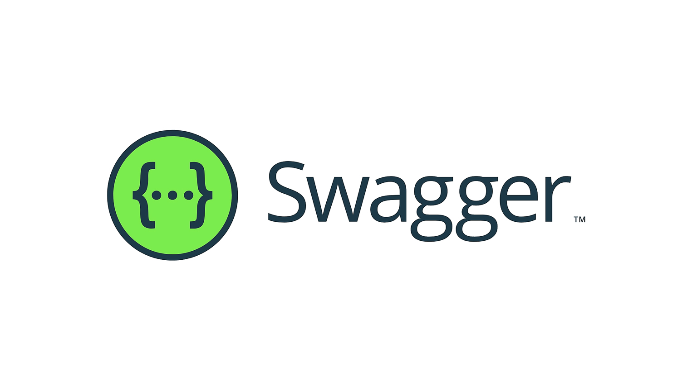
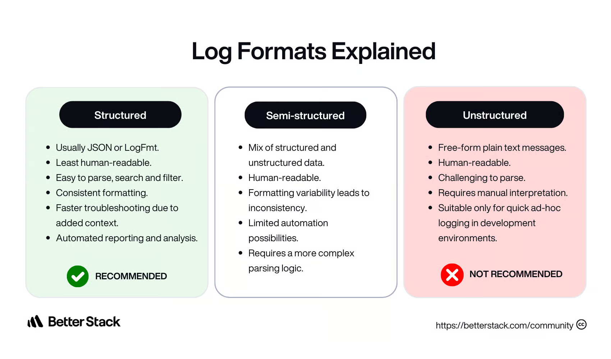

# API Documentation and Logging

A comprehensive guide to implementing API documentation with Swagger/OpenAPI and structured logging with Winston in a Node.js/Express application.

---

## 1. Core Terminology

### What is API Documentation?

API documentation is a technical content deliverable that describes how to use an API. Good API documentation helps developers understand how to integrate with an API, what endpoints are available, what parameters to send, and what responses to expect. It serves as a reference guide and interactive testing interface for API consumers.

### What is OpenAPI/Swagger?

**OpenAPI Specification** (formerly Swagger Specification) is an API description format for REST APIs. An OpenAPI file allows you to describe your entire API, including available endpoints, operation parameters, authentication methods, and more.

**Swagger** is a set of open-source tools built around the OpenAPI Specification. Swagger tools include Swagger UI (interactive API documentation), Swagger Editor (editor for OpenAPI specs), and Swagger Codegen (code generation from specs).



OpenAPI and Swagger are used together: OpenAPI defines the specification standard, while Swagger provides tools to work with OpenAPI specifications. Swagger UI reads OpenAPI specifications and generates interactive documentation that allows developers to test API endpoints directly from the browser.

### Why Use API Documentation?

API documentation provides several benefits:

- **Developer Experience**: Clear documentation helps developers understand and integrate with your API faster.

- **Reduced Support Burden**: Good documentation answers common questions, reducing the need for support.

- **Testing Interface**: Interactive documentation allows developers to test endpoints without writing code.

- **API Contract**: Documentation serves as a contract between API provider and consumers, ensuring consistent expectations.

- **Code Generation**: OpenAPI specifications can be used to generate client libraries and server stubs.

### What is Structured Logging?

Structured logging is the practice of logging messages in a structured format, typically JSON, instead of plain text. Structured logs contain fields that can be easily parsed, searched, and analyzed by log management tools.



**Example of Structured Logging**:

```json
{
  "timestamp": "2024-06-17T08:55:00Z",
  "level": "INFO",
  "message": "User 'user123' logged in",
  "user": "user123",
  "ip_address": "192.168.0.1"
},
{
  "timestamp": "2024-06-17T08:55:01Z",
  "level": "ERROR",
  "message": "Database connection failed",
  "error": {
    "code": "DB_CONNECT_ERROR",
    "message": "Connection refused"
   }
}
```

**Example of Unstructured Logging**:

```text
2024-06-17T08:55:00Z [INFO]  User 'user123' logged in from 192.168.0.1
2024-06-17T08:55:01Z [ERROR] Database connection failed: Connection refused
```

### What is Winston?

**Winston** is a popular logging library for Node.js that supports multiple transports, log levels, and formats. Winston allows you to configure different log destinations (console, files, databases, remote services) and formats (JSON, plain text, custom formats) for different environments.

Winston features:

- **Multiple Transports (Log Destinations)**: Log to console, files, databases, or remote services.

- **Log Levels**: Categorize log messages based on their severity. The standard log levels are: error: 0, warn: 1, info: 2, http: 3, verbose: 4, debug: 5, silly: 6. Conventionally, lower numbers are more severe.

- **Formats**: Customize log formats for different transports.

- **Metadata**: Add contextual information to log entries.

- **Log Rotation**: Automatically rotate log files to manage disk space.

---

## 2. Winston Logger Implementation

### 2.1. Project Setup & Dependencies

This project builds upon the setup from **[RESTful API Design](../09_Restful_API_Design/README.md)**. Ensure you have completed that guide first.

Install Winston dependency:

```bash
npm install winston
```

- **winston**: Logging library for Node.js with multiple transports and formats.

### 2.2. Winston Logger Configuration

Winston provides a flexible logging system with multiple transports and customizable formats. Create a logger utility that configures Winston for your application.

**Logger Utility**: Create `src/utils/logger.util.ts`:

```typescript
import winston from 'winston';
import path from 'path';
import fs from 'fs';

// Create logs directory if it doesn't exist
const logsDir = path.join(process.cwd(), 'logs');
if (!fs.existsSync(logsDir)) {
  fs.mkdirSync(logsDir, { recursive: true });
}

// Define log format
const logFormat = winston.format.combine(
  winston.format.timestamp({ format: 'YYYY-MM-DD HH:mm:ss' }),
  winston.format.errors({ stack: true }),
  winston.format.splat(),
  winston.format.json()
);

// Define console format (human-readable)
const consoleFormat = winston.format.combine(
  winston.format.colorize(),
  winston.format.timestamp({ format: 'YYYY-MM-DD HH:mm:ss' }),
  winston.format.printf((info: winston.Logform.TransformableInfo) => {
    const { timestamp, level, message, ...metadata } = info;
    let msg = `${timestamp} [${level}]: ${message}`;
    if (Object.keys(metadata).length > 0) {
      msg += ` ${JSON.stringify(metadata)}`;
    }
    return msg;
  })
);

// Create the logger
const logger = winston.createLogger({
  level: process.env.LOG_LEVEL || 'info',
  format: logFormat,
  defaultMeta: { service: 'api-service' },
  transports: [
    // Write all logs to combined.log
    new winston.transports.File({
      filename: path.join(logsDir, 'combined.log'),
      maxsize: 5242880, // 5MB
      maxFiles: 5,
    }),
    // Write error logs to error.log
    new winston.transports.File({
      filename: path.join(logsDir, 'error.log'),
      level: 'error',
      maxsize: 5242880, // 5MB
      maxFiles: 5,
    }),
  ],
});

export default logger;
```

The logger configuration includes:

- **Log Levels**: The default level is 'info', which means info, warn, and error messages are logged. The default level is intentionally chosen to ensure that only critical information is logged, allowing developers to concentrate on the most important aspects of their application's behavior.

- **Formats**: JSON format for file logs (easily parsed by log analysis tools) and human-readable format for console logs (better for development).

- **Transports**: File transports write logs to files with automatic rotation (max 5MB per file, keep 5 files). Console transport is added in development for immediate visibility.

- **Log Rotation**: Winston automatically rotates log files when they reach the maximum size, keeping only the specified number of files.

### 2.3. Logger Middleware

Replace the simple console logger with Winston-based logging middleware that provides structured logging for HTTP requests.

**Logger Middleware**: Update `src/middlewares/logger.middleware.ts`:

```typescript
import type { Request, Response, NextFunction } from 'express';
import logger from '../utils/logger.util';

export const loggerMiddleware = (
  req: Request,
  res: Response,
  next: NextFunction
) => {
  const start = Date.now();

  res.on('finish', () => {
    const duration = Date.now() - start;
    const logData = {
      method: req.method,
      url: req.originalUrl,
      statusCode: res.statusCode,
      duration: `${duration}ms`,
      ip: req.ip,
      userAgent: req.get('user-agent'),
    };

    if (res.statusCode >= 500) {
      logger.error('HTTP Request Error', logData);
    } else if (res.statusCode >= 400) {
      logger.warn('HTTP Request Warning', logData);
    } else {
      logger.info('HTTP Request', logData);
    }
  });

  next();
};
```

The middleware logs HTTP requests with structured data including method, URL, status code, response time, IP address, and user agent. Different log levels are used based on the HTTP status code: error for 5xx, warn for 4xx, and info for successful requests.

This middleware is placed at the beginning of the app to register a listener on `res.on('finish')`. The callback runs when the response is fully sent, regardless of which route or middleware handled the request.

### 2.4. Using Winston in the Application

Replace console.log and console.error calls with Winston logger for consistent structured logging. Follow the principle of separation of concerns: database module handles connections, while server handles error handling and logging.

**Database Connection**: Update `src/config/database.ts` to focus solely on database operations:

```typescript
import mongoose from 'mongoose';
import config from './config';

export const connectDB = async (): Promise<void> => {
  await mongoose.connect(config.mongoUri);
};

export const disconnectDB = async (): Promise<void> => {
  await mongoose.disconnect();
};
```

**Server Startup**: Update `src/server.ts` to handle error handling and logging:

```typescript
import app from './app';
import config from './config/config';
import { connectDB, disconnectDB } from './config/database';
import logger from './utils/logger.util';

// Connect to database
connectDB()
  .then(() => {
    logger.info('Connected to MongoDB successfully');

    // Start server
    app.listen(config.port, () => {
      logger.info('Server started successfully', {
        port: config.port,
        environment: config.nodeEnv,
        apiDocs: `http://localhost:${config.port}/api-docs`,
      });
    });
  })
  .catch((error) => {
    logger.error('Failed to connect to database', { error });
    process.exit(1);
  });

// Disconnect from database on shutdown
const gracefulShutdown = async (signal: string) => {
  try {
    await disconnectDB();
    logger.info('Disconnected from MongoDB successfully');
  } catch (error) {
    logger.error('Error disconnecting from MongoDB', { error });
  }
  process.exit(0);
};

process.on('SIGINT', () => gracefulShutdown('SIGINT'));
process.on('SIGTERM', () => gracefulShutdown('SIGTERM'));
```

### 2.5. Log File Management

Winston automatically manages log files with rotation. Configure log rotation to prevent log files from growing too large. Log rotation settings in the Winston configuration:

- **maxsize**: Maximum size of a log file before rotation (5MB in the example).

- **maxFiles**: Number of rotated log files to keep (5 files in the example).

When a log file reaches the maximum size, Winston creates a new file and renames the old file with a timestamp. Old log files are automatically deleted when the maximum number of files is exceeded.

**Log Directory Structure**:

```plaintext
logs/
├── combined.log      # All logs
├── error.log         # Error logs only
├── combined.log.1    # Rotated files
├── combined.log.2
└── error.log.1
```

### 2.6. Environment-Based Logging

Configure different logging behavior for development and production environments.

- **Development**: Console logging for immediate feedback, file logging for persistence.

- **Production**: File logging only, no console output (console output is typically captured by process managers).

The logger configuration checks `NODE_ENV` to determine which transports to use:

```typescript
// Add console transport for development
if (process.env.NODE_ENV !== 'production') {
  logger.add(
    new winston.transports.Console({
      format: consoleFormat,
    })
  );
}
```

---

## 3. Swagger/OpenAPI Implementation

### 3.1. Project Setup & Dependencies

This project builds upon the setup from **[RESTful API Design](../09_Restful_API_Design/README.md)**. Ensure you have completed that guide first.

Install Swagger dependencies:

```bash
npm install swagger-ui-express
npm install -D @types/swagger-ui-express
```

- **swagger-ui-express**: Serves Swagger UI for interactive API documentation.

> Note: We build the OpenAPI specification directly from TypeScript objects instead of using swagger-jsdoc with JSDoc comments. This approach keeps route files clean and makes documentation easier to maintain.

### 3.2. Swagger/OpenAPI Configuration

Swagger UI requires an OpenAPI specification. Instead of adding JSDoc comments directly in route files (which makes routes long and hard to maintain), we separate Swagger path definitions into dedicated files. This approach keeps routes clean and makes documentation easier to maintain.

**Organizing Swagger Definitions**: Create a `src/swagger/paths/` directory to store path definitions separately:

```plaintext
src/swagger/paths/
├── products.paths.ts
├── auth.paths.ts
└── health.paths.ts
```

**Product Paths**: Create `src/swagger/paths/products.paths.ts`:

```typescript
export const productPaths = {
  '/api/products': {
    get: {
      summary: 'Get list of products',
      tags: ['Products'],
      parameters: [
        {
          in: 'query',
          name: 'page',
          schema: {
            type: 'integer',
            default: 1,
          },
          description: 'Page number',
        },
        {
          in: 'query',
          name: 'limit',
          schema: {
            type: 'integer',
            default: 10,
            maximum: 100,
          },
          description: 'Number of items per page',
        },
      ],
      responses: {
        '200': {
          description: 'List of products retrieved successfully',
          content: {
            'application/json': {
              schema: {
                type: 'object',
                properties: {
                  message: {
                    type: 'string',
                    example: 'Products retrieved successfully',
                  },
                  data: {
                    type: 'object',
                    properties: {
                      products: {
                        type: 'array',
                        items: {
                          $ref: '#/components/schemas/Product',
                        },
                      },
                    },
                  },
                },
              },
            },
          },
        },
        '400': {
          $ref: '#/components/responses/ValidationError',
        },
      },
    },
    post: {
      summary: 'Create a new product',
      tags: ['Products'],
      security: [
        {
          bearerAuth: [],
        },
      ],
      requestBody: {
        required: true,
        content: {
          'application/json': {
            schema: {
              type: 'object',
              required: ['name', 'price', 'description'],
              properties: {
                name: {
                  type: 'string',
                  minLength: 2,
                  maxLength: 100,
                  example: 'Laptop',
                },
                price: {
                  type: 'number',
                  minimum: 0,
                  example: 999.99,
                },
              },
            },
          },
        },
      },
      responses: {
        '201': {
          description: 'Product created successfully',
        },
      },
    },
  },
  '/api/products/{id}': {
    get: {
      summary: 'Get a single product by ID',
      tags: ['Products'],
      parameters: [
        {
          in: 'path',
          name: 'id',
          required: true,
          schema: {
            type: 'string',
          },
        },
      ],
      responses: {
        '200': {
          description: 'Product retrieved successfully',
        },
        '404': {
          $ref: '#/components/responses/NotFoundError',
        },
      },
    },
  },
};
```

**Swagger Configuration**: Create `src/config/swagger.config.ts` that imports and merges all path definitions:

```typescript
import { productPaths } from '../swagger/paths/products.paths';
import { authPaths } from '../swagger/paths/auth.paths';
import { healthPaths } from '../swagger/paths/health.paths';

const version = '1.0.0';

const swaggerDefinition = {
  openapi: '3.0.0',
  info: {
    title: 'RESTful API Documentation',
    version: version,
    description:
      'Comprehensive RESTful API documentation with authentication, authorization, and CRUD operations.',
  },
  servers: [
    {
      url: 'http://localhost:3000',
      description: 'Development server',
    },
  ],
  components: {
    securitySchemes: {
      bearerAuth: {
        type: 'http',
        scheme: 'bearer',
        bearerFormat: 'JWT',
      },
    },
    schemas: {
      Product: {
        type: 'object',
        properties: {
          _id: {
            type: 'string',
          },
          name: {
            type: 'string',
          },
          // ... more properties
        },
      },
      // ... more schemas
    },
    responses: {
      UnauthorizedError: {
        description: 'Authentication required',
        content: {
          'application/json': {
            schema: {
              $ref: '#/components/schemas/Error',
            },
          },
        },
      },
      // ... more responses
    },
  },
  tags: [
    {
      name: 'Products',
      description: 'Product management endpoints',
    },
    {
      name: 'Authentication',
      description: 'User authentication endpoints',
    },
  ],
  paths: {
    ...productPaths,
    ...authPaths,
    ...healthPaths,
  },
};

export const swaggerSpec = swaggerDefinition;
```

The Swagger configuration defines:

- **API Information**: Title, version, description, contact, and license information.

- **Servers**: List of API servers (development and production).

- **Security Schemes**: Authentication methods (Bearer token and cookie).

- **Schemas**: Reusable data models (Product, User, Error, Pagination).

- **Responses**: Reusable error responses.

- **Tags**: Groups endpoints by functionality.

- **Paths**: Merged path definitions from separate files.

### 3.3. Integrating Swagger UI

Swagger UI provides an interactive interface for API documentation. Integrate Swagger UI into your Express application to serve the documentation.

**Express App Configuration**: Update `src/app.ts` to add Swagger UI:

```typescript
import swaggerUi from 'swagger-ui-express';
import { swaggerSpec } from './config/swagger.config';

// ... other imports and middleware

// Swagger API Documentation
app.use('/api-docs', swaggerUi.serve, swaggerUi.setup(swaggerSpec));

// ... routes and other middleware
```

### 3.4. Documenting Authentication and Security

Document authentication endpoints and security requirements in separate path definition files:

**Authentication Paths**: Create `src/swagger/paths/auth.paths.ts`:

```typescript
export const authPaths = {
  '/api/auth/signup': {
    post: {
      summary: 'Register a new user',
      tags: ['Authentication'],
      requestBody: {
        required: true,
        content: {
          'application/json': {
            schema: {
              type: 'object',
              required: ['email', 'password'],
              properties: {
                email: {
                  type: 'string',
                  format: 'email',
                  example: 'user@example.com',
                },
                password: {
                  type: 'string',
                  minLength: 6,
                  example: 'password123',
                },
              },
            },
          },
        },
      },
      responses: {
        '201': {
          description: 'User created successfully',
        },
        '400': {
          $ref: '#/components/responses/ValidationError',
        },
        '409': {
          description: 'User already exists',
        },
      },
    },
  },
};
```

For protected endpoints, specify security requirements in the path definition:

```typescript
'/api/products': {
  post: {
    summary: 'Create a new product',
    tags: ['Products'],
    security: [
      {
        bearerAuth: [],
      },
      {
        cookieAuth: [],
      },
    ],
    responses: {
      '201': {
        description: 'Product created successfully',
      },
      '401': {
        $ref: '#/components/responses/UnauthorizedError',
      },
      '403': {
        $ref: '#/components/responses/ForbiddenError',
      },
    },
  },
},
```

The security section indicates that the endpoint requires authentication. Swagger UI will show an "Authorize" button that allows users to enter their JWT token for testing protected endpoints.

### 3.5. Accessing API Documentation

After starting the server, access Swagger UI at `http://localhost:3000/api-docs`. The Swagger UI interface provides:

- **API Overview**: List of all endpoints organized by tags.

- **Endpoint Details**: Click on an endpoint to see detailed documentation including parameters, request body, and responses.

- **Try It Out**: Use the "Try it out" button to test endpoints directly from the browser.

- **Authentication**: Use the "Authorize" button to enter JWT tokens for testing protected endpoints.

- **Schema Definitions**: View reusable schemas and response definitions.

Swagger UI makes it easy for developers to understand and test your API without writing code.

---

## 4. Best Practices

### Logging Best Practices

Use appropriate log levels:

- **error**: For errors that require immediate attention or indicate system failures.

- **warn**: For warnings that indicate potential issues but don't stop execution.

- **info**: For informational messages about application flow (request logging, important events).

- **verbose/debug**: For detailed debugging information (only in development).

Include contextual information in logs:

- Add metadata objects with relevant context (user ID, request ID, operation details).

- Use structured logging (JSON format) for easy parsing and analysis.

- Avoid logging sensitive information (passwords, tokens, credit card numbers).

### API Documentation Best Practices

Keep documentation up to date:

- Document all endpoints, including error cases.

- Update documentation when APIs change.

- Use clear descriptions and examples.

Make documentation comprehensive:

- Include authentication requirements.

- Document all request parameters and response formats.

- Provide example requests and responses.

- Document error responses with status codes and messages.

### Security Considerations

Don't expose sensitive information in logs:

- Avoid logging passwords, tokens, or personal information.

- Use log levels appropriately (don't log sensitive data at info level).

- Consider log encryption for production environments.

Secure API documentation in production:

- Consider restricting access to Swagger UI in production.

- Use authentication for API documentation if it contains sensitive information.

- Remove or redact sensitive endpoints from documentation if necessary.

---

## 5. Summary of Implementation Steps

### Winston Logger Implementation

1. **[Project Setup & Dependencies](#21-project-setup--dependencies)**: Install `winston`.
2. **[Winston Logger Configuration](#22-winston-logger-configuration)**: Configure Winston with multiple transports and formats.
3. **[Logger Middleware](#23-logger-middleware)**: Create middleware to log HTTP requests with structured data.
4. **[Using Winston in the Application](#24-using-winston-in-the-application)**: Replace console logs with Winston logger in server startup and DB integration.
5. **[Log File Management](#25-log-file-management)**: Configure log rotation to manage log file sizes.
6. **[Environment-Based Logging](#26-environment-based-logging)**: Differentiate logging behavior for development (console+file) and production (file only).

### Swagger/OpenAPI Implementation

1. **[Project Setup & Dependencies](#31-project-setup--dependencies)**: Install `swagger-ui-express`.
2. **[Swagger/OpenAPI Configuration](#32-swaggeropenapi-configuration)**: Define Swagger configuration and organize path definitions in separate files.
3. **[Integrating Swagger UI](#33-integrating-swagger-ui)**: Configure Express to serve interactive API documentation at `/api-docs`.
4. **[Documenting Authentication and Security](#34-documenting-authentication-and-security)**: Define security schemes and document protected endpoints.
5. **[Accessing API Documentation](#35-accessing-api-documentation)**: Access the interactive Swagger UI to test endpoints.

---

## 6. Resources

- [Winston Documentation](https://github.com/winstonjs/winston) - Winston logging library documentation
- [OpenAPI Specification](https://swagger.io/specification/) - OpenAPI 3.0 specification
- [Swagger UI](https://swagger.io/tools/swagger-ui/) - Swagger UI documentation
