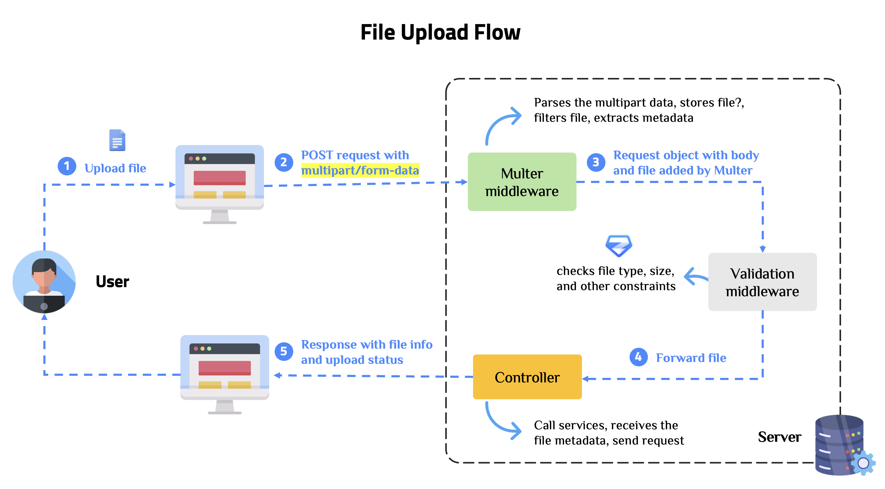
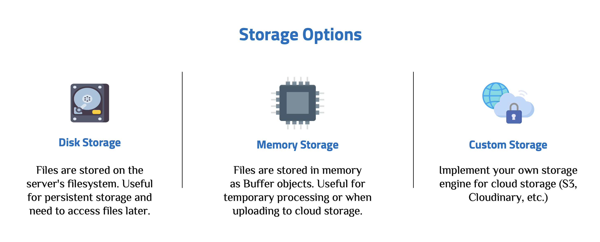

# File Handling with Multer and Zod Validation

A comprehensive guide to implementing file upload functionality in Node.js/Express applications using Multer for file handling and Zod for schema-based validation.

---

## 1. Core Terminology

### What is Multer?

**Multer** is a Node.js middleware for handling `multipart/form-data`, which is primarily used for uploading files. It is written on top of `busboy` for maximum efficiency. Multer adds a `body` object and a `file` or `files` object to the `request` object. The `body` object contains the text fields of the form, while the `file`/`files` object contains the files uploaded via the form.

### Why Use Multer?

Express does not handle file uploads natively. When a form includes file inputs, the data is sent as `multipart/form-data`, which requires special parsing. Multer simplifies this process by:

- **Handling multipart/form-data**: Automatically parses file uploads from form submissions
- **Storage configuration**: Provides flexible storage options (disk storage, memory storage, or custom storage)
- **File filtering**: Allows filtering files by type, size, and other criteria
- **Metadata extraction**: Provides file metadata (original name, mimetype, size, etc.)

### File Upload Flow



1. **Client sends request**: The client sends a POST request with `multipart/form-data` content type containing the file(s)
2. **Multer middleware**: Multer intercepts the request, parses the multipart data, and stores the file(s) according to configuration
3. **Validation**: File validation middleware checks file type, size, and other constraints using Zod schemas
4. **Controller processing**: The controller receives the file metadata and processes the upload
5. **Response**: The server responds with file information and upload status

### Storage Options



### Schema-Based Validation with Zod

When used with file uploads, Zod schemas validate:

- **File type**: Ensures only allowed MIME types are accepted
- **File size**: Validates file size against maximum limits
- **Required fields**: Checks if files are present when required
- **Array constraints**: Validates number of files in multiple uploads

---

## 2. Implementation Guide

### 2.1. Project Setup & Dependencies

This project builds upon the **[Express.js setup](../04_Working_with_Express/SETUP.md)**. Install the required dependencies:

```bash
npm install express multer zod
npm install -D typescript @types/node @types/express @types/multer tsx nodemon
```

- **multer**: Middleware for handling `multipart/form-data` file uploads
- **zod**: Schema-based validation library with TypeScript support

### 2.2. Configuration Setup

**Environment Variables**:

```env
# Server Configuration
PORT=3000
NODE_ENV=development

# File Upload Configuration
UPLOAD_DIR=uploads
MAX_FILE_SIZE=5242880  # 5MB in bytes
MAX_FILES=10
```

**Configuration Module**: Create `src/config/config.ts`:

```typescript
import dotenv from "dotenv";

dotenv.config();

interface Config {
  port: number;
  nodeEnv: string;
  uploadDir: string;
  maxFileSize: number; // in bytes
  maxFiles: number;
}

const config: Config = {
  port: Number(process.env.PORT) || 3000,
  nodeEnv: process.env.NODE_ENV || "development",
  uploadDir: process.env.UPLOAD_DIR || "uploads",
  maxFileSize: Number(process.env.MAX_FILE_SIZE) || 5 * 1024 * 1024, // 5MB default
  maxFiles: Number(process.env.MAX_FILES) || 10,
};

export default config;
```

### 2.3. Multer Configuration

Multer configuration defines how files are stored and what constraints are applied. Create `src/config/multer.config.ts`:

```typescript
import multer from "multer";
import path from "path";
import fs from "fs";
import { fileURLToPath } from "url";

const __filename = fileURLToPath(import.meta.url);
const __dirname = path.dirname(__filename);

// Create uploads directory if it doesn't exist
const uploadsDir = path.join(__dirname, "../../uploads");
if (!fs.existsSync(uploadsDir)) {
  fs.mkdirSync(uploadsDir, { recursive: true });
}

// Configure storage for file uploads
const storage = multer.diskStorage({
  destination: (req, file, cb) => {
    cb(null, uploadsDir);
  },
  filename: (req, file, cb) => {
    // Generate unique filename: timestamp-random-originalname
    const uniqueSuffix = `${Date.now()}-${Math.round(Math.random() * 1e9)}`;
    const ext = path.extname(file.originalname);
    const basename = path.basename(file.originalname, ext);
    cb(null, `${basename}-${uniqueSuffix}${ext}`);
  },
});

// File filter function to validate file types
const fileFilter = (
  req: Express.Request,
  file: Express.Multer.File,
  cb: multer.FileFilterCallback
) => {
  // Allow common file types (images, documents, etc.)
  const allowedMimes = [
    "image/jpeg",
    "image/jpg",
    "image/png",
    "image/gif",
    "image/webp",
    "application/pdf",
    "text/plain",
    "application/msword",
    "application/vnd.openxmlformats-officedocument.wordprocessingml.document",
  ];

  if (allowedMimes.includes(file.mimetype)) {
    cb(null, true);
  } else {
    cb(new Error(`File type ${file.mimetype} is not allowed`));
  }
};

// Multer configuration for single file upload
export const uploadSingle = multer({
  storage,
  fileFilter,
  limits: {
    fileSize: 5 * 1024 * 1024, // 5MB limit
  },
});

// Multer configuration for multiple file uploads
export const uploadMultiple = multer({
  storage,
  fileFilter,
  limits: {
    fileSize: 5 * 1024 * 1024, // 5MB per file
    files: 10, // Maximum 10 files
  },
});

// Multer configuration for single image upload (stricter)
export const uploadSingleImage = multer({
  storage,
  fileFilter: (req, file, cb) => {
    const allowedMimes = [
      "image/jpeg",
      "image/jpg",
      "image/png",
      "image/gif",
      "image/webp",
    ];
    if (allowedMimes.includes(file.mimetype)) {
      cb(null, true);
    } else {
      cb(new Error("Only image files are allowed"));
    }
  },
  limits: {
    fileSize: 2 * 1024 * 1024, // 2MB limit for images
  },
});

export default { uploadSingle, uploadMultiple, uploadSingleImage };
```

**Key Configuration Points**:

- **Storage**: `diskStorage` stores files on the filesystem with custom filename generation
- **File Filter**: Validates MIME types before accepting files
- **Limits**: Sets maximum file size and number of files
- **Filename Generation**: Creates unique filenames to prevent conflicts

### 2.4. TypeScript Types

Define TypeScript types for file uploads. Create `src/types/file.types.ts`:

```typescript
import type { Request } from "express";

// File upload response type
export interface FileUploadResponse {
  success: boolean;
  message: string;
  data?: {
    file?: {
      filename: string;
      originalName: string;
      mimetype: string;
      size: number;
      path: string;
    };
    files?: Array<{
      filename: string;
      originalName: string;
      mimetype: string;
      size: number;
      path: string;
    }>;
  };
}

// Extended Request type with file/files
export interface RequestWithFile extends Request {
  file?: Express.Multer.File;
}

export interface RequestWithFiles extends Request {
  files?: Express.Multer.File[];
}

// File validation options
export interface FileValidationOptions {
  maxSize?: number; // in bytes
  allowedMimeTypes?: string[];
  required?: boolean;
}

// Multiple file validation options
export interface MultipleFileValidationOptions {
  maxFiles?: number;
  maxSize?: number; // in bytes per file
  allowedMimeTypes?: string[];
  required?: boolean;
}
```

### 2.5. Zod Validation Schemas

Create Zod schemas for file validation. Create `src/validations/file.validation.ts`:

```typescript
import { z } from "zod";

// Schema for single file upload validation
export const singleFileUploadSchema = z.object({
  fieldname: z.string().min(1, "Field name is required"),
  originalname: z.string().min(1, "Original name is required"),
  encoding: z.string(),
  mimetype: z
    .string()
    .refine(
      (mime) =>
        [
          "image/jpeg",
          "image/jpg",
          "image/png",
          "image/gif",
          "image/webp",
          "application/pdf",
          "text/plain",
          "application/msword",
          "application/vnd.openxmlformats-officedocument.wordprocessingml.document",
        ].includes(mime),
      {
        message:
          "Invalid file type. Allowed types: images, PDF, text, Word documents",
      }
    ),
  size: z
    .number()
    .positive("File size must be positive")
    .max(5 * 1024 * 1024, "File size must not exceed 5MB"),
  destination: z.string(),
  filename: z.string().min(1, "Filename is required"),
  path: z.string().min(1, "File path is required"),
});

// Schema for multiple file upload validation
export const multipleFileUploadSchema = z
  .array(singleFileUploadSchema)
  .min(1, "At least one file is required")
  .max(10, "Maximum 10 files allowed");

// Schema for image file upload validation (stricter)
export const imageFileUploadSchema = z.object({
  fieldname: z.string().min(1, "Field name is required"),
  originalname: z.string().min(1, "Original name is required"),
  encoding: z.string(),
  mimetype: z
    .string()
    .refine(
      (mime) =>
        [
          "image/jpeg",
          "image/jpg",
          "image/png",
          "image/gif",
          "image/webp",
        ].includes(mime),
      {
        message: "Only image files are allowed (JPEG, PNG, GIF, WebP)",
      }
    ),
  size: z
    .number()
    .positive("File size must be positive")
    .max(2 * 1024 * 1024, "Image size must not exceed 2MB"),
  destination: z.string(),
  filename: z.string().min(1, "Filename is required"),
  path: z.string().min(1, "File path is required"),
});

// Schema for multiple image upload validation
export const multipleImageUploadSchema = z
  .array(imageFileUploadSchema)
  .min(1, "At least one image is required")
  .max(5, "Maximum 5 images allowed");

// Type inference from schemas
export type SingleFileUploadInput = z.infer<typeof singleFileUploadSchema>;
export type MultipleFileUploadInput = z.infer<typeof multipleFileUploadSchema>;
export type ImageFileUploadInput = z.infer<typeof imageFileUploadSchema>;
export type MultipleImageUploadInput = z.infer<
  typeof multipleImageUploadSchema
>;
```

**Validation Rules**:

- **MIME Type Validation**: Uses `refine` to check against allowed MIME types
- **Size Validation**: Validates file size against maximum limits
- **Array Validation**: Validates minimum and maximum number of files
- **Required Fields**: Ensures essential file properties are present

### 2.6. File Validation Middleware

Create middleware to validate files using Zod schemas. Create `src/middlewares/fileValidation.middleware.ts`:

```typescript
import type { Request, Response, NextFunction } from "express";
import { z } from "zod";
import { AppError } from "./error.middleware.js";
import {
  singleFileUploadSchema,
  multipleFileUploadSchema,
  imageFileUploadSchema,
  multipleImageUploadSchema,
} from "../validations/file.validation.js";

// Middleware to validate single file upload with Zod
export const validateSingleFile = (
  req: Request,
  res: Response,
  next: NextFunction
) => {
  try {
    if (!req.file) {
      throw new AppError("No file uploaded", 400);
    }

    // Validate file using Zod schema
    singleFileUploadSchema.parse(req.file);
    next();
  } catch (error) {
    if (error instanceof z.ZodError) {
      const errorMessages = error.issues
        .map((err: z.ZodIssue) => err.message)
        .join(", ");
      next(new AppError(`File validation failed: ${errorMessages}`, 400));
    } else {
      next(error);
    }
  }
};

// Middleware to validate multiple file uploads with Zod
export const validateMultipleFiles = (
  req: Request,
  res: Response,
  next: NextFunction
) => {
  try {
    const files = req.files as Express.Multer.File[] | undefined;

    if (!files || files.length === 0) {
      throw new AppError("No files uploaded", 400);
    }

    // Validate files array using Zod schema
    multipleFileUploadSchema.parse(files);
    next();
  } catch (error) {
    if (error instanceof z.ZodError) {
      const errorMessages = error.issues
        .map((err: z.ZodIssue) => err.message)
        .join(", ");
      next(new AppError(`Files validation failed: ${errorMessages}`, 400));
    } else {
      next(error);
    }
  }
};

// Middleware to validate single image upload with Zod
export const validateSingleImage = (
  req: Request,
  res: Response,
  next: NextFunction
) => {
  try {
    if (!req.file) {
      throw new AppError("No image uploaded", 400);
    }

    // Validate image using Zod schema
    imageFileUploadSchema.parse(req.file);
    next();
  } catch (error) {
    if (error instanceof z.ZodError) {
      const errorMessages = error.issues
        .map((err: z.ZodIssue) => err.message)
        .join(", ");
      next(new AppError(`Image validation failed: ${errorMessages}`, 400));
    } else {
      next(error);
    }
  }
};

// Middleware to validate multiple image uploads with Zod
export const validateMultipleImages = (
  req: Request,
  res: Response,
  next: NextFunction
) => {
  try {
    const files = req.files as Express.Multer.File[] | undefined;

    if (!files || files.length === 0) {
      throw new AppError("No images uploaded", 400);
    }

    // Validate images array using Zod schema
    multipleImageUploadSchema.parse(files);
    next();
  } catch (error) {
    if (error instanceof z.ZodError) {
      const errorMessages = error.issues
        .map((err: z.ZodIssue) => err.message)
        .join(", ");
      next(new AppError(`Images validation failed: ${errorMessages}`, 400));
    } else {
      next(error);
    }
  }
};
```

**Middleware Flow**:

1. Check if file(s) exist in the request
2. Validate file(s) against Zod schema
3. If validation fails, extract error messages and pass to error handler
4. If validation passes, call `next()` to proceed to controller

### 2.7. File Upload Controllers

Controllers handle the business logic after file validation. Create `src/controllers/file.controller.ts`:

```typescript
import type { Request, Response } from "express";
import type { FileUploadResponse } from "../types/file.types.js";
import path from "path";

/**
 * Handle single file upload
 * POST /api/files/upload/single
 */
export const uploadSingleFile = async (
  req: Request,
  res: Response<FileUploadResponse>
) => {
  try {
    if (!req.file) {
      return res.status(400).json({
        success: false,
        message: "No file uploaded",
      });
    }

    const file = req.file;

    res.status(200).json({
      success: true,
      message: "File uploaded successfully",
      data: {
        file: {
          filename: file.filename,
          originalName: file.originalname,
          mimetype: file.mimetype,
          size: file.size,
          path: file.path,
        },
      },
    });
  } catch (error) {
    res.status(500).json({
      success: false,
      message: error instanceof Error ? error.message : "Failed to upload file",
    });
  }
};

/**
 * Handle multiple file uploads
 * POST /api/files/upload/multiple
 */
export const uploadMultipleFiles = async (
  req: Request,
  res: Response<FileUploadResponse>
) => {
  try {
    const files = req.files as Express.Multer.File[] | undefined;

    if (!files || files.length === 0) {
      return res.status(400).json({
        success: false,
        message: "No files uploaded",
      });
    }

    const uploadedFiles = files.map((file) => ({
      filename: file.filename,
      originalName: file.originalname,
      mimetype: file.mimetype,
      size: file.size,
      path: file.path,
    }));

    res.status(200).json({
      success: true,
      message: `${files.length} file(s) uploaded successfully`,
      data: {
        files: uploadedFiles,
      },
    });
  } catch (error) {
    res.status(500).json({
      success: false,
      message:
        error instanceof Error ? error.message : "Failed to upload files",
    });
  }
};

/**
 * Handle single image upload
 * POST /api/files/upload/image
 */
export const uploadSingleImage = async (
  req: Request,
  res: Response<FileUploadResponse>
) => {
  try {
    if (!req.file) {
      return res.status(400).json({
        success: false,
        message: "No image uploaded",
      });
    }

    const file = req.file;

    res.status(200).json({
      success: true,
      message: "Image uploaded successfully",
      data: {
        file: {
          filename: file.filename,
          originalName: file.originalname,
          mimetype: file.mimetype,
          size: file.size,
          path: file.path,
        },
      },
    });
  } catch (error) {
    res.status(500).json({
      success: false,
      message:
        error instanceof Error ? error.message : "Failed to upload image",
    });
  }
};

/**
 * Handle multiple image uploads
 * POST /api/files/upload/images
 */
export const uploadMultipleImages = async (
  req: Request,
  res: Response<FileUploadResponse>
) => {
  try {
    const files = req.files as Express.Multer.File[] | undefined;

    if (!files || files.length === 0) {
      return res.status(400).json({
        success: false,
        message: "No images uploaded",
      });
    }

    const uploadedImages = files.map((file) => ({
      filename: file.filename,
      originalName: file.originalname,
      mimetype: file.mimetype,
      size: file.size,
      path: file.path,
    }));

    res.status(200).json({
      success: true,
      message: `${files.length} image(s) uploaded successfully`,
      data: {
        files: uploadedImages,
      },
    });
  } catch (error) {
    res.status(500).json({
      success: false,
      message:
        error instanceof Error ? error.message : "Failed to upload images",
    });
  }
};

/**
 * Get file information
 * GET /api/files/:filename
 */
export const getFileInfo = async (req: Request, res: Response) => {
  try {
    const { filename } = req.params;

    if (!filename || Array.isArray(filename)) {
      return res.status(400).json({
        success: false,
        message: "Filename is required",
      });
    }

    const filePath = path.join(process.cwd(), "uploads", filename);

    // In a real application, you might want to store file metadata in a database
    // For now, we'll just check if file exists
    const fs = await import("fs/promises");
    try {
      const stats = await fs.stat(filePath);
      res.status(200).json({
        success: true,
        data: {
          filename,
          size: stats.size,
          createdAt: stats.birthtime,
          modifiedAt: stats.mtime,
        },
      });
    } catch {
      res.status(404).json({
        success: false,
        message: "File not found",
      });
    }
  } catch (error) {
    res.status(500).json({
      success: false,
      message:
        error instanceof Error ? error.message : "Failed to get file info",
    });
  }
};
```

Controllers extract file metadata from `req.file` or `req.files` and return structured responses with file information.

### 2.8. Routes Setup

Define routes with Multer middleware and validation. Create `src/routes/file.routes.ts`:

```typescript
import { Router } from "express";
import {
  uploadSingleFile,
  uploadMultipleFiles,
  uploadSingleImage,
  uploadMultipleImages,
  getFileInfo,
} from "../controllers/file.controller.js";
import {
  uploadSingle,
  uploadMultiple,
  uploadSingleImage as multerSingleImage,
} from "../config/multer.config.js";
import {
  validateSingleFile,
  validateMultipleFiles,
  validateSingleImage,
  validateMultipleImages,
} from "../middlewares/fileValidation.middleware.js";

const router = Router();

router.post(
  "/upload/single",
  uploadSingle.single("file"),
  validateSingleFile,
  uploadSingleFile
);

router.post(
  "/upload/multiple",
  uploadMultiple.array("files", 10),
  validateMultipleFiles,
  uploadMultipleFiles
);

router.post(
  "/upload/image",
  multerSingleImage.single("image"),
  validateSingleImage,
  uploadSingleImage
);

router.post(
  "/upload/images",
  multerSingleImage.array("images", 5),
  validateMultipleImages,
  uploadMultipleImages
);

router.get("/:filename", getFileInfo);

export default router;
```

**Middleware Order**:

1. **Multer middleware**: Parses and stores files (`uploadSingle.single()`, `uploadMultiple.array()`, etc.)
2. **Validation middleware**: Validates files using Zod schemas
3. **Controller**: Processes the upload and returns response

### 2.9. Express App Configuration

Integrate file routes into the Express app. Update `src/app.ts`:

```typescript
import express from "express";
import { errorHandler } from "./middlewares/error.middleware.js";
import fileRoutes from "./routes/file.routes.js";

const app = express();

// Body parser
app.use(express.json());
app.use(express.urlencoded({ extended: true }));

// Health check endpoint
app.get("/api/health", (req, res) => {
  res.status(200).json({ success: true, message: "Server is running" });
});

// File upload routes
app.use("/api/files", fileRoutes);

// Global error handler (should be after routes)
app.use(errorHandler);

export default app;
```

---

## 3. API Endpoints

### 3.1. Upload Single File

**POST** `/api/files/upload/single`

Upload a single file of any allowed type (images, PDF, text, Word documents).

**Request:**

- Content-Type: `multipart/form-data`
- Field name: `file`
- Max size: 5MB

**Example Request (cURL):**

```bash
curl -X POST http://localhost:3000/api/files/upload/single \
  -F "file=@/path/to/your/file.pdf"
```

**Example Request (JavaScript):**

```typescript
const formData = new FormData();
formData.append("file", fileInput.files[0]);

const response = await fetch("http://localhost:3000/api/files/upload/single", {
  method: "POST",
  body: formData,
});

const result = await response.json();
console.log(result);
```

**Response:**

```json
{
  "success": true,
  "message": "File uploaded successfully",
  "data": {
    "file": {
      "filename": "document-1234567890-987654321.pdf",
      "originalName": "document.pdf",
      "mimetype": "application/pdf",
      "size": 102400,
      "path": "/path/to/uploads/document-1234567890-987654321.pdf"
    }
  }
}
```

### 3.2. Upload Multiple Files

**POST** `/api/files/upload/multiple`

Upload multiple files simultaneously (maximum 10 files).

**Request:**

- Content-Type: `multipart/form-data`
- Field name: `files` (array)
- Max files: 10
- Max size per file: 5MB

**Example Request (cURL):**

```bash
curl -X POST http://localhost:3000/api/files/upload/multiple \
  -F "files=@/path/to/file1.pdf" \
  -F "files=@/path/to/file2.jpg" \
  -F "files=@/path/to/file3.txt"
```

**Response:**

```json
{
  "success": true,
  "message": "3 file(s) uploaded successfully",
  "data": {
    "files": [
      {
        "filename": "file1-1234567890-987654321.pdf",
        "originalName": "file1.pdf",
        "mimetype": "application/pdf",
        "size": 102400,
        "path": "/path/to/uploads/file1-1234567890-987654321.pdf"
      }
    ]
  }
}
```

### 3.3. Upload Single Image

**POST** `/api/files/upload/image`

Upload a single image file (JPEG, PNG, GIF, WebP only).

**Request:**

- Content-Type: `multipart/form-data`
- Field name: `image`
- Max size: 2MB
- Allowed types: image/jpeg, image/png, image/gif, image/webp

**Example Request (cURL):**

```bash
curl -X POST http://localhost:3000/api/files/upload/image \
  -F "image=@/path/to/your/image.jpg"
```

**Response:**

```json
{
  "success": true,
  "message": "Image uploaded successfully",
  "data": {
    "file": {
      "filename": "photo-1234567890-987654321.jpg",
      "originalName": "photo.jpg",
      "mimetype": "image/jpeg",
      "size": 512000,
      "path": "/path/to/uploads/photo-1234567890-987654321.jpg"
    }
  }
}
```

### 3.4. Upload Multiple Images

**POST** `/api/files/upload/images`

Upload multiple image files simultaneously (maximum 5 images).

**Request:**

- Content-Type: `multipart/form-data`
- Field name: `images` (array)
- Max images: 5
- Max size per image: 2MB

**Example Request (cURL):**

```bash
curl -X POST http://localhost:3000/api/files/upload/images \
  -F "images=@/path/to/image1.jpg" \
  -F "images=@/path/to/image2.png"
```

**Response:**

```json
{
  "success": true,
  "message": "3 image(s) uploaded successfully",
  "data": {
    "files": [
      {
        "filename": "photo1-1234567890-987654321.jpg",
        "originalName": "photo1.jpg",
        "mimetype": "image/jpeg",
        "size": 512000,
        "path": "/path/to/uploads/photo1-1234567890-987654321.jpg"
      }
    ]
  }
}
```

### 3.5. Get File Information

**GET** `/api/files/:filename`

Retrieve information about an uploaded file.

**Example Request:**

```bash
curl -X GET http://localhost:3000/api/files/document-1234567890-987654321.pdf
```

**Response:**

```json
{
  "success": true,
  "data": {
    "filename": "document-1234567890-987654321.pdf",
    "size": 102400,
    "createdAt": "2024-01-01T00:00:00.000Z",
    "modifiedAt": "2024-01-01T00:00:00.000Z"
  }
}
```

---

## 4. Best Practices

### Validation Strategy

File validation should occur at multiple layers:

- **Multer Level**: Filter files by MIME type and size before storage. This prevents invalid files from being stored.
- **Zod Level**: Validate file metadata after Multer processing. This provides detailed validation error messages.
- **Controller Level**: Check for file existence and handle edge cases.

### Security Considerations

Implement security best practices:

- **File Type Validation**: Always validate MIME types, not just file extensions
- **File Size Limits**: Set reasonable size limits to prevent DoS attacks
- **Filename Sanitization**: Generate unique filenames to prevent path traversal attacks
- **Storage Location**: Store uploads outside the web root when possible
- **Virus Scanning**: Consider scanning uploaded files in production
- **Rate Limiting**: Implement rate limiting to prevent abuse

### Performance Optimization

Optimize file upload performance:

- **Streaming**: Use streams for large files instead of loading entire files into memory
- **Compression**: Compress images before storage
- **CDN**: Serve uploaded files through a CDN for better performance
- **Async Processing**: Process file uploads asynchronously for better user experience

---

## 5. Summary of Implementation Steps

1. **[Project Setup & Dependencies](#21-project-setup--dependencies)**: Install `multer`, `zod`, and other necessary packages.
2. **[Configuration Setup](#22-configuration-setup)**: Configure environment variables and create the config module.
3. **[Multer Configuration](#23-multer-configuration)**: Set up Multer storage, file filters, and limits.
4. **[TypeScript Types](#24-typescript-types)**: Define TypeScript types for file uploads and responses.
5. **[Zod Validation Schemas](#25-zod-validation-schemas)**: Create Zod schemas for file validation.
6. **[File Validation Middleware](#26-file-validation-middleware)**: Implement middleware to validate files using Zod.
7. **[File Upload Controllers](#27-file-upload-controllers)**: Create controllers to handle file uploads and return responses.
8. **[Routes Setup](#28-routes-setup)**: Define API endpoints with Multer and validation middleware.
9. **[Express App Configuration](#29-express-app-configuration)**: Integrate file routes into the Express app.

## 6. Resources

- [Multer Documentation](https://github.com/expressjs/multer) - Multer middleware documentation
- [Zod Documentation](https://zod.dev/) - Zod validation library documentation
- [Express File Upload](https://expressjs.com/en/resources/middleware/multer.html) - Express file upload guide
- [OWASP File Upload Cheat Sheet](https://cheatsheetseries.owasp.org/cheatsheets/File_Upload_Cheat_Sheet.html) - Security best practices for file uploads
- [Node.js File System](https://nodejs.org/api/fs.html) - Node.js file system module documentation
