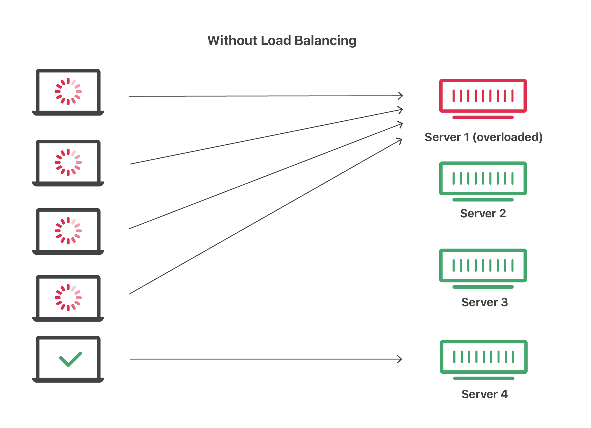
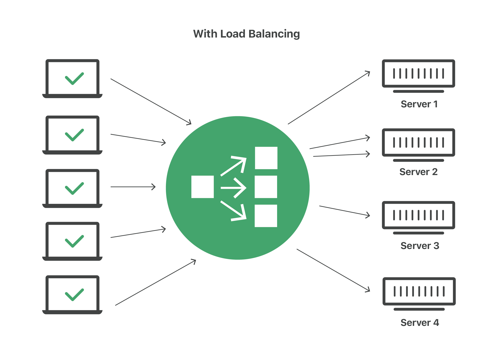

# Load Balancing in Node.js

A practical guide to load balancing strategies for Node.js applications —
covering what load balancing is, common algorithms, Nginx as a reverse proxy,
horizontal scaling, and how it connects to clustering.

---

## 1. Core Concepts

### What is Load Balancing?

Load balancing distributes incoming network traffic across multiple servers
or processes so no single instance becomes a bottleneck.





### Load Balancing vs Clustering

These are related but different concepts:

| | Clustering | Load Balancing |
|---|---|---|
| Scope | Single machine, multiple processes | Multiple machines |
| Tool | Node.js Cluster / PM2 | Nginx, HAProxy, AWS ALB |
| What's shared | Same server, same port | Different servers |
| Why | Use all CPU cores | Handle more total traffic, redundancy |

In production, you often use **both**:
```
Internet
   ↓
[Load Balancer]  ← distributes across machines
   ↓         ↓
Server A   Server B   ← each runs PM2 cluster
(4 workers) (4 workers) ← uses all CPU cores on each machine
```

---

## 2. Load Balancing Algorithms

### 2.1. Round Robin (Default)

Requests distributed to each server in turn, cycling through the list.

```
Request 1 → Server A
Request 2 → Server B
Request 3 → Server C
Request 4 → Server A  ← cycles back
Request 5 → Server B
...
```

**Best for:** Servers with similar specs, stateless requests.
**Weakness:** Ignores server load — a slow request on Server A still gets
the next request assigned.

### 2.2. Least Connections

New request goes to the server with the fewest active connections.

```
Server A: 10 active connections
Server B: 3 active connections   ← next request goes here
Server C: 7 active connections
```

**Best for:** Long-lived connections (WebSocket, file uploads), varying
request durations.

### 2.3. IP Hash

Client IP is hashed to always route to the same server (session affinity /
sticky sessions).

```
Client 192.168.1.1 → always → Server A
Client 192.168.1.2 → always → Server B
Client 192.168.1.3 → always → Server A
```

**Best for:** When sessions are stored in-memory and you can't use Redis.
**Weakness:** Uneven distribution if many clients share an IP (corporate
proxies, NAT).

### 2.4. Weighted Round Robin

Servers with more capacity receive proportionally more requests.

```
Server A (weight 3): ████████████ gets 3x requests
Server B (weight 1): ████         gets 1x requests
```

**Best for:** Heterogeneous infrastructure — mixing powerful and weak servers.

### 2.5. Algorithm Comparison

| Algorithm | Distribution | Session Affinity | Best For |
|---|---|---|---|
| Round Robin | Even | ❌ | Stateless, uniform requests |
| Least Connections | Dynamic | ❌ | Long-lived or slow requests |
| IP Hash | By client | ✅ | In-memory sessions (avoid if possible) |
| Weighted Round Robin | Proportional | ❌ | Mixed server capacity |

---

## 3. Nginx as a Load Balancer

Nginx is the most common tool for load balancing Node.js applications.
It acts as a **reverse proxy** — sitting in front of your Node.js servers
and forwarding requests to them.

```
Client → Nginx (port 80/443) → Node.js servers (port 3001, 3002, 3003)
```

### 3.1. Basic Round Robin

```nginx
# /etc/nginx/nginx.conf

http {
  # Define the pool of backend servers
  upstream nodejs_cluster {
    server 127.0.0.1:3001;
    server 127.0.0.1:3002;
    server 127.0.0.1:3003;
  }

  server {
    listen 80;
    server_name myapp.com;

    location / {
      proxy_pass http://nodejs_cluster;
      proxy_http_version 1.1;
      proxy_set_header Host $host;
      proxy_set_header X-Real-IP $remote_addr;
      proxy_set_header X-Forwarded-For $proxy_add_x_forwarded_for;
    }
  }
}
```

### 3.2. Least Connections

```nginx
upstream nodejs_cluster {
  least_conn;   # ← add this directive
  server 127.0.0.1:3001;
  server 127.0.0.1:3002;
  server 127.0.0.1:3003;
}
```

### 3.3. IP Hash (Sticky Sessions)

```nginx
upstream nodejs_cluster {
  ip_hash;      # ← add this directive
  server 127.0.0.1:3001;
  server 127.0.0.1:3002;
  server 127.0.0.1:3003;
}
```

### 3.4. Weighted Servers

```nginx
upstream nodejs_cluster {
  server 127.0.0.1:3001 weight=3;  # powerful server
  server 127.0.0.1:3002 weight=1;  # weaker server
}
```

### 3.5. Health Checks

Mark a server as down if it fails — Nginx stops sending traffic to it:

```nginx
upstream nodejs_cluster {
  server 127.0.0.1:3001;
  server 127.0.0.1:3002;
  server 127.0.0.1:3003 backup;  # only used if others are down

  # Passive health check (built-in)
  # After 3 failures within 30s, mark server as unavailable for 30s
}

server {
  location / {
    proxy_pass http://nodejs_cluster;
    proxy_next_upstream error timeout http_500;  # retry on these errors
    proxy_connect_timeout 5s;
    proxy_read_timeout 60s;
  }
}
```

### 3.6. SSL Termination

Nginx handles HTTPS, forwards plain HTTP to Node.js — Node.js doesn't
need to deal with SSL certificates:

```nginx
server {
  listen 443 ssl;
  server_name myapp.com;

  ssl_certificate     /etc/ssl/myapp.com.crt;
  ssl_certificate_key /etc/ssl/myapp.com.key;

  location / {
    proxy_pass http://nodejs_cluster;  # plain HTTP internally
  }
}

# Redirect HTTP → HTTPS
server {
  listen 80;
  return 301 https://$host$request_uri;
}
```

---

## 4. Horizontal vs Vertical Scaling

| | Vertical Scaling | Horizontal Scaling |
|---|---|---|
| What | Bigger single server (more RAM, CPU) | More servers |
| Limit | Physical limits of hardware | Nearly unlimited |
| Cost | Expensive, diminishing returns | Linear cost growth |
| Downtime | Required to upgrade | None (add servers live) |
| Load balancer needed | No | Yes |
| Complexity | Low | Higher |

**Node.js recommendation:** Scale horizontally — Node.js is designed for
it. Add more small servers behind a load balancer rather than one massive server.

---

## 5. Stateless Design — The Key to Scaling

The only way horizontal scaling works cleanly is if your application is
**stateless** — each server can handle any request without depending on
local state from a previous request.

**Common state that breaks scaling:**

```
❌ In-memory sessions  → User session only exists on Server A,
                          Server B doesn't know about it

❌ Local file storage  → File uploaded to Server A not available on Server B

❌ In-memory cache     → Cache warmed on Server A is cold on Server B
```

**Solutions:**

```
✅ Sessions  → Store in Redis (shared across all servers)
✅ Files     → Store in S3 / object storage (shared)
✅ Cache     → Store in Redis (shared)
✅ WebSocket → Use Redis adapter for Socket.io (shared pub/sub)
```

---

## 6. Cloud Load Balancers

In real production, you often use managed load balancers instead of
self-managing Nginx:

| Provider | Service | Notes |
|---|---|---|
| AWS | Application Load Balancer (ALB) | HTTP/HTTPS, path-based routing |
| AWS | Network Load Balancer (NLB) | TCP, ultra-low latency |
| GCP | Cloud Load Balancing | Global anycast |
| Cloudflare | Cloudflare Load Balancing | Built-in DDoS protection |
| Vercel / Railway | Built-in | Automatic for PaaS deployments |

**When to use managed vs self-managed:**
- **Managed (ALB, Cloudflare)** — production, don't want to manage Nginx config
- **Self-managed (Nginx)** — VPS/bare metal, full control needed, cost-sensitive

---

## 7. Full Production Architecture

```
                         [DNS]
                           ↓
                    [Cloudflare / CDN]   ← static assets cached here
                           ↓
                    [Load Balancer]      ← Nginx or AWS ALB
                    (SSL termination)
                    /       |       \
              Server A  Server B  Server C   ← multiple machines
              (PM2 cluster) (PM2 cluster) (PM2 cluster)
              4 workers    4 workers    4 workers
                    \       |       /
                     [Redis cluster]     ← shared sessions, cache
                           |
                      [Database]         ← PostgreSQL / primary + replicas
```

---

## 8. Summary

| Concept | Key Takeaway |
|---|---|
| Round Robin | Default, good enough for most stateless apps |
| Least Connections | Better for WebSocket or slow endpoints |
| IP Hash | Avoid — use Redis for sessions instead |
| Nginx | Standard reverse proxy + load balancer for Node.js |
| SSL Termination | Let Nginx handle TLS, Node.js gets plain HTTP |
| Stateless design | Required for horizontal scaling — move state to Redis/S3 |
| Horizontal scaling | Preferred for Node.js — more servers, not bigger servers |

---

## 9. Resources

- [Nginx Load Balancing Guide](https://docs.nginx.com/nginx/admin-guide/load-balancer/http-load-balancer/) — official Nginx docs
- [Node.js Scaling Best Practices](https://nodejs.org/en/docs/guides/dont-block-the-event-loop) — official Node.js guide
- [Socket.io Redis Adapter](https://socket.io/docs/v4/redis-adapter/) — for scaling Socket.io horizontally
