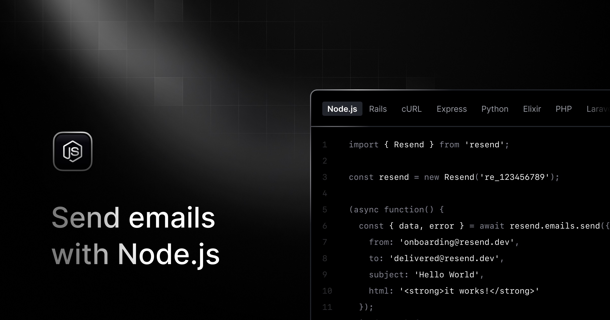

# Sending Emails with Resend

A practical guide to sending transactional emails in a Node.js/Express application using the Resend SDK, covering core email concepts, SDK usage, scheduling, batch sending, and rate limiting.



---

## 1. Core Terminology

### What is Resend?

**Resend** is a modern email API platform designed for developers. It provides a simple SDK to send transactional emails reliably from any backend, with built-in support for delivery tracking, scheduling, batching, and React-based email templates.

### Transactional vs Marketing Emails

| Type | Description | Examples |
|---|---|---|
| **Transactional** | Triggered by a user action, sent to one recipient at a time | Welcome emails, order confirmations, invoices |
| **Marketing** | Sent to a list of subscribers, typically in bulk | Newsletters, promotional campaigns, announcements |

Resend is optimized for **transactional** email. Sending bulk marketing emails via Resend without proper list hygiene can damage your sender reputation.

### Email Deliverability

**Deliverability** is the ability of an email to reach the recipient's inbox rather than their spam folder. The main factors are:

- **Sender reputation**: History of your sending domain/IP. Poor reputation from bounces, spam complaints, or low engagement causes emails to be filtered.
- **Domain authentication**: DNS records that prove you own the domain you send from.
- **Content quality**: Avoid spam-trigger words, broken links, or excessive images.

### DNS Authentication Records

Before sending production emails, you must verify your domain with Resend by adding DNS records to your domain. There are three records:

| Record | Full Name | Purpose |
|---|---|---|
| **SPF** | Sender Policy Framework | Declares which mail servers are authorized to send email on behalf of your domain. Prevents spoofing. |
| **DKIM** | DomainKeys Identified Mail | Adds a cryptographic signature to every outgoing email so receiving servers can verify it was not tampered with in transit. |
| **DMARC** | Domain-based Message Authentication, Reporting & Conformance | Tells receiving servers what to do if SPF or DKIM checks fail (none / quarantine / reject), and where to send failure reports. |

All three records are configured at [https://resend.com/domains](https://resend.com/domains) after adding your domain. Without them, emails will land in spam or be rejected entirely.

### Test Email Addresses

Resend provides dedicated test addresses that simulate delivery events without sending real emails or affecting your domain reputation:

| Address | Simulated Event |
|---|---|
| `delivered@resend.dev` | Successful delivery |
| `bounced@resend.dev` | Hard bounce |
| `complained@resend.dev` | Spam complaint |
| `suppressed@resend.dev` | Suppressed address |

> Always use `delivered@resend.dev` as the `to` address when testing locally.

---

## 2. Project Setup

### 2.1. Prerequisites

1. Create a free account at [https://resend.com](https://resend.com).
2. Generate an API key at [https://resend.com/api-keys](https://resend.com/api-keys).
3. Add and verify your sending domain at [https://resend.com/domains](https://resend.com/domains) (required for production).
4. Store the API key in an environment variable — **never hardcode it**.

### 2.2. Install the SDK

```bash
npm install resend
```

### 2.3. Environment Variables

```env
RESEND_API_KEY=re_xxxxxxxxxxxxxxxxxxxxxxxxxxxx

# Use a verified domain in production, e.g. "Acme <hello@yourdomain.com>"
# onboarding@resend.dev is for testing only
FROM_EMAIL=onboarding@resend.dev
FROM_NAME=My App
```

### 2.4. Initialize the Client

The `Resend` client is instantiated once and reused throughout the application. Place it in the service layer, not in controllers or routes.

```typescript
import { Resend } from 'resend';

const resend = new Resend(process.env.RESEND_API_KEY);
```

---

## 3. The `emails.send()` API

### 3.1. Required Parameters

Every `emails.send()` call requires these three fields:

| Parameter | Type | Description |
|---|---|---|
| `from` | `string` | Sender address. Supports friendly name: `"Name <email@domain.com>"`. Must use a verified domain in production. |
| `to` | `string \| string[]` | Recipient address(es). Maximum 50. |
| `subject` | `string` | Email subject line. |

At least one content field is also required:

| Parameter | Type | Description |
|---|---|---|
| `html` | `string` | HTML email body. |
| `text` | `string` | Plain text body. Auto-generated from `html` if omitted. |
| `react` | `React.ReactNode` | React Email component (Node.js only). |

### 3.2. Basic Send

```typescript
import { Resend } from 'resend';

const resend = new Resend(process.env.RESEND_API_KEY);

const { data, error } = await resend.emails.send({
  from: 'My App <hello@yourdomain.com>',
  to: 'delivered@resend.dev',
  subject: 'Welcome to My App',
  html: '<h1>Welcome!</h1><p>Thanks for signing up.</p>',
});

if (error) {
  console.error(error);
  return;
}

console.log(data); // { id: '49a3999c-...' }
```

### 3.3. Response Pattern

The SDK always returns `{ data, error }` — it **never throws**. Always check `error` before using `data`:

```typescript
const { data, error } = await resend.emails.send({ ... });

if (error) {
  // error: { name: string, message: string }
  console.error(error.message);
  return;
}

// data: { id: string }
console.log(`Email sent with ID: ${data.id}`);
```

> Do not wrap `resend.emails.send()` in a `try/catch` for error handling. The SDK uses a result object pattern instead of exceptions. Only use `try/catch` if you need to handle unexpected network-level failures.

### 3.4. Optional Parameters

```typescript
const { data, error } = await resend.emails.send({
  from: 'My App <hello@yourdomain.com>',
  to: ['alice@example.com', 'bob@example.com'],
  cc: 'manager@example.com',
  bcc: 'archive@example.com',
  replyTo: 'support@example.com',
  subject: 'Your Invoice #1042',
  html: '<p>Please find your invoice attached.</p>',
  text: 'Please find your invoice attached.',
  attachments: [
    {
      filename: 'invoice.pdf',
      content: pdfBuffer, // Buffer or base64 string, max 40MB total
    },
  ],
  tags: [
    { name: 'category', value: 'invoice' },
    { name: 'user_id', value: '1042' },
  ],
});
```

**Parameter reference:**

| Parameter | Type | Description |
|---|---|---|
| `cc` | `string \| string[]` | Carbon copy recipients |
| `bcc` | `string \| string[]` | Blind carbon copy recipients |
| `replyTo` | `string \| string[]` | Reply-to address(es) |
| `scheduledAt` | `string` | ISO 8601 date or natural language (e.g. `"in 2 hours"`). Max 30 days ahead. |
| `headers` | `object` | Custom email headers as key-value pairs |
| `tags` | `Tag[]` | Custom metadata for tracking. Name/value max 256 chars, ASCII only. |
| `attachments` | `Attachment[]` | File attachments. Max 40MB total per email after base64 encoding. |
| `idempotencyKey` | `string` | Unique key to prevent duplicate sends. Max 256 chars. Expires after 24 hours. |

> All SDK parameters use **camelCase** (`replyTo`, `scheduledAt`), not snake_case.

---

## 4. Idempotency

**Idempotency** means sending the same request multiple times produces the same result — the email is sent only once. This is critical when retrying failed requests to avoid duplicate emails.

Add an `idempotencyKey` to any send call that might be retried:

```typescript
const { data, error } = await resend.emails.send({
  from: 'My App <hello@yourdomain.com>',
  to: 'user@example.com',
  subject: 'Welcome!',
  html: '<p>Welcome aboard.</p>',
  idempotencyKey: `welcome-user/123456789`, // pattern: <event-type>/<entity-id>
});
```

Idempotency key rules:

- Must be **unique per logical email event** (reuse the same key to deduplicate retries of the same event).
- Maximum length: **256 characters**.
- Keys expire after **24 hours**.
- Recommended pattern: `<event-type>/<entity-id>` — e.g. `password-reset/user_abc`.

---

## 5. Batch Sending

### 5.1. When to Use Batch

`batch.send()` sends multiple independent emails in a single API call. Use it when you need to notify several users at once (e.g. sending individual order confirmations after a bulk import) and want to minimize API round-trips.

### 5.2. `batch.send()`

```typescript
const { data, error } = await resend.batch.send([
  {
    from: 'My App <hello@yourdomain.com>',
    to: 'alice@example.com',
    subject: 'Your order is confirmed',
    html: '<p>Order #1001 confirmed.</p>',
  },
  {
    from: 'My App <hello@yourdomain.com>',
    to: 'bob@example.com',
    subject: 'Your order is confirmed',
    html: '<p>Order #1002 confirmed.</p>',
  },
]);

if (error) {
  console.error(error);
  return;
}

// data.data: Array<{ id: string }>
console.log(`Sent ${data.data.length} emails`);
```

Each item in the array is an independent email with the same parameters as a single `emails.send()` call. The maximum is 100 emails per batch call.

---

## 6. Scheduling Emails

### 6.1. How It Works

Pass a `scheduledAt` value to delay delivery. Resend accepts ISO 8601 strings or natural language. The maximum scheduling window is **30 days ahead**.

```typescript
const { data, error } = await resend.emails.send({
  from: 'My App <hello@yourdomain.com>',
  to: 'user@example.com',
  subject: 'Your trial ends soon',
  html: '<p>Your 7-day trial expires tomorrow.</p>',
  scheduledAt: '2026-12-31T09:00:00Z',  // ISO 8601
});
```

### 6.2. Cancelling a Scheduled Email

Cancel a scheduled email before it is sent using `emails.cancel()`. This only works while the email is still in `scheduled` status.

```typescript
const { data, error } = await resend.emails.cancel('49a3999c-0ce1-4ea6-ab68-550f993de5a5');

if (error) {
  console.error(error);
  return;
}

console.log(data); // { object: 'email', id: '49a3999c-...' }
```

### 6.3. Retrieving an Email

Retrieve the current status and details of any sent or scheduled email by its ID:

```typescript
const { data, error } = await resend.emails.get('49a3999c-0ce1-4ea6-ab68-550f993de5a5');

if (error) {
  console.error(error);
  return;
}

// data.last_event reflects the latest delivery status
console.log(data.last_event); // 'delivered' | 'bounced' | 'complained' | ...
```

---

## 7. Rate Limiting

### 7.1. Resend's Default Limit

The Resend API allows **2 requests per second** per team by default (some sources say 5 — verify in your dashboard). If you exceed this, the API returns a `429 Too Many Requests` response.

### 7.2. Applying a Rate Limiter in Express

Use `express-rate-limit` on email endpoints to stay within the Resend limit:

```typescript
import rateLimit from 'express-rate-limit';

export const emailLimiter = rateLimit({
  windowMs: 1000,   // 1 second window
  max: 2,           // max 2 requests per second per IP
  message: 'Email rate limit exceeded. Maximum 2 emails per second.',
  standardHeaders: true,
  legacyHeaders: false,
});
```

Apply it only on the sending routes:

```typescript
router.post('/send', emailLimiter, validate(sendEmailSchema), sendEmailController);
router.post('/batch', emailLimiter, validate(batchEmailSchema), sendBatchEmailsController);
```

> Batch sending counts as a single API request regardless of how many emails are in the batch, making it more efficient under rate limiting.

---

## 8. Service Layer Architecture

Keep all Resend SDK calls inside a **service layer** (`email.service.ts`), not in controllers. This separates transport logic from HTTP concerns and makes the service independently testable.

```
src/
├── controllers/email.controller.ts   ← handles req/res, delegates to service
├── services/email.service.ts         ← owns all Resend SDK calls
├── routes/email.route.ts             ← wires middleware + controller
└── validations/email.validation.ts   ← Zod schemas for request bodies
```

**Service** (`email.service.ts`):
```typescript
import { Resend, type CreateEmailOptions } from 'resend';
import config from '../config/config';

const resend = new Resend(config.resendApiKey);
const from = `${config.fromName} <${config.fromEmail}>`;

export async function sendEmail(payload: SendEmailPayload) {
  const { data, error } = await resend.emails.send({
    from,
    to: payload.to,
    subject: payload.subject,
    ...(payload.html && { html: payload.html }),
    ...(payload.text && { text: payload.text }),
  } as CreateEmailOptions);

  if (error) throw error;
  return data;
}
```

**Controller** (`email.controller.ts`):
```typescript
export async function sendEmailController(req: Request, res: Response) {
  const data = await sendEmail(req.body);

  res.status(200).json({
    success: true,
    message: 'Email sent successfully',
    data,
  });
}
```

The controller only handles the HTTP layer; the service handles the Resend interaction.

---

## 9. API Endpoints

This project exposes the following endpoints:

| Method | Path | Description |
|---|---|---|
| `POST` | `/api/emails/send` | Send a single email |
| `POST` | `/api/emails/batch` | Send up to 100 emails in one call |
| `GET` | `/api/emails/:id` | Retrieve email status/details by Resend ID |
| `DELETE` | `/api/emails/:id/cancel` | Cancel a scheduled email |
| `GET` | `/api/health` | Health check |
| `GET` | `/api-docs` | Swagger UI |

### Running Locally

```bash
cp .env.example .env
# Fill in RESEND_API_KEY (and FROM_EMAIL for production)
npm run dev
```

---

## 10. Summary of Implementation Steps

1. **[Prerequisites](#21-prerequisites)**: Create a Resend account, generate an API key, verify your domain.
2. **[Install the SDK](#22-install-the-sdk)**: `npm install resend`.
3. **[Environment Variables](#23-environment-variables)**: Store `RESEND_API_KEY` and `FROM_EMAIL` in `.env`. Never hardcode.
4. **[Initialize the Client](#24-initialize-the-client)**: Instantiate `new Resend(apiKey)` once in the service layer.
5. **[Send Emails](#32-basic-send)**: Call `resend.emails.send()` with `from`, `to`, `subject`, and `html`/`text`. Always check `{ data, error }`.
6. **[Add Idempotency](#4-idempotency)**: Use `idempotencyKey: "<event>/<entity-id>"` for safe retries.
7. **[Batch Sending](#5-batch-sending)**: Use `resend.batch.send([...])` to send multiple emails in one request.
8. **[Schedule & Cancel](#6-scheduling-emails)**: Use `scheduledAt` to delay delivery and `emails.cancel(id)` to cancel before send.
9. **[Rate Limiting](#7-rate-limiting)**: Apply `express-rate-limit` on email routes to stay within Resend's API limits.
10. **[Service Layer](#8-service-layer-architecture)**: Isolate all Resend calls in a service file; keep controllers thin.

---

## 11. Resources

- [Resend Node.js SDK](https://resend.com/docs/send-with-nodejs) — Official SDK documentation
- [Resend API Reference](https://resend.com/docs/api-reference/emails/send-email) — Full parameter reference for `emails.send()`
- [React Email](https://react.email) — Build email templates with React components
- [SPF, DKIM & DMARC explained](https://resend.com/blog/email-authentication) — Understanding email authentication
- [express-rate-limit](https://github.com/express-rate-limit/express-rate-limit) — Rate limiting middleware for Express
