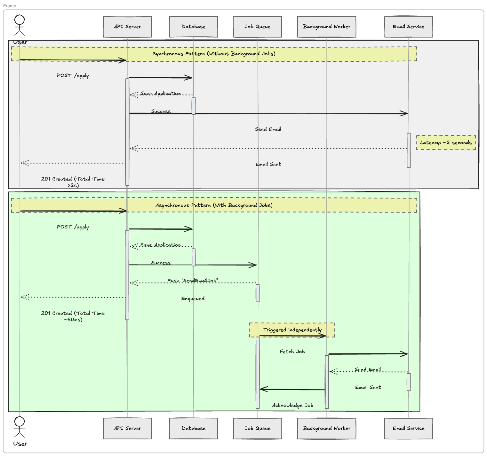
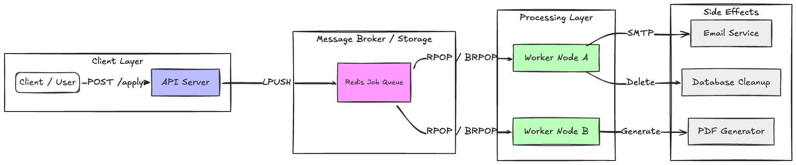
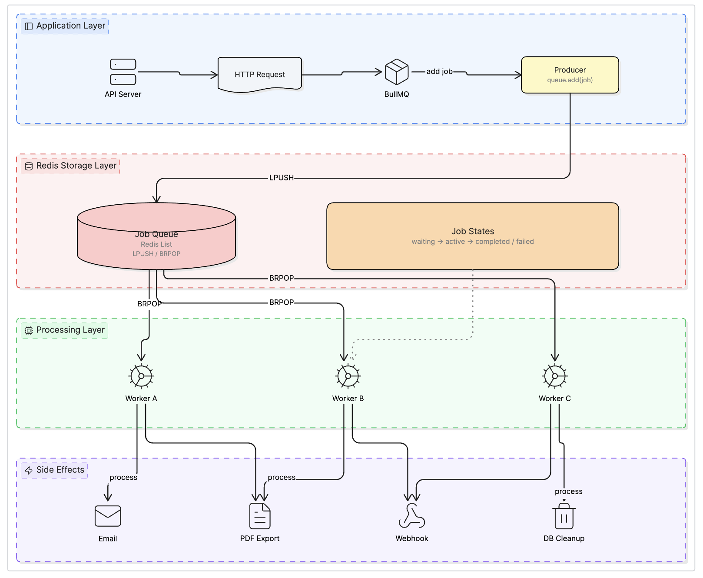
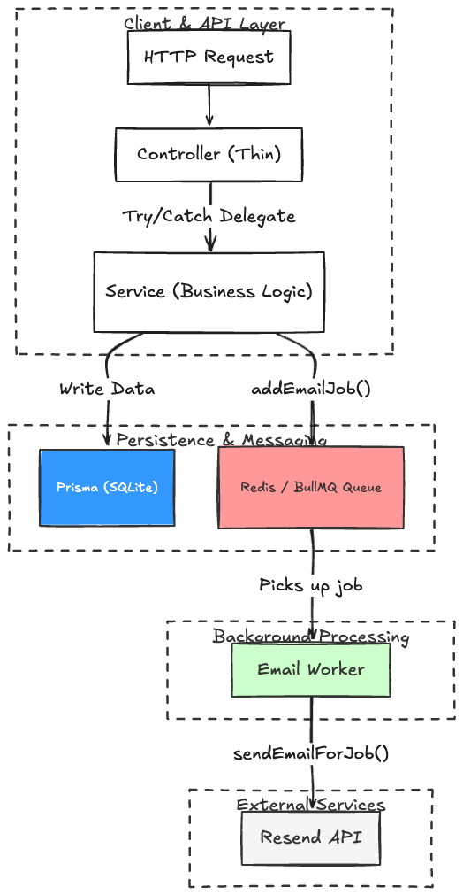

# Background Jobs — BullMQ, node-cron, and Task Scheduling

A Job Board REST API that demonstrates real-world background job patterns using BullMQ for job queues, node-cron for scheduled tasks, and Resend for transactional emails. The project shows how to move time-consuming or recurring work out of the HTTP request/response cycle.

---

## 1. Core Concepts

### 1.1. What is a Background Job?

A **background job** is a unit of work that runs outside the HTTP request/response cycle. Instead of making the client wait while the server sends an email, processes a file, or updates thousands of database rows, the server queues that work and responds immediately. A separate process picks it up and executes it asynchronously.



Benefits:
- **Faster responses** — the HTTP handler returns immediately.
- **Retry logic** — failed jobs can be retried automatically.
- **Concurrency control** — process jobs at a controlled rate.
- **Deferred execution** — delay a job to run hours or days later.
- **Priority queuing** — urgent jobs run before low-priority ones.

### 1.2. What is a Job Queue?

A **job queue** is a data structure (stored in Redis) where producers add jobs and consumers (workers) pick them up. It acts as a buffer between the API and the background processing layer.



### 1.3. What is Redis?

**Redis** is an in-memory data store. BullMQ uses Redis as the persistence layer for its queue. Jobs are stored in Redis data structures (sorted sets, lists, hashes), which allows:
- **Persistence** — jobs survive server restarts.
- **Atomicity** — a job is claimed by exactly one worker.
- **Speed** — Redis operations are sub-millisecond.

In this project Redis runs as a Docker container:

```bash
docker compose up -d
```

### 1.4. What is BullMQ?

**BullMQ** is a Node.js library that provides a production-ready job queue on top of Redis. It handles the hard parts of queue management:

| Feature | Description |
|---|---|
| **Persistence** | Jobs stored in Redis — survive crashes |
| **Retries** | Automatically retry failed jobs with configurable backoff |
| **Priority** | Higher-priority jobs run before lower-priority ones |
| **Delay** | Schedule a job to run after a specified delay (e.g. 3 days) |
| **Concurrency** | Process multiple jobs in parallel inside one worker |
| **Events** | Listen for `completed`, `failed`, `error` events |

### 1.5. What is a Worker?

A **Worker** is a process that listens to a queue and executes a processor function for each job it picks up. The worker is separate from the API server — in production it often runs as its own process.

```typescript
// Worker picks up jobs from "email-queue" and calls processEmailJob
const worker = new Worker('email-queue', processEmailJob, { connection });

async function processEmailJob(job: Job) {
  // job.data contains the payload you enqueued
  await sendEmail(job.data);
}
```



### 1.6. What is node-cron?

**node-cron** is a task scheduler for Node.js based on Unix cron syntax. It runs a function on a recurring schedule defined by a cron expression — without any queue or Redis involved.

```
Schedule: "0 0 * * *"
           │ │ │ │ │
           │ │ │ │ └── Day of week (0=Sunday, 6=Saturday)
           │ │ │ └──── Month (1-12)
           │ │ └────── Day of month (1-31)
           │ └──────── Hour (0-23)
           └────────── Minute (0-59)
```

Unlike BullMQ jobs, cron tasks are **not persisted** — if the server is down at the scheduled time, the task does not run. For work that must not be missed, combine cron with a queue: the cron job enqueues BullMQ jobs, and the worker processes them.

---

## 2. BullMQ In Depth

### 2.1. Queue

A **Queue** is the entry point for adding jobs. It connects to Redis and exposes the `add()` method. One queue is created per concern; this project uses a single `email-queue`.

```typescript
import { Queue } from 'bullmq';
import { redisConnection } from './redis.connection';

export const emailQueue = new Queue('email-queue', {
  connection: redisConnection,
  defaultJobOptions: {
    removeOnComplete: 100, // keep last 100 completed jobs
    removeOnFail: 50,
  },
});
```

`removeOnComplete` and `removeOnFail` prevent Redis from growing indefinitely.

### 2.2. Adding a Job

```typescript
await emailQueue.add(
  'application_received',  // job name (used for logging / filtering)
  { type: 'application_received', candidateEmail: '...' },  // payload
  { priority: 2, attempts: 3 }  // options
);
```

### 2.3. Job Options

Job options control **how** and **when** a job runs:

| Option | Type | Description |
|---|---|---|
| `priority` | `number` | Lower number = higher priority. `1` runs before `10`. |
| `attempts` | `number` | How many times to try before marking as failed. |
| `backoff` | `object` | Delay strategy between retries: `fixed` or `exponential`. |
| `delay` | `number` | Milliseconds to wait before the first attempt. |
| `removeOnComplete` | `number \| boolean` | Auto-clean completed jobs from Redis. |
| `removeOnFail` | `number \| boolean` | Auto-clean failed jobs from Redis. |

**Backoff strategies:**

```typescript
// Fixed: always wait 5 seconds between retries
backoff: { type: 'fixed', delay: 5000 }

// Exponential: wait 5s, then 10s, then 20s ...
backoff: { type: 'exponential', delay: 5000 }
```

### 2.4. Job Priorities in This Project

Higher priority = lower number. Jobs with priority 2 will always start before priority 10 jobs.

| Job Type | Priority | Rationale |
|---|---|---|
| `application_received` | 2 | Transactional — candidate expects it immediately |
| `job_posted` | 2 | Transactional — recruiter expects it immediately |
| `follow_up_reminder` | 5 | Delayed by 3 days, less urgent |
| `weekly_digest` | 10 | Bulk/marketing, lowest urgency |

### 2.5. Delayed Jobs

Pass a `delay` (in milliseconds) to defer execution. The job is stored in Redis but the worker will not pick it up until the delay has elapsed.

```typescript
// Follow-up reminder runs 3 days after the application
await emailQueue.add('follow_up_reminder', payload, {
  delay: 259_200_000, // 3 * 24 * 60 * 60 * 1000 ms
  priority: 5,
  attempts: 3,
});
```

### 2.6. Keeping Job Options DRY

Define all job options in one place and import them wherever you add jobs:

```typescript
// src/queues/email.queue.ts
export const JOB_OPTIONS = {
  application_received: { priority: 2, attempts: 3, backoff: { type: 'exponential', delay: 5000 } },
  job_posted:           { priority: 2, attempts: 3, backoff: { type: 'exponential', delay: 5000 } },
  follow_up_reminder:   { priority: 5, delay: 259_200_000, attempts: 3, backoff: { type: 'exponential', delay: 5000 } },
  weekly_digest:        { priority: 10, attempts: 2, backoff: { type: 'fixed', delay: 10000 } },
} as const;
```

### 2.7. Worker

The Worker runs the processor function for each job. Use the `concurrency` option to process multiple jobs simultaneously.

```typescript
import { Worker, type Job } from 'bullmq';

const emailWorker = new Worker<EmailJobPayload>('email-queue', async (job: Job) => {
  await sendEmailForJob(job.data);
}, {
  connection: redisConnection,
  concurrency: 5,
});

emailWorker.on('completed', (job) => logger.info('Completed', { jobId: job.id }));
emailWorker.on('failed', (job, err) => logger.error('Failed', { error: err.message }));
```

### 2.8. Redis Connection

BullMQ requires `maxRetriesPerRequest: null` on the IORedis connection. This prevents IORedis from throwing when a Redis command is waiting in queue. Share one connection across Queue and Worker:

```typescript
import IORedis from 'ioredis';

export const redisConnection = new IORedis({
  host: 'localhost',
  port: 6379,
  maxRetriesPerRequest: null, // required by BullMQ
});
```

---

## 3. node-cron In Depth

### 3.1. Cron Syntax

A cron expression has five fields:

```
┌─── minute       (0-59)
│ ┌── hour         (0-23)
│ │ ┌─ day of month (1-31)
│ │ │ ┌ month        (1-12)
│ │ │ │ ┌ day of week  (0=Sun, 6=Sat)
│ │ │ │ │
* * * * *
```

Special characters:

| Character | Meaning | Example |
|---|---|---|
| `*` | Every value | `* * * * *` — every minute |
| `,` | List of values | `0,30 * * * *` — at :00 and :30 of every hour |
| `-` | Range | `0 9-17 * * *` — every hour from 9am to 5pm |
| `/` | Step | `*/15 * * * *` — every 15 minutes |

Common schedules used in this project:

| Expression | Description |
|---|---|
| `0 0 * * *` | Every day at midnight |
| `0 8 * * 1` | Every Monday at 8:00 AM |
| `*/5 * * * *` | Every 5 minutes |
| `0 9 1 * *` | First day of each month at 9:00 AM |

### 3.2. Scheduling a Task

```typescript
import cron from 'node-cron';

const task = cron.schedule('0 0 * * *', async () => {
  // This runs every day at midnight
  await expireOldJobs();
});

// Stop the task on shutdown
task.stop();
```

### 3.3. Cron vs Queue

| | node-cron | BullMQ |
|---|---|---|
| **Persistence** | No — missed if server is down | Yes — stored in Redis |
| **Retry on failure** | No | Yes — configurable |
| **Priority** | No | Yes |
| **Delay** | No | Yes |
| **Best for** | Simple recurring triggers | Reliable async work |

**Best pattern**: Use node-cron as the trigger, BullMQ for the execution:

```typescript
// Cron fires every Monday at 8am
cron.schedule('0 8 * * 1', async () => {
  const candidates = await getCandidates();

  // Each candidate gets a BullMQ job (retryable, persistent)
  for (const candidate of candidates) {
    await emailQueue.add('weekly_digest', candidate, JOB_OPTIONS.weekly_digest);
  }
});
```

---

## 4. Project Architecture

### 4.1. Data Flow



### 4.2. Folder Structure

```
src/
├── config/
│   ├── config.ts          — env vars with requireEnv() guard
│   └── swagger.config.ts  — OpenAPI spec assembled from path files
├── controllers/           — thin: try/catch, call service, send response
├── routes/                — express routers, wires middleware + controller
├── services/              — all business logic, Prisma queries, queue calls
├── queues/
│   ├── redis.connection.ts — single shared IORedis instance
│   └── email.queue.ts      — Queue definition + JOB_OPTIONS + addEmailJob()
├── workers/
│   └── email.worker.ts    — Worker processor + startWorkers() / stopWorkers()
├── crons/
│   ├── midnight-expiry.cron.ts — expires old job postings at 00:00
│   ├── weekly-digest.cron.ts   — enqueues digest emails at Mon 08:00
│   └── index.ts                — startCronJobs() / stopCronJobs()
├── middlewares/           — error, logger, validation, rateLimit
├── validations/           — Zod schemas
├── types/                 — EmailJobPayload discriminated union
├── utils/
│   └── logger.util.ts     — Winston logger
├── prisma/
│   └── client.ts          — singleton PrismaClient
├── app.ts                 — Express app setup
└── server.ts              — listen, startWorkers(), startCronJobs(), graceful shutdown
```

---

## 5. API Endpoints

| Method | Path | Description |
|---|---|---|
| `POST` | `/api/jobs` | Create a job posting. Queues `job_posted` email to recruiter (priority 2). |
| `GET` | `/api/jobs` | List all ACTIVE job postings. |
| `POST` | `/api/jobs/:id/apply` | Apply to a job. Queues `application_received` (priority 2, immediate) and `follow_up_reminder` (priority 5, delayed 3 days). |
| `GET` | `/api/applications` | List all applications. Filter by `?jobId=` query param. |
| `GET` | `/api/health` | Health check — pings Redis and SQLite, returns status of each. |
| `GET` | `/api-docs` | Swagger UI — interactive API documentation. |

### POST /api/jobs — Request Body

```json
{
  "title": "Senior TypeScript Engineer",
  "company": "Acme Corp",
  "description": "We are looking for a senior TypeScript engineer...",
  "expiresAt": "2026-12-31T23:59:59Z",
  "recruiterEmail": "alice@acme.com",
  "recruiterName": "Alice Smith"
}
```

### POST /api/jobs/:id/apply — Request Body

```json
{
  "candidateName": "Jane Doe",
  "candidateEmail": "jane@example.com"
}
```

---

## 6. Background Jobs in This Project

### 6.1. Job Types

| Job Name | Trigger | Priority | Delay | Attempts |
|---|---|---|---|---|
| `job_posted` | Recruiter creates a job | 2 | None | 3 |
| `application_received` | Candidate applies | 2 | None | 3 |
| `follow_up_reminder` | Candidate applies | 5 | 3 days | 3 |
| `weekly_digest` | node-cron Mon 08:00 | 10 | None | 2 |

### 6.2. Cron Jobs

| Name | Schedule | Action |
|---|---|---|
| `midnight-expiry` | `0 0 * * *` — daily at midnight | Marks expired job postings (`expiresAt < now`) as `EXPIRED` in DB |
| `weekly-digest` | `0 8 * * 1` — Monday 8:00 AM | Fetches all unique candidates, enqueues a `weekly_digest` job for each |

### 6.3. Graceful Shutdown

When the process receives `SIGTERM` or `SIGINT`, the server:
1. Stops accepting new HTTP connections.
2. Stops cron tasks (no new triggers).
3. Closes the BullMQ worker (waits for in-progress jobs to finish).
4. Closes the email queue and Redis connection.
5. Disconnects Prisma.

This ensures no jobs are lost mid-execution and no Redis connections are leaked.

---

## 7. Running the Project

### Prerequisites

- Node.js 18+
- Docker (for Redis)

### Steps

```bash
# 1. Clone and navigate
cd 15_Background_Jobs

# 2. Install dependencies
npm install

# 3. Set up environment variables
cp .env.example .env
# Edit .env and fill in RESEND_API_KEY (required)

# 4. Start Redis
docker compose up -d

# 5. Create the SQLite database and run migrations
npm run db:migrate

# 6. Start the dev server (tsx watch — hot reload)
npm run dev
```

The server starts at `http://localhost:3000`.

- Swagger UI: `http://localhost:3000/api-docs`
- Health check: `http://localhost:3000/api/health`

### Quick Test

```bash
# Create a job posting
curl -X POST http://localhost:3000/api/jobs \
  -H "Content-Type: application/json" \
  -d '{
    "title": "Senior TypeScript Engineer",
    "company": "Acme Corp",
    "description": "We are looking for an experienced TypeScript engineer.",
    "expiresAt": "2026-12-31T23:59:59Z",
    "recruiterEmail": "delivered@resend.dev",
    "recruiterName": "Alice Smith"
  }'

# Apply to the job (use the id from the response above)
curl -X POST http://localhost:3000/api/jobs/<JOB_ID>/apply \
  -H "Content-Type: application/json" \
  -d '{
    "candidateName": "Jane Doe",
    "candidateEmail": "delivered@resend.dev"
  }'
```

> Use `delivered@resend.dev` as the email address during local testing — it simulates successful delivery without sending real emails or affecting your domain reputation.

---

## 8. Summary of Implementation Steps

1. **[Redis Connection](#28-redis-connection)**: Create a single IORedis instance with `maxRetriesPerRequest: null`. Share it between Queue and Worker.
2. **[Queue Definition](#21-queue)**: Define the `email-queue` with `removeOnComplete`/`removeOnFail` to prevent Redis bloat.
3. **[Job Options](#26-keeping-job-options-dry)**: Centralize all `JobsOptions` in a `JOB_OPTIONS` constant — one source of truth.
4. **[Email Service](#41-data-flow)**: Implement `sendEmailForJob()` with a switch on `payload.type` — each type renders its own HTML email.
5. **[Worker](#27-worker)**: Implement `startWorkers()` and `stopWorkers()`. Wire `completed`/`failed` event logging.
6. **[Cron Jobs](#3-node-cron-in-depth)**: Implement `scheduleMidnightExpiry()` and `scheduleWeeklyDigest()`. Wrap in `startCronJobs()` / `stopCronJobs()`.
7. **[Service Layer](#41-data-flow)**: Call `addEmailJob()` inside service functions — controllers stay thin (only try/catch + delegate).
8. **[Graceful Shutdown](#63-graceful-shutdown)**: Handle `SIGTERM`/`SIGINT` — stop crons, close worker, close queue, close Redis, disconnect Prisma.
9. **[Health Check](#5-api-endpoints)**: Ping Redis and Prisma in the health route — returns `503` if either is down.

---

## 9. Real-World Use Cases

### 9.1. Rule of Thumb

> **If a task takes more than ~200ms or can fail → move it to a background job.**

Anything that should stay synchronous: simple DB reads, input validation, in-memory calculations — things where the caller needs the result immediately to build the response.

### 9.2. BullMQ — Triggered by User Actions

These are jobs that fire in response to a user event. The API returns immediately; the worker handles the heavy work.

| Trigger | Job | Why background? |
|---|---|---|
| User registers | Send verification email | Email delivery can be slow or fail |
| User places an order | Generate & email invoice PDF | PDF generation is CPU-intensive |
| User uploads an image | Resize, compress, watermark | File processing blocks the event loop |
| User uploads a video | Transcode to multiple resolutions | Can take minutes |
| Payment webhook arrives | Update order status, notify user | Webhook must return 200 immediately |
| User clicks "Export CSV" | Generate large file, send download link | Query + file build can take seconds |
| User connects Stripe | Sync subscription/billing data | External API calls are slow and can fail |

### 9.3. BullMQ — Delayed Jobs

Jobs scheduled to run after a specific wait time, set at enqueue time.

| Use Case | Delay |
|---|---|
| Trial ending — remind user 3 days before expiry | `trialEnd - 3 days` |
| Abandoned cart — nudge after 1 hour of inactivity | `+1 hour` |
| Re-engagement — email inactive user after 7 days | `+7 days` |
| Auto-cancel unpaid order | `+30 minutes` |
| Scheduled report — send at a specific future datetime | `target datetime` |

### 9.4. BullMQ — Advanced Patterns

**Webhook Queue** — receive fast, process safely:
```
Stripe webhook → POST /webhook → enqueue → 200 OK (instant)
                                     ↓
                         Worker: update DB, send email, retry on fail
```

**Fan-out** — one job spawns many child jobs (e.g. bulk notifications):
```
"send_campaign" job → creates 100,000 "send_email" jobs → workers process in parallel
```

**Job Chaining** — job A completes → triggers job B:
```
transcode_video → generate_thumbnail → notify_user
```

**Priority Queues** — different urgency levels share one queue:

| Job | Priority | Expected latency |
|---|---|---|
| OTP / 2FA code email | 1 | Seconds |
| Order confirmation | 2 | Seconds |
| Password reset | 2 | Seconds |
| Follow-up reminder | 5 | Minutes |
| Weekly digest | 10 | Hours — whenever queue is free |

### 9.5. node-cron — Recurring Scheduled Tasks

| Schedule | Use Case |
|---|---|
| `0 2 * * *` — 2 AM daily | Database backup, temp file cleanup, log rotation |
| `0 0 1 * *` — 1st of month | Generate monthly invoices for all subscribers |
| `*/5 * * * *` — every 5 min | Sync exchange rates, stock/crypto prices from external API |
| `0 9 * * 1` — Mon 9 AM | Weekly analytics report email to admins |
| `0 0 * * *` — midnight | Expire promotions, deactivate lapsed accounts |
| `30 23 * * *` — 11:30 PM | Aggregate daily metrics before the day rolls over |

### 9.6. Cron + Queue (Best of Both)

The most robust pattern: cron triggers, BullMQ executes. Cron alone has no retry — if the task fails, it is lost until the next scheduled run. Handing work off to BullMQ gives retry, persistence, and priority on top of the schedule.

```
Cron "0 0 * * *"
    │
    └─▶ enqueue "expire_postings" job into BullMQ
                        │
                Worker picks it up → updates DB
                        │
              If it fails → retries with exponential backoff
```

---

## 10. Resources

- [BullMQ Documentation](https://docs.bullmq.io/) — Official BullMQ docs
- [BullMQ Guide: Job Options](https://docs.bullmq.io/guide/jobs/job-options) — Priority, delay, backoff, attempts
- [ioredis](https://github.com/redis/ioredis) — Redis client used by BullMQ
- [node-cron](https://github.com/node-cron/node-cron) — Cron task scheduler for Node.js
- [Cron Expression Editor](https://crontab.guru/) — Interactive cron syntax reference
- [Prisma ORM](https://www.prisma.io/docs) — TypeScript ORM for SQLite/PostgreSQL
- [Resend Node.js SDK](https://resend.com/docs/send-with-nodejs) — Transactional email API
