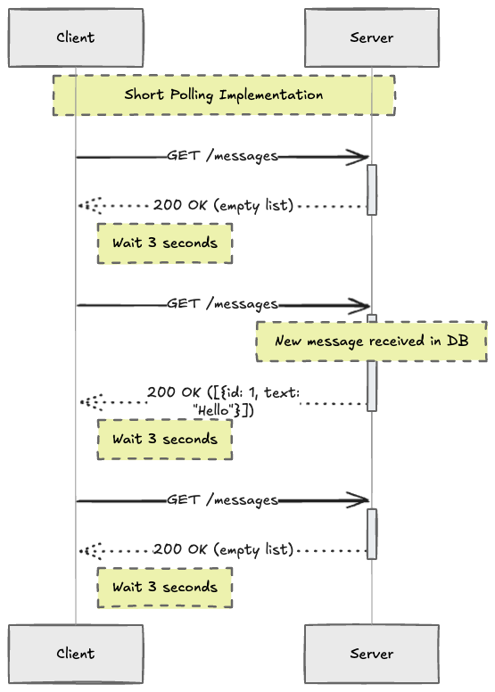
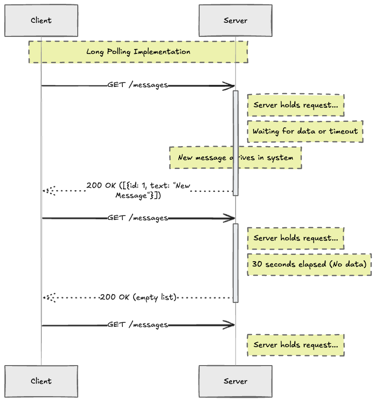
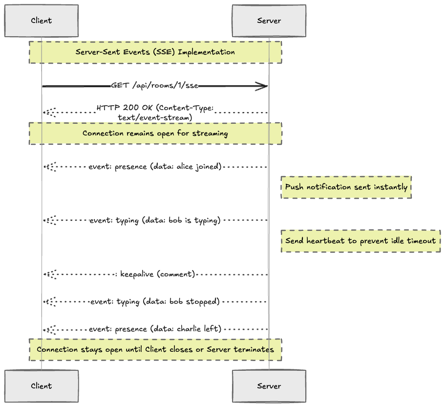
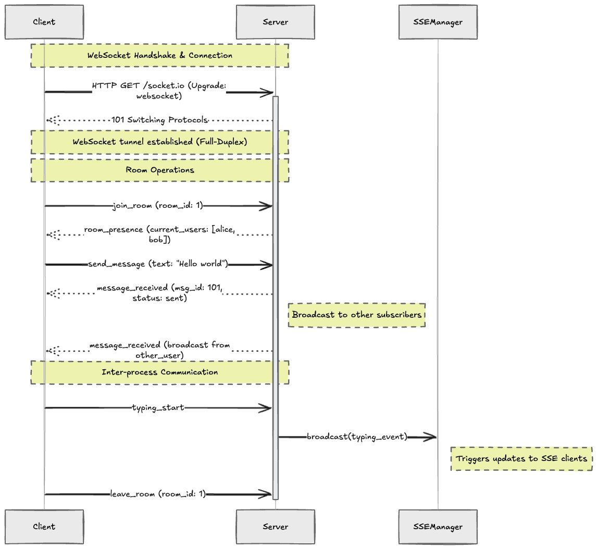
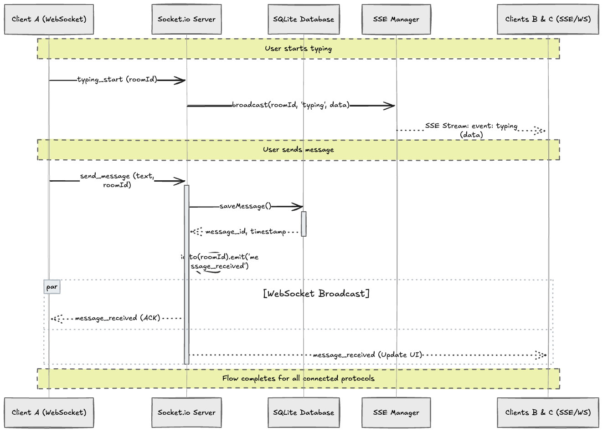

# Real-Time Communication — WebSocket, SSE, and Polling

A real-time chat API that demonstrates the four main techniques for pushing data from server to client in a Node.js application: Short Polling, Long Polling, Server-Sent Events (SSE), and WebSocket via Socket.io. The project uses Socket.io for chat messages and SSE for typing indicators and presence — intentionally mixing both to show when each is appropriate.

---

## 1. The Problem: Server-Push

HTTP was designed as a request/response protocol — the client always initiates. This creates a fundamental challenge for real-time features: **how does the server push data to the client without the client asking first?**

Four techniques solve this in different ways, each with different trade-offs:

---

## 2. Short Polling

### What It Is

The client sends repeated HTTP requests at a fixed interval, regardless of whether the server has new data. Each request is a complete HTTP round-trip.



### Code Example

```typescript
// Client-side (browser)
setInterval(async () => {
  const res = await fetch('/api/messages?since=' + lastTimestamp);
  const { data } = await res.json();
  if (data.length > 0) renderMessages(data);
}, 3000); // poll every 3 seconds
```

```typescript
// Server-side (Express)
app.get('/api/messages', async (req, res) => {
  const since = req.query.since as string;
  const messages = await prisma.message.findMany({
    where: { createdAt: { gt: new Date(since) } },
  });
  res.json({ data: messages });
});
```

### Pros and Cons

| Pros | Cons |
|---|---|
| Simplest to implement | Wastes bandwidth — most responses are empty |
| Works everywhere (plain HTTP) | High server load — constant requests even with no data |
| Easy to debug and understand | Latency = up to the interval length |
| No special server configuration | Not suitable for high-frequency updates |

### When to Use

- Low-update-frequency data (dashboards refreshed every 30–60 seconds)
- Environments where WebSocket is not available
- Quick prototyping

---

## 3. Long Polling

### What It Is

The client sends a request and the server **holds it open** until new data is available (or a timeout occurs). When the server responds, the client immediately sends another request. This creates a near-real-time channel with a standard HTTP connection.



### Code Example

```typescript
// Server-side (Express) — simplified
const waitingClients: Map<string, Response> = new Map();

app.get('/api/poll/messages', (req, res) => {
  const roomId = req.query.roomId as string;

  // Hold the request — set a 30s timeout to avoid hanging forever
  const timeout = setTimeout(() => {
    waitingClients.delete(roomId);
    res.json({ data: [] }); // empty response on timeout
  }, 30_000);

  waitingClients.set(roomId, res);

  req.on('close', () => {
    clearTimeout(timeout);
    waitingClients.delete(roomId);
  });
});

// When a new message arrives, resolve waiting clients
function notifyWaitingClients(roomId: string, message: Message) {
  const client = waitingClients.get(roomId);
  if (client) {
    waitingClients.delete(roomId);
    client.json({ data: [message] });
  }
}
```

```typescript
// Client-side — immediately reconnects after each response
async function poll() {
  const res = await fetch('/api/poll/messages?roomId=general');
  const { data } = await res.json();
  if (data.length > 0) renderMessages(data);
  poll(); // reconnect immediately
}
poll();
```

### Pros and Cons

| Pros | Cons |
|---|---|
| Near real-time with standard HTTP | Each client holds an open server connection |
| Works through most proxies/firewalls | Complex server implementation (tracking waiting clients) |
| No extra protocols needed | Head-of-line blocking — one response per request cycle |
| Lower bandwidth than short polling | Memory pressure at scale (many concurrent held requests) |

### When to Use

- Environments where WebSocket is blocked (corporate proxies)
- Real-time features with infrequent updates
- Legacy systems that cannot upgrade to WebSocket

---

## 4. Server-Sent Events (SSE)

### What It Is

SSE is a **one-directional** persistent HTTP connection where the server can push events to the client at any time. The client opens one connection using the browser's `EventSource` API and the server keeps it open, writing events as they occur.



### Wire Format

SSE uses a simple plain-text format over HTTP. Each event is separated by a blank line:

```
event: typing
data: {"username":"alice","isTyping":true}

event: presence
data: {"onlineUsers":["alice","bob"]}

: keepalive

```

- `event:` — custom event name (client listens with `addEventListener`)
- `data:` — event payload (any string, typically JSON)
- `: comment` — ignored by client, used for keepalive
- Blank line — marks end of one event

### Server Implementation

```typescript
// SSE controller — one response object per connected client
app.get('/api/rooms/:id/sse', (req, res) => {
  res.setHeader('Content-Type', 'text/event-stream');
  res.setHeader('Cache-Control', 'no-cache');
  res.setHeader('Connection', 'keep-alive');
  res.flushHeaders(); // send headers immediately

  // Push an event to this client
  res.write('event: presence\ndata: {"onlineUsers":["alice"]}\n\n');

  // Keepalive every 30s to prevent proxy timeouts
  const timer = setInterval(() => res.write(': keepalive\n\n'), 30_000);

  // Cleanup when client disconnects
  req.on('close', () => {
    clearInterval(timer);
    // remove client from SSEManager
  });
});
```

### Client Implementation

```typescript
// Browser EventSource — automatic reconnect built in
const source = new EventSource('/api/rooms/room-1/sse');

source.addEventListener('typing', (e) => {
  const { username, isTyping } = JSON.parse(e.data);
  showTypingIndicator(username, isTyping);
});

source.addEventListener('presence', (e) => {
  const { onlineUsers } = JSON.parse(e.data);
  updateOnlineList(onlineUsers);
});

// Built-in reconnect — browser automatically retries on disconnect
source.onerror = () => console.log('SSE reconnecting...');
```

### SSEManager — Managing Multiple Clients

The `SSEManager` singleton (in `src/sse/manager.ts`) tracks all open SSE connections grouped by room ID, so any part of the app can push events to a specific room:

```typescript
class SSEManager {
  private clients = new Map<string, Set<Response>>();

  addClient(roomId: string, res: Response): void { ... }
  removeClient(roomId: string, res: Response): void { ... }

  broadcast(roomId: string, event: string, data: unknown): void {
    const payload = `event: ${event}\ndata: ${JSON.stringify(data)}\n\n`;
    this.clients.get(roomId)?.forEach((res) => res.write(payload));
  }
}

export const sseManager = new SSEManager(); // singleton
```

### Pros and Cons

| Pros | Cons |
|---|---|
| Simple — plain HTTP, no extra protocol | **One-directional** — server → client only |
| Built-in browser reconnect via `EventSource` | Not suitable for high-frequency events (use WebSocket) |
| Works through HTTP/2 multiplexing | Limited browser connections per domain (HTTP/1.1: 6 max) |
| Lightweight — no handshake overhead | No binary support — text only |
| Perfect for notifications and indicators | |

### When to Use

- Typing indicators, presence updates
- Live notifications (new order, new comment)
- Dashboard metrics updated from server
- Any feature that is **server-pushes, client reads** only

---

## 5. WebSocket / Socket.io

### What It Is

WebSocket is a **full-duplex** persistent connection. After an HTTP upgrade handshake, both client and server can send messages at any time without the overhead of HTTP headers per message.

**Socket.io** is a library built on top of WebSocket that adds:
- Automatic fallback to Long Polling if WebSocket is unavailable
- Rooms (logical groups of sockets)
- Namespaces (isolated Socket.io instances on the same server)
- Built-in reconnection logic
- Event-based API



### Core Socket.io Concepts

**Namespace** — a communication channel that allows splitting logic over a single shared connection. The default namespace is `/`. You can create isolated namespaces like `/chat` and `/admin`.

```typescript
const chatNs = io.of('/chat');
const adminNs = io.of('/admin');
```

**Room** — a logical sub-group inside a namespace. A socket can join multiple rooms. When you emit to a room, only sockets in that room receive the event.

```typescript
socket.join('general');         // join a room
io.to('general').emit('msg');   // broadcast to all in room
socket.to('general').emit();    // broadcast excluding sender
socket.leave('general');        // leave a room
```

**Event** — the fundamental unit of communication. Both sides emit named events and listen with `on()`:

```typescript
// Server emits
io.to(roomId).emit('message_received', { id, username, content });

// Server listens
socket.on('send_message', async ({ roomId, username, content }) => {
  const msg = await saveMessage({ roomId, username, content });
  io.to(roomId).emit('message_received', msg);
});
```

**Broadcast** — emit to everyone in a room except the sender:

```typescript
socket.broadcast.to(roomId).emit('user_joined', { username });
```

### Server Implementation

```typescript
import { Server } from 'socket.io';
import http from 'http';

const server = http.createServer(app); // must use http.Server, not express app
const io = new Server(server, {
  cors: { origin: '*', methods: ['GET', 'POST'] },
});

io.on('connection', (socket) => {
  socket.on('join_room', async ({ roomId, username }) => {
    socket.join(roomId);
    io.to(roomId).emit('user_joined', { username, roomId });
    const history = await getRecentMessages(roomId, 50);
    socket.emit('message_history', history); // only to the joining socket
  });

  socket.on('send_message', async ({ roomId, username, content }) => {
    const msg = await saveMessage({ roomId, username, content });
    io.to(roomId).emit('message_received', msg); // to everyone in room
  });

  socket.on('disconnect', () => {
    // cleanup presence
  });
});
```

### Client Implementation

```typescript
import { io } from 'socket.io-client';

const socket = io('http://localhost:3000');

socket.emit('join_room', { roomId: 'room-1', username: 'alice' });

socket.on('message_received', (msg) => {
  appendMessage(msg); // render new message in UI
});

socket.on('room_presence', ({ onlineUsers }) => {
  updatePresenceList(onlineUsers);
});

// Send a message
socket.emit('send_message', {
  roomId: 'room-1',
  username: 'alice',
  content: 'Hello!',
});

// Typing indicator (triggers SSE push to all clients)
socket.emit('typing_start', { roomId: 'room-1', username: 'alice' });
socket.emit('typing_stop', { roomId: 'room-1', username: 'alice' });
```

### Pros and Cons

| Pros | Cons |
|---|---|
| Full-duplex — both sides send at any time | More complex setup than SSE or polling |
| Extremely low latency (no HTTP header overhead) | Requires WebSocket support (most proxies support it today) |
| Socket.io adds rooms, namespaces, auto-reconnect | Stateful — server must track connections |
| Scales to thousands of concurrent connections | Load balancer needs sticky sessions or Redis adapter |
| Binary support | Overkill for simple server-push use cases |

### When to Use

- Real-time chat and messaging
- Multiplayer games
- Collaborative editing (Google Docs-style)
- Live bidding / trading platforms
- Any feature needing **bi-directional** real-time communication

---

## 6. Comparison of All Four Techniques

| | Short Polling | Long Polling | SSE | WebSocket |
|---|---|---|---|---|
| **Direction** | Client → Server (repeated) | Client → Server (held) | Server → Client only | Full-duplex (both) |
| **Connection** | New HTTP per interval | HTTP held open until data | HTTP persistent stream | TCP tunnel (upgraded) |
| **Protocol** | HTTP | HTTP | HTTP | WS / WSS |
| **Browser API** | `fetch` / `XMLHttpRequest` | `fetch` | `EventSource` | `WebSocket` |
| **Latency** | Up to interval duration | Near real-time | Near real-time | Near real-time |
| **Server resources** | Low (short-lived) | Medium (held connections) | Low-medium | Low per connection |
| **Complexity** | Very low | Medium | Low | Medium-High |
| **Auto-reconnect** | Manual | Manual | Built-in (`EventSource`) | Socket.io handles it |
| **Binary support** | Yes (base64 encoded) | Yes | No (text only) | Yes |
| **Best for** | Dashboards, status checks | Legacy real-time | Notifications, indicators | Chat, games, collab |

### Decision Guide

```
Need bi-directional communication?
  ├─ YES → WebSocket / Socket.io
  └─ NO (server push only)
       │
       ├─ High frequency (>1 event/sec)? → WebSocket
       │
       ├─ Moderate frequency, simple notifications? → SSE
       │
       ├─ WebSocket/SSE blocked by proxy? → Long Polling
       │
       └─ Very infrequent, simple? → Short Polling
```

---

## 7. Project Architecture

### 7.1. Why Mix Socket.io and SSE?

This project deliberately uses both technologies to demonstrate their different strengths:

| Feature | Technology | Reason |
|---|---|---|
| Chat messages | Socket.io (WebSocket) | Bi-directional: client sends and receives |
| Typing indicators | SSE | Uni-directional: server pushes typing state |
| Online presence | SSE | Uni-directional: server pushes user list |
| Message history | REST (HTTP GET) | Stateless fetch — no real-time needed |

### 7.2. Socket.io + SSE Integration Flow



### 7.3. Folder Structure

```
src/
├── config/
│   ├── config.ts          — env vars
│   └── swagger.config.ts  — OpenAPI spec
├── controllers/
│   ├── room.controller.ts — create/list rooms, message history
│   └── sse.controller.ts  — SSE handshake, keepalive, cleanup
├── routes/
│   ├── room.route.ts      — REST routes + SSE route
│   └── health.route.ts
├── services/
│   ├── room.service.ts    — Prisma room queries
│   └── message.service.ts — Prisma message queries
├── socket/
│   └── index.ts           — Socket.io server setup + all event handlers
│                            exports initSocket(), getOnlineUsers()
├── sse/
│   └── manager.ts         — SSEManager singleton
│                            Map<roomId, Set<Response>> + broadcast()
├── middlewares/           — error, logger, validation, rateLimit
├── validations/           — Zod schemas
├── types/
│   └── index.ts           — Typed Socket.io events + domain types
├── utils/
│   └── logger.util.ts
├── prisma/
│   └── client.ts          — singleton PrismaClient
├── app.ts                 — Express app (no http.Server here)
└── server.ts              — http.createServer(app) + initSocket(server)
```

> **Important**: `http.createServer(app)` is in `server.ts`, not `app.ts`. Socket.io must attach to the raw `http.Server` instance, not the Express app directly.

---

## 8. Socket.io Events Reference

### Client → Server

| Event | Payload | Description |
|---|---|---|
| `join_room` | `{ roomId, username }` | Join a chat room. Server sends back message history and updates presence. |
| `leave_room` | `{ roomId, username }` | Leave a room. Server updates presence. |
| `send_message` | `{ roomId, username, content }` | Send a chat message. Persisted to DB and broadcast to all in room. |
| `typing_start` | `{ roomId, username }` | User started typing. Triggers SSE broadcast `typing: { isTyping: true }`. |
| `typing_stop` | `{ roomId, username }` | User stopped typing. Triggers SSE broadcast `typing: { isTyping: false }`. |

### Server → Client

| Event | Payload | Description |
|---|---|---|
| `message_received` | `{ id, roomId, username, content, createdAt }` | A new message was sent to the room. |
| `message_history` | `MessageData[]` | Last 50 messages. Sent only to the joining socket. |
| `user_joined` | `{ username, roomId }` | A user joined the room. |
| `user_left` | `{ username, roomId }` | A user left the room. |
| `room_presence` | `{ roomId, onlineUsers: string[] }` | Current list of online users in the room. |

### SSE Events (GET /api/rooms/:id/sse)

| Event | Payload | Description |
|---|---|---|
| `typing` | `{ username, isTyping: boolean }` | Pushed when a user starts or stops typing. |
| `presence` | `{ onlineUsers: string[] }` | Pushed when the user list changes (join/leave/disconnect). |
| `: keepalive` | _(comment, no data)_ | Sent every 30s to keep the connection alive through proxies. |

---

## 9. REST API Endpoints

| Method | Path | Description |
|---|---|---|
| `POST` | `/api/rooms` | Create a new chat room |
| `GET` | `/api/rooms` | List all rooms |
| `GET` | `/api/rooms/:id/messages` | Get last 50 messages for a room |
| `GET` | `/api/rooms/:id/sse` | Open SSE stream for typing indicators and presence |
| `GET` | `/api/health` | Health check — DB status and active SSE client count |
| `GET` | `/api-docs` | Swagger UI |

### POST /api/rooms

```json
{ "name": "general" }
```

### GET /api/rooms/:id/sse

Response is a persistent `text/event-stream`. Example stream:

```
event: presence
data: {"onlineUsers":["alice","bob"]}

event: typing
data: {"username":"alice","isTyping":true}

: keepalive

event: typing
data: {"username":"alice","isTyping":false}
```

---

## 10. Running the Project

### Prerequisites

- Node.js 18+

### Steps

```bash
# 1. Navigate to project
cd 16_Real_Time_Communication

# 2. Install dependencies
npm install

# 3. Set up environment
cp .env.example .env

# 4. Create SQLite database and run migrations
npm run db:migrate

# 5. Start the dev server
npm run dev
```

Server starts at `http://localhost:3000`.

- Swagger UI: `http://localhost:3000/api-docs`
- Health check: `http://localhost:3000/api/health`

### Quick Test

```bash
# Create a room
curl -X POST http://localhost:3000/api/rooms \
  -H "Content-Type: application/json" \
  -d '{"name":"general"}'

# List rooms
curl http://localhost:3000/api/rooms

# Open SSE stream (keep terminal open to see events)
curl -N http://localhost:3000/api/rooms/<ROOM_ID>/sse

# Connect with Socket.io client
node -e "
  const { io } = require('socket.io-client');
  const socket = io('http://localhost:3000');
  socket.emit('join_room', { roomId: '<ROOM_ID>', username: 'alice' });
  socket.on('message_history', (msgs) => console.log('History:', msgs));
  socket.on('room_presence', (p) => console.log('Presence:', p));
  setTimeout(() => {
    socket.emit('send_message', { roomId: '<ROOM_ID>', username: 'alice', content: 'Hello!' });
  }, 1000);
"
```

---

## 11. Summary of Implementation Steps

1. **[SSEManager](#4-server-sent-events-sse)**: Singleton class tracking `Map<roomId, Set<Response>>`. Methods: `addClient`, `removeClient`, `broadcast`, `closeAll`.
2. **[SSE Controller](#sse-controller)**: Set headers (`text/event-stream`, `no-cache`, `keep-alive`), call `flushHeaders()`, register with SSEManager, start keepalive timer, clean up on `req.on('close')`.
3. **[Socket.io Server](#5-websocket--socketio)**: Create with `http.createServer(app)` — not with Express directly. Call `initSocket(server)` from `server.ts`.
4. **[Online Users](#71-why-mix-socketio-and-sse)**: Track with `Map<roomId, Set<string>>` in-memory inside `src/socket/index.ts`. Update on `join_room`, `leave_room`, `disconnect`.
5. **[Typing → SSE Bridge](#72-socketio--sse-integration-flow)**: Inside `typing_start`/`typing_stop` socket handlers, call `sseManager.broadcast()` — this is the key integration point between the two technologies.
6. **[Message Persistence](#socket-events-reference)**: Inside `send_message` handler, call `saveMessage()` before `io.to(room).emit()`. On `join_room`, send history with `socket.emit('message_history', ...)` (not `io.to()` — only to the joining socket).
7. **[Graceful Shutdown](#server)**: Call `sseManager.closeAll()` on `SIGTERM`/`SIGINT` to properly terminate all open SSE response streams before the process exits.

---

## 12. Resources

- [Socket.io Documentation](https://socket.io/docs/v4/) — Official Socket.io docs
- [Socket.io Rooms](https://socket.io/docs/v4/rooms/) — Working with rooms
- [MDN: Server-Sent Events](https://developer.mozilla.org/en-US/docs/Web/API/Server-sent_events) — SSE specification and EventSource API
- [MDN: WebSocket API](https://developer.mozilla.org/en-US/docs/Web/API/WebSockets_API) — WebSocket browser API
- [HTML Spec: SSE wire format](https://html.spec.whatwg.org/multipage/server-sent-events.html#server-sent-events) — Official SSE event stream format
- [Prisma ORM](https://www.prisma.io/docs) — TypeScript ORM for SQLite
